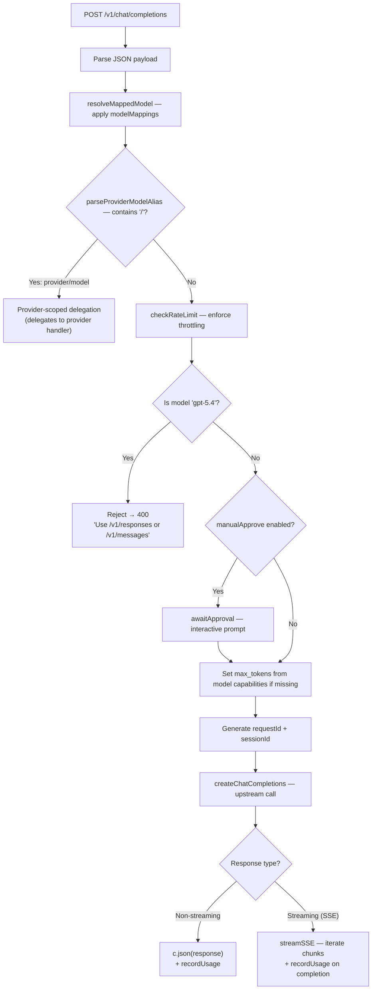
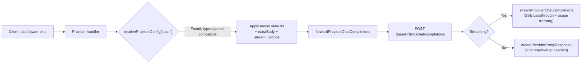

The Chat Completions endpoint is the primary interface for OpenAI-compatible LLM interactions within `copilot-api`. It implements the `POST /v1/chat/completions` contract, acting as a bridge between standard OpenAI SDK clients and GitHub Copilot's upstream API — or any configured third-party OpenAI-compatible provider. This page covers the endpoint's request lifecycle, dual-mode streaming architecture, model routing mechanics, and provider-scoped delegation.

## Route Registration and HTTP Surface

The chat completions endpoint is registered on the Hono server at two path variants to maximize client compatibility. The canonical path is `/chat/completions`, while `/v1/chat/completions` provides interoperability with tooling that assumes the standard OpenAI v1 prefix convention. Both paths share the identical handler — there is no versioning distinction between them.

Sources: [server.ts](src/server.ts#L67-L80)

The route itself is minimal — a single `POST /` handler mounted under its parent path. Error forwarding is delegated to the centralized `forwardError` utility, which translates `HTTPError` instances into structured JSON error responses with appropriate status codes.

Sources: [route.ts](src/routes/chat-completions/route.ts#L1-L16)

## Request Lifecycle Overview

The handler orchestrates a multi-stage pipeline before producing any response. Understanding this pipeline is critical for debugging, as each stage can transform the payload, reject the request, or redirect it entirely.

Sources: [handler.ts](src/routes/chat-completions/handler.ts#L28-L135)

## Model Resolution and Mapping

Before any upstream interaction, the handler applies a two-tier model resolution system.

**Tier 1 — Alias mapping.** The `resolveMappedModel` function consults the `modelMappings` dictionary from the configuration file. This allows administrators to transparently redirect requests for one model name to another. For example, mapping `"gpt-4o-mini"` → `"gpt-4.1-mini"` means all incoming requests for the former are silently rewritten. The mapping is applied unconditionally; the original model name is only used for logging.

Sources: [config.ts](src/lib/config.ts#L362-L414)

**Tier 2 — Provider prefix parsing.** After mapping, the handler calls `parseProviderModelAlias` to check whether the model string contains a `/` separator. A model string like `dash/qwen-plus` is split into provider `dash` and model `qwen-plus`. When a provider alias is detected, the handler **exits the Copilot pipeline entirely** — it does not check rate limits, does not require a Copilot token, and instead delegates to the provider-specific chat completions handler. This is a critical routing boundary.

Sources: [provider-model.ts](src/lib/provider-model.ts#L1-L26), [handler.ts](src/routes/chat-completions/handler.ts#L38-L45)

| Resolution Stage | Input Example | Output | Effect |
|---|---|---|---|
| `modelMappings` lookup | `"gpt-4o-mini"` | `"gpt-4.1-mini"` (if mapped) | Rewrites model in-place |
| `parseProviderModelAlias` | `"dash/qwen-plus"` | `{ provider: "dash", model: "qwen-plus" }` | Delegates to provider handler |
| Neither applies | `"gpt-4o"` | `"gpt-4o"` (unchanged) | Continues to Copilot pipeline |

## Provider-Scoped Delegation

When the model string contains a provider prefix, control transfers to `handleProviderChatCompletionsForProvider`. This handler resolves the provider configuration, applies per-model defaults, and forwards the request to the provider's upstream OpenAI-compatible endpoint.

The delegation process enforces several constraints:

1. **Type validation** — Only providers with `type: "openai-compatible"` accept chat completions requests. Providers typed as `"openai-responses"` or `"anthropic"` are rejected with a `400` error.
2. **Model defaults** — If the provider configuration specifies `temperature`, `topP`, or `topK` for the requested model, these are applied as defaults (only when the client has not already set them, using the `??=` nullish coalescing operator).
3. **Extra body merging** — Provider-level `extraBody` fields (e.g., `enable_thinking: true`) are injected into the payload, but never overwrite client-provided fields.
4. **Stream options** — For streaming requests, `stream_options.include_usage` is forced to `true` to ensure usage data is available for recording.

Sources: [provider/handler.ts](src/routes/provider/chat-completions/handler.ts#L27-L130)

Sources: [provider-proxy.ts](src/services/providers/provider-proxy.ts#L95-L106), [provider/handler.ts](src/routes/provider/chat-completions/handler.ts#L142-L175)

## Copilot Upstream Communication

For non-provider requests, the Copilot service layer handles the actual upstream call to GitHub Copilot's API. The `createChatCompletions` function constructs the request with a carefully orchestrated header set that emulates the VS Code Copilot Chat extension.

**Vision detection** is performed by scanning message contents for `image_url` type entries. When detected, the `copilot-vision-request: true` header is added, enabling the upstream to process multimodal inputs.

**Agent/user detection** examines only the **last message** in the conversation history. If the last message has a role of `"assistant"` or `"tool"`, the `x-initiator` header is set to `"agent"`; otherwise `"user"`. This design prevents multi-turn conversations from incorrectly triggering agent-mode billing — only the actual caller of the current turn determines the initiator.

The upstream base URL varies by account type and configuration: individual accounts use `https://api.githubcopilot.com`, while organization accounts route through `https://api.{accountType}.githubcopilot.com`. Enterprise deployments override this via the `COPILOT_API_ENTERPRISE_URL` environment variable.

Sources: [create-chat-completions.ts](src/services/copilot/create-chat-completions.ts#L17-L82), [api-config.ts](src/lib/api-config.ts#L159-L176)

| Header | Purpose | Value |
|---|---|---|
| `Authorization` | Copilot authentication | `Bearer {copilotToken}` |
| `copilot-integration-id` | Identifies as VS Code Chat | `vscode-chat` |
| `editor-plugin-version` | Plugin version tracking | `copilot-chat/{version}` |
| `openai-intent` | Conversation intent | `conversation-agent` |
| `x-initiator` | Caller type for billing | `user` or `agent` |
| `x-request-id` | Deterministic request tracing | UUID from payload hash |
| `x-github-api-version` | Copilot API version | `2026-06-01` |
| `copilot-vision-request` | Enable multimodal | `true` (only when vision detected) |

Sources: [api-config.ts](src/lib/api-config.ts#L361-L407), [create-chat-completions.ts](src/services/copilot/create-chat-completions.ts#L28-L60)

## Streaming vs Non-Streaming Response Handling

The endpoint supports both streaming (Server-Sent Events) and non-streaming (single JSON response) modes, determined by the `stream` field in the request payload.

**Non-streaming** responses are returned directly as JSON. The handler checks for the presence of a `choices` property on the response object to distinguish this mode — a type-guard function `isNonStreaming` performs this check.

**Streaming** responses use Hono's `streamSSE` utility to proxy Server-Sent Events from the upstream. Each chunk is parsed to extract usage data from the final chunk (which includes the `usage` field when `stream_options.include_usage` is `true`). The `[DONE]` sentinel is handled gracefully by the `parseChatCompletionChunk` function, which returns `null` for both the sentinel and unparseable chunks.

Usage recording happens **after** all chunks are streamed for both modes. For non-streaming, usage is extracted from the response's `usage` field. For streaming, usage accumulates from the final chunk and is recorded in the `finally` block of the provider handler (ensuring recording even on upstream errors).

Sources: [handler.ts](src/routes/chat-completions/handler.ts#L95-L135), [provider/handler.ts](src/routes/provider/chat-completions/handler.ts#L142-L175)

## Token Usage Tracking

Every chat completions request — whether routed through Copilot or a third-party provider — records token usage. The system distinguishes between two source types:

- **`copilot`** — Usage from GitHub Copilot upstream (handled by `createCopilotTokenUsageRecorder`)
- **`provider`** — Usage from third-party providers (handled by `createProviderTokenUsageRecorder`)

Usage data is normalized from OpenAI's format (which includes `prompt_tokens`, `completion_tokens`, and `prompt_tokens_details`) into an internal schema that separates `input_tokens`, `cache_read_input_tokens`, and `cache_creation_input_tokens`. This normalized form is published via an internal event bus (`EventBus`) and persisted asynchronously through a write queue, ensuring usage recording never blocks the response path.

Sources: [token-usage/index.ts](src/lib/token-usage/index.ts#L141-L200)

## Payload Schema

The `ChatCompletionsPayload` interface mirrors the OpenAI Chat Completions API with extensions for Copilot-specific features. Notable fields beyond the standard OpenAI spec include:

- **`thinking_budget`** — Controls reasoning token allocation for models that support extended thinking
- **`top_k`** — Alternative sampling parameter alongside `top_p`
- **`stream_options.include_usage`** — Forces usage data in streaming responses

The `Message` type supports roles including `"developer"` (extending the standard set), and content can be a string, an array of typed content parts (text, image URL, file), or null. Tool calls and reasoning content fields (`reasoning_content`, `reasoning_text`, `reasoning_opaque`) are also supported in both request and response directions.

Sources: [create-chat-completions.ts](src/services/copilot/create-chat-completions.ts#L170-L268)

## Request ID and Session Tracking

Request IDs are deterministically derived from the payload using a SHA-256 hash of the concatenated session ID, machine ID, and last user message content. This design ensures that identical requests from the same client produce the same request ID, enabling deduplication and tracing without explicit client-provided identifiers.

Session IDs are similarly derived via UUID v5-style hashing of the request ID, creating a stable session identifier for a given request even when no explicit session context is provided.

Sources: [utils.ts](src/lib/utils.ts#L243-L285), [handler.ts](src/routes/chat-completions/handler.ts#L79-L88)

## Error Handling and Special Cases

The handler includes several guard conditions:

- **Model rejection** — Requests for `gpt-5.4` are explicitly rejected with a `400` error and a message directing clients to the `/v1/responses` or `/v1/messages` endpoints, as this model requires the newer API surfaces.
- **Missing Copilot token** — The service layer throws if `state.copilotToken` is absent, resulting in a `500` via `forwardError`.
- **Rate limiting** — When `rateLimitSeconds` is configured, the handler either rejects with `429` (non-wait mode) or blocks until the cooldown expires (wait mode).
- **Manual approval** — When enabled, a terminal prompt intercepts every request, requiring interactive confirmation before proceeding.
- **HTTPError forwarding** — Upstream 429 responses pass through `Retry-After` and `X-*` headers to the client.

Sources: [handler.ts](src/routes/chat-completions/handler.ts#L56-L68), [error.ts](src/lib/error.ts#L15-L59), [rate-limit.ts](src/lib/rate-limit.ts#L8-L46)

## Next Steps

For related deep dives, consider:

- [Third-Party Provider Configuration and Proxying](15-third-party-provider-configuration-and-proxying) — details on configuring providers that the `/provider/model` routing depends on
- [Model Resolution, Aliasing, and Normalization](16-model-resolution-aliasing-and-normalization) — comprehensive coverage of the `modelMappings` system and model capability resolution
- [Rate Limiting and Manual Approval](8-rate-limiting-and-manual-approval) — further detail on throttling and interactive approval workflows
- [Authentication and Authorization Middleware](7-authentication-and-authorization-middleware) — the middleware pipeline that gates access to this endpoint