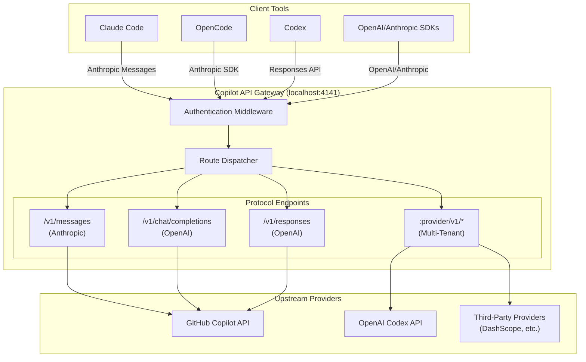
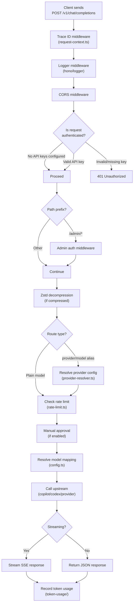

Copilot API is a reverse-engineered GitHub Copilot integration that functions as a lightweight AI gateway. Beyond its Copilot origins, it routes requests through the built-in `codex` provider and configurable third-party providers behind **OpenAI-compatible** and **Anthropic-compatible** API endpoints. This allows developer tools like Claude Code, OpenCode, Codex, and any OpenAI/Anthropic SDK to use Copilot, Codex, or third-party models through a single local proxy.

The gateway is built with **Hono** (HTTP framework), **srvx** (HTTP server), **Bun** as the primary runtime, and ships as both a CLI tool and an Electron desktop application. It is designed for developer workflows where local control, multi-provider routing, and agent compatibility matter.

Sources: [package.json](package.json#L1-L91) · [README.md](README.md#L1-L60)

## What Problem Does It Solve?

Most AI coding assistants — Claude Code, OpenCode, Codex, and similar tools — are tightly coupled to specific provider APIs. Copilot API bridges this gap by acting as a protocol translator and multi-provider router:

| Client Tool | Native API Support | Copilot API Compatibility Layer |
|---|---|---|
| **Claude Code** | Anthropic Messages | Translates Copilot → Anthropic `/v1/messages` |
| **OpenCode** | Anthropic SDK (`@ai-sdk/anthropic`) | Same Anthropic Messages translation |
| **Codex** | OpenAI Responses | Routes through `/v1/responses` with WebSocket |
| **Any OpenAI SDK** | OpenAI Chat Completions | Translates to Copilot's internal chat API |
| **Any Anthropic SDK** | Anthropic Messages | Routes Copilot Claude models or third-party providers |

The gateway handles authentication, token lifecycle management, model resolution, and protocol translation so that clients can connect using their native SDKs without modification.

Sources: [README.md](README.md#L29-L40)

## Architecture at a Glance

The following diagram shows the high-level architecture: client tools connect to the local Copilot API gateway, which translates requests into the appropriate upstream protocol (Copilot, Codex, or third-party providers) and routes responses back.



Sources: [server.ts](src/server.ts#L1-L88) · [start.ts](src/start.ts#L1-L100)

## Key Features

| Feature | Description |
|---|---|
| **OpenAI & Anthropic compatibility** | Single gateway serving `/v1/responses`, `/v1/chat/completions`, `/v1/models`, `/v1/embeddings`, and `/v1/messages` |
| **Multi-provider routing** | Route GitHub Copilot, built-in `codex`, and third-party providers behind the same endpoint |
| **Provider-scoped routing** | Use `/:provider/v1/*` routes or `model: "provider/model"` syntax for multi-tenant isolation |
| **Agent-friendly Claude handling** | Prefer Copilot's native `/v1/messages` when available, preserving Claude-style tool flows and subagent markers |
| **Claude Code integration** | Works with `@ai-sdk/anthropic`, including `--claude-code` flag for interactive setup |
| **Token lifecycle management** | Automatic GitHub token and Copilot token refresh with background refresh loops |
| **Model aliasing** | Global `modelMappings` rewrite model IDs across all endpoints |
| **Context management** | Automatic Responses API `context_management` compaction and per-model thresholds |
| **WebSearch support** | Claude WebSearch through Responses-capable models on Copilot paths |
| **GPT Tool Search** | MCP bridge for `tool_search` with deferred tool loading |
| **Usage monitoring** | Built-in `/usage` endpoint, `/usage-viewer` dashboard, and token usage SQLite storage |
| **Admin API** | `auth.adminApiKey` protected endpoints for runtime configuration changes |
| **Desktop app** | Electron GUI with sign-in, server control, model listing, usage display, and logs |
| **Docker support** | Single-container deployment with bind-mounted auth data |

Sources: [README.md](README.md#L29-L40) · [config.ts](src/lib/config.ts#L17-L68)

## Project Structure

The repository follows a layered architecture that separates concerns clearly:

```
copilot-api/
├── src/
│   ├── main.ts              # CLI entry point (citty subcommand dispatcher)
│   ├── start.ts             # Server startup orchestration
│   ├── server.ts            # Hono HTTP server with middleware & route mounting
│   ├── auth.ts              # Authentication subcommand
│   ├── check-usage.ts       # Usage check subcommand
│   ├── debug.ts             # Debug subcommand
│   ├── mcp.ts               # MCP tool search bridge
│   │
│   ├── lib/                 # Core libraries (shared utilities & state)
│   │   ├── config.ts        # Configuration loading, defaults & provider types
│   │   ├── state.ts         # Global mutable runtime state
│   │   ├── token.ts         # Token setup, refresh loops & credential management
│   │   ├── provider-resolver.ts  # Provider config resolution with Codex support
│   │   ├── request-auth.ts  # Auth middleware (API key & admin key validation)
│   │   ├── rate-limit.ts    # Rate limiting with wait-or-error semantics
│   │   ├── models.ts        # Claude model ID normalization & endpoint matching
│   │   ├── compact.ts       # GPT context compaction support
│   │   ├── tokenizer.ts     # Token counting (GPT tokenizer + Anthropic API)
│   │   ├── token-usage/     # SQLite-backed token usage storage
│   │   └── ...              # Other shared utilities
│   │
│   ├── routes/              # HTTP route handlers (Hono route definitions)
│   │   ├── chat-completions/  # POST /v1/chat/completions
│   │   ├── messages/          # POST /v1/messages (Anthropic-compatible)
│   │   ├── responses/         # POST /v1/responses (OpenAI Responses)
│   │   ├── models/            # GET /v1/models
│   │   ├── embeddings/        # POST /v1/embeddings
│   │   ├── provider/          # /:provider/v1/* multi-tenant routes
│   │   ├── admin/             # /admin/config/* protected endpoints
│   │   ├── token/             # /token endpoint
│   │   ├── token-usage/       # /token-usage endpoint
│   │   └── usage/             # /usage endpoint
│   │
│   └── services/            # Upstream API clients
│       ├── copilot/           # GitHub Copilot API interactions
│       ├── codex/             # OpenAI Codex API interactions
│       ├── github/            # GitHub OAuth & token management
│       ├── providers/         # Third-party provider proxy
│       └── responses-websocket.ts  # WebSocket transport for Responses API
│
├── desktop/                 # Electron desktop application
├── plugin/                  # Claude & OpenCode MCP plugins
├── tests/                   # Test suite
└── pages/                   # Static usage viewer HTML
```

Sources: [src/](src#L1-L1) · [server.ts](src/server.ts#L1-L88)

## How Request Flow Works

When a client sends a request, it passes through several processing stages. Here is the typical flow for an OpenAI-compatible chat completion request:



Sources: [server.ts](src/server.ts#L1-L88) · [chat-completions/handler.ts](src/routes/chat-completions/handler.ts#L1-L80) · [request-auth.ts](src/lib/request-auth.ts#L1-L50)

## Core Runtime State

The gateway maintains a global `State` object that holds all runtime information — GitHub tokens, Copilot tokens, Codex credentials, available models, device IDs, and configuration flags. This state is initialized during server startup in a specific sequence:

1. **Configuration** is loaded from `~/.local/share/copilot-api/config.json` with defaults merged
2. **Device identifiers** are cached (macOS machine ID, VS Code session/device IDs)
3. **GitHub token** is either provided via `--github-token` or obtained through the interactive OAuth flow
4. **Copilot token** is fetched from GitHub's Copilot API and refreshed periodically
5. **Model list** is cached from the Copilot API and used for request validation

This state is shared across all request handlers and is mutated by background refresh loops for tokens.

Sources: [state.ts](src/lib/state.ts#L1-L43) · [start.ts](src/start.ts#L1-L100) · [token.ts](src/lib/token.ts#L1-L80)

## Configuration System

The configuration file (`config.json`) controls all gateway behavior. The system supports:

| Config Category | Purpose | Key Fields |
|---|---|---|
| **Authentication** | API keys for route protection | `auth.apiKeys`, `auth.adminApiKey` |
| **Providers** | Third-party upstream providers | `providers.{name}.type`, `baseUrl`, `apiKey` |
| **Model Mappings** | Rewrite model IDs globally | `modelMappings` |
| **Prompts** | Inject system prompts per model | `extraPrompts` |
| **Context Management** | Responses API compaction | `useResponsesApiContextManagement`, `modelResponsesApiCompactThresholds` |
| **Reasoning** | Per-model reasoning effort | `modelReasoningEfforts` |
| **API Routing** | Control which API paths are used | `useMessagesApi`, `useResponsesApiWebSocket` |
| **WebSearch** | Claude web search support | `useResponsesApiWebSearch`, `messageApiWebSearchModel` |

Provider types support three upstream protocols: `anthropic`, `openai-compatible`, and `openai-responses`. Each provider can have per-model configuration including temperature defaults, `extraBody` fields, context cache settings, and PDF support.

Sources: [config.ts](src/lib/config.ts#L17-L100) · [README.md](README.md#L195-L280)

## Supported API Endpoints

| Endpoint | Method | Description |
|---|---|---|
| `POST /v1/responses` | POST | OpenAI Responses API (supports WebSocket transport) |
| `POST /v1/chat/completions` | POST | OpenAI Chat Completions API |
| `GET /v1/models` | GET | List available models |
| `POST /v1/embeddings` | POST | Create embeddings |
| `POST /v1/messages` | POST | Anthropic Messages API |
| `POST /v1/messages/count_tokens` | POST | Count tokens (local estimation or Anthropic API) |
| `POST /:provider/v1/messages` | POST | Provider-scoped Anthropic Messages |
| `GET /:provider/v1/models` | GET | Provider-scoped model listing |
| `GET /usage` | GET | Copilot usage statistics |
| `GET /token` | GET | Current Copilot token |
| `GET /usage-viewer` | GET | HTML usage dashboard |
| `GET /admin/config/model-mappings` | GET | Read model mappings (admin) |
| `POST /admin/config/model-mappings` | POST | Update model mappings (admin) |

Sources: [server.ts](src/server.ts#L60-L88) · [README.md](README.md#L335-L380)

## Runtime Requirements

The gateway runs on **Bun** (>= 1.2.x) or **Node.js** (>= 20, with full features on >= 22.13.0 for SQLite-backed token usage). A GitHub account with an active Copilot subscription (individual, business, or enterprise) is required for the Copilot path. The `codex` provider requires a separate Codex OAuth login. Third-party providers require their own API keys configured in `config.json`.

The desktop app packages its own Electron runtime and does not require a separate Node.js installation.

Sources: [package.json](package.json#L86-L90) · [README.md](README.md#L140-L150)

## Next Steps

- **[Quick Start](2-quick-start)** — Install and run the gateway in under 5 minutes
- **[CLI Commands and Global Options](3-cli-commands-and-global-options)** — Full reference for all command-line flags and subcommands
- **[Configuration Reference](4-configuration-reference)** — Deep dive into `config.json` and all available settings
- **[Docker Deployment](5-docker-deployment)** — Run the gateway in a container with persistent auth data

For a deeper understanding of the internals, start the **Deep Dive** section with [Server Initialization and HTTP Framework](6-server-initialization-and-http-framework).