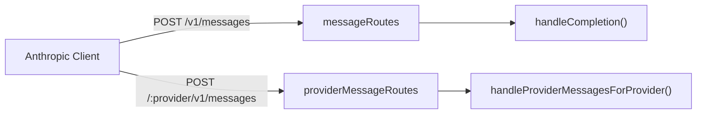
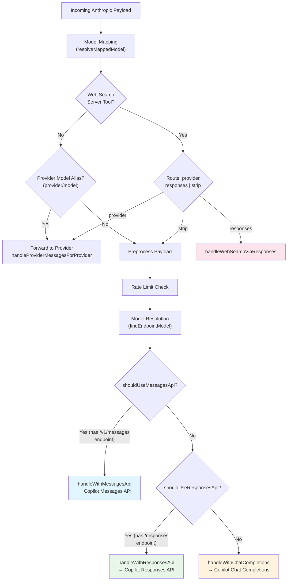
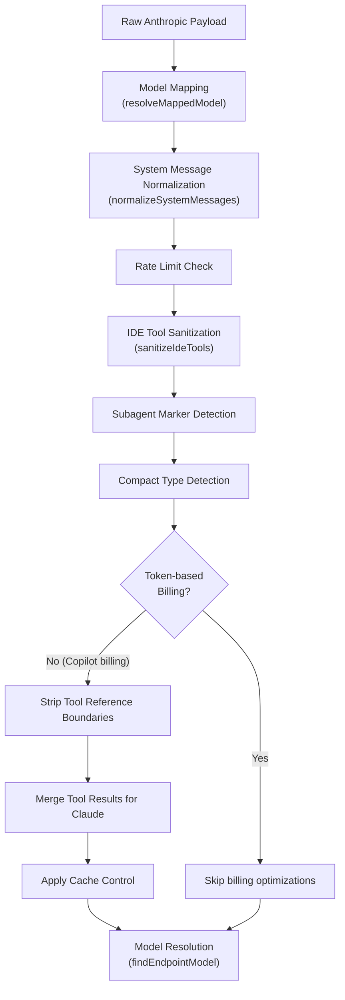
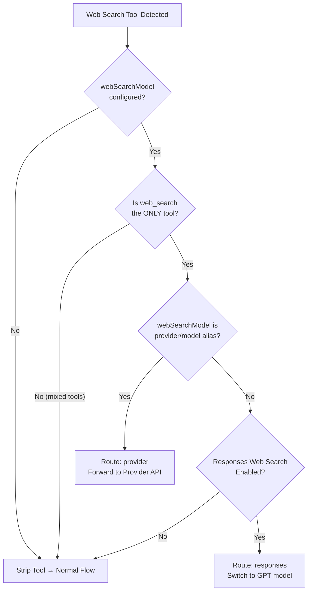

The `/v1/messages` endpoint is the most architecturally complex route in the proxy, acting as a **universal adapter** that accepts Anthropic Messages API payloads and routes them through one of three distinct backend flows — Messages API, Responses API, or Chat Completions — depending on model capabilities, configuration, and request characteristics. This page documents the request lifecycle from ingestion through translation to response delivery.

## Route Registration and Endpoint Surface

The messages endpoint is mounted on the Hono server at two paths: the canonical `/v1/messages` for standard Anthropic-compatible clients and `/:provider/v1/messages` for provider-scoped multi-tenant routing. Both routes share the same Anthropic payload schema but diverge in their resolution logic.

The primary route definition in [route.ts](src/routes/messages/route.ts#L1-L25) exposes two POST handlers:

| Route | Handler | Purpose |
|-------|---------|---------|
| `POST /v1/messages` | `handleCompletion` | Main completion endpoint — the multi-flow router |
| `POST /v1/messages/count_tokens` | `handleCountTokens` | Token counting with Anthropic API or local estimation |

The server mounts both via `server.route("/v1/messages", messageRoutes)` in [server.ts](src/server.ts#L83), with authentication and rate-limiting middleware applied upstream.

Sources: [route.ts](src/routes/messages/route.ts#L1-L25), [server.ts](src/server.ts#L83-L84)

## Multi-Flow Routing Architecture

The core architectural insight is that a single Anthropic-formatted request can be served by three fundamentally different backend paths. The routing decision is made in `handleCompletion` and depends on a cascade of conditions evaluated in priority order.

### Flow Selection Criteria

The routing decision uses two predicate functions defined in [handler.ts](src/routes/messages/handler.ts#L186-L206):

**`shouldUseMessagesApi(selectedModel)`** — Returns `true` when the `useMessagesApi` configuration flag is enabled (defaults to `true`) AND the resolved model declares `/v1/messages` in its `supported_endpoints` array. This is the preferred path for Claude models proxied through Copilot's native Anthropic-compatible endpoint.

**`shouldUseResponsesApi(selectedModel, compactType)`** — Returns `true` when the model has a `/responses` or `ws:/responses` endpoint in its capabilities. This handles GPT and other OpenAI-family models that Copilot exposes through its Responses API.

**Default fallback** — When neither condition is met, the request falls through to `handleWithChatCompletions`, which translates the Anthropic payload to OpenAI Chat Completions format.

| Flow | Backend API | Format | When Selected |
|------|-------------|--------|---------------|
| `handleWithMessagesApi` | Copilot `/v1/messages` | Anthropic native | Claude models with `/v1/messages` endpoint |
| `handleWithResponsesApi` | Copilot `/responses` | OpenAI Responses | GPT models with `/responses` endpoint |
| `handleWithChatCompletions` | Copilot `/chat/completions` | OpenAI Chat Completions | All other models |

Sources: [handler.ts](src/routes/messages/handler.ts#L130-L206), [config.ts](src/lib/config.ts#L618-L620)

## Preprocessing Pipeline

Before the routing decision is made, the Anthropic payload undergoes a multi-stage preprocessing pipeline that normalizes, cleans, and optimizes the request. This pipeline is critical for compatibility with upstream Copilot APIs that may reject or misinterpret certain Anthropic-native constructs.

### System Message Normalization

Anthropic clients often embed `role: "system"` messages directly in the messages array rather than using the top-level `system` parameter. The `normalizeSystemMessages` function in [preprocess.ts](src/routes/messages/preprocess.ts#L202-L230) extracts these and merges them into the `system` field, wrapping each system text block in `<system-reminder>` tags for consistency with Claude Code conventions.

### Tool Result Merging

A significant preprocessing step is `mergeToolResultForClaude` ([preprocess.ts](src/routes/messages/handler.ts#L97-L103)), which collapses adjacent `tool_result` blocks and trailing text blocks within a single user message into a unified `tool_result` content array. This prevents premium request consumption caused by skill invocations, edit hooks, and plan reminders in Claude Code and OpenCode.

The merge logic handles three content types: text blocks (merged into the tool_result content), attachment blocks (images, documents — merged as content blocks), and tool reference blocks (preserved as-is). The function also respects a `skipLastMessage` option for compact requests, where the final compact message must retain its exact structure.

### IDE Tool Sanitization

The `sanitizeIdeTools` function ([preprocess.ts](src/routes/messages/preprocess.ts#L737-L755)) removes the `mcp__ide__executeCode` tool when `defer_loading` is not set and rewrites the `mcp__ide__getDiagnostics` tool description to a standardized format. This aligns the tool definitions with VS Code Copilot extension expectations.

### Compact Request Detection

Claude Code 2.x implements a compact/auto-continue mechanism where the client sends specially formatted messages to trigger context compaction. The `getCompactType` function ([preprocess.ts](src/routes/messages/preprocess.ts#L369-L408)) detects three states:

| Type | Constant | Detection Criteria |
|------|----------|-------------------|
| Normal | `0` | Default — no compaction markers |
| Compact Request | `COMPACT_REQUEST` | Message contains compaction summary markers |
| Auto-Continue | `COMPACT_AUTO_CONTINUE` | Message starts with auto-continue prompt prefix |

Compact requests receive special treatment: tool result merging is skipped for the final message, WebSocket transport is disabled (forced to HTTP), and the small model may be applied for warmup requests without tools.

Sources: [preprocess.ts](src/routes/messages/preprocess.ts#L1-L200), [handler.ts](src/routes/messages/handler.ts#L55-L130), [preprocess.ts](src/routes/messages/preprocess.ts#L800-L904)

## Web Search Routing

The Anthropic Messages endpoint intercepts web search requests before the main flow. When the payload contains an Anthropic server-side `web_search` tool (identified by a `type` field starting with `"web_search"` and no `input_schema`), the `tryHandleWebSearch` function in [fulfill.ts](src/routes/messages/web-search/fulfill.ts#L594-L632) evaluates three routing paths.

The three route types in [fulfill.ts](src/routes/messages/web-search/fulfill.ts#L49-L53):

| Route Kind | Behavior | Example Config |
|------------|----------|----------------|
| `provider` | Forward to a third-party provider whose message API natively supports web search | `messageApiWebSearchModel: "openrouter/claude-sonnet-4"` |
| `responses` | Switch to a GPT model and execute via the Responses API web search tool | `messageApiWebSearchModel: "gpt-5-mini"` |
| `strip` | Remove the web_search tool and continue with the normal multi-flow routing | Default when no model configured |

When the `responses` route is selected, `handleWebSearchViaResponses` ([fulfill.ts](src/routes/messages/web-search/fulfill.ts#L673-L732)) translates the Anthropic payload to a Responses API payload with the web search tool attached, executes it against the GPT model, and reconstructs a native Anthropic response containing `server_tool_use` and `web_search_tool_result` content blocks. Both streaming and non-streaming modes are supported.

Sources: [fulfill.ts](src/routes/messages/web-search/fulfill.ts#L40-L80), [fulfill.ts](src/routes/messages/web-search/fulfill.ts#L594-L660), [config.ts](src/lib/config.ts#L638-L641)

## Provider Model Alias Routing

Before the multi-flow routing decision, the handler checks for a provider model alias — a `provider/model` string format like `openai/gpt-4o` — via `parseProviderModelAlias` in [provider-model.ts](src/lib/provider-model.ts#L12-L28). When detected, the request is short-circuited directly to `handleProviderMessagesForProvider`, bypassing all Copilot-specific flows entirely.

This enables the Messages endpoint to serve as a universal gateway: Claude clients can target any configured third-party provider by prefixing the model name with the provider identifier. The provider messages handler in [provider/messages/handler.ts](src/routes/provider/messages/handler.ts#L38-L88) then resolves the provider configuration and routes to the appropriate backend (Anthropic passthrough, OpenAI-compatible, or OpenAI Responses).

Sources: [handler.ts](src/routes/messages/handler.ts#L42-L50), [provider-model.ts](src/lib/provider-model.ts#L12-L28)

## API Flow Implementations

Each of the three flow handlers in [api-flows.ts](src/routes/messages/api-flows.ts#L1-L467) follows a consistent pattern: translate the Anthropic payload to the target format, execute against Copilot, translate the response back to Anthropic format, and record token usage.

### Chat Completions Flow

`handleWithChatCompletions` ([api-flows.ts](src/routes/messages/api-flows.ts#L62-L147)) is the most translation-heavy path. It converts the entire Anthropic payload to OpenAI Chat Completions format using `translateToOpenAI`, applies Copilot-specific context cache markers to system and recent messages, and then translates the response back via `translateToAnthropic`.

The context cache optimization in `applyCopilotContextCache` ([api-flows.ts](src/routes/messages/api-flows.ts#L335-L376)) marks up to 2 system messages and the 2 most recent non-system messages with `copilot_cache_control: { type: "ephemeral" }`, reducing token billing for repeated context.

Streaming support translates OpenAI `ChatCompletionChunk` deltas into Anthropic SSE events (`message_start`, `content_block_start`, `content_block_delta`, `content_block_stop`, `message_delta`, `message_stop`) via the `translateChunkToAnthropicEvents` state machine in [stream-translation.ts](src/routes/messages/stream-translation.ts#L19-L44).

### Messages API Flow

`handleWithMessagesApi` ([api-flows.ts](src/routes/messages/api-flows.ts#L284-L353)) is the lowest-translation path. The Anthropic payload is passed nearly as-is to Copilot's native `/v1/messages` endpoint, with only lightweight preparation via `prepareMessagesApiPayload` (cache control stripping, thinking block filtering, adaptive thinking configuration).

The `createMessages` function in [create-messages.ts](src/services/copilot/create-messages.ts#L56-L162) forwards the payload directly to `${copilotBaseUrl}/v1/messages` with Copilot authentication headers, vision detection, and Anthropic beta header management (e.g., `interleaved-thinking-2025-05-14` for thinking-enabled requests).

### Responses API Flow

`handleWithResponsesApi` ([api-flows.ts](src/routes/messages/api-flows.ts#L149-L282)) translates the Anthropic payload to the OpenAI Responses format using `translateAnthropicMessagesToResponsesPayload` from [responses-translation.ts](src/routes/messages/responses-translation.ts#L60-L155). This includes tool search bridge integration, compaction carrier signature handling, and reasoning effort configuration.

The Responses flow supports both HTTP and WebSocket transports. The transport selection in `getResponsesTransportForModel` considers the model's declared endpoints (preferring `ws:/responses` when available), compact request status (forced to HTTP), and the global `useResponsesApiWebSocket` configuration flag.

| Aspect | Chat Completions | Messages API | Responses API |
|--------|-----------------|--------------|---------------|
| Translation effort | Full bidirectional | Minimal (passthrough) | Anthropic→Responses bidirectional |
| Context cache | Copilot `copilot_cache_control` | N/A | `prompt_cache_key` |
| Streaming format | OpenAI chunks → Anthropic SSE | Anthropic SSE passthrough | Responses events → Anthropic SSE |
| WebSocket support | No | No | Yes (model-dependent) |
| Tool search bridge | No | No | Yes (deferred tool resolution) |
| Thinking support | Via `thinking_budget` field | Via `thinking` + `output_config` | Via `reasoning.effort` |

Sources: [api-flows.ts](src/routes/messages/api-flows.ts#L62-L282), [api-flows.ts](src/routes/messages/api-flows.ts#L284-L353), [create-messages.ts](src/services/copilot/create-messages.ts#L56-L162)

## Anthropic Type System

The endpoint's type definitions in [anthropic-types.ts](src/routes/messages/anthropic-types.ts#L1-L306) model the complete Anthropic Messages API schema, including:

- **Content blocks**: `AnthropicTextBlock`, `AnthropicImageBlock`, `AnthropicDocumentBlock`, `AnthropicToolUseBlock`, `AnthropicToolResultBlock`, `AnthropicThinkingBlock`
- **Message types**: `AnthropicUserMessage`, `AnthropicAssistantMessage`, `AnthropicSystemMessage`
- **Web search blocks**: `AnthropicServerToolUseBlock`, `AnthropicWebSearchResultBlock` — used for reconstructing native web search responses
- **Request payload**: `AnthropicMessagesPayload` with thinking configuration, tool choice options, and service tier selection
- **Response payload**: `AnthropicResponse` with stop reasons, usage metrics, and content block arrays

The `AnthropicTool` interface notably supports both custom tools (with `input_schema`) and server-side tools (with `type` field like `"web_search_20250305"`), allowing the same type definitions to describe both paradigms.

Sources: [anthropic-types.ts](src/routes/messages/anthropic-types.ts#L1-L200)

## Token Counting Endpoint

The `/v1/messages/count_tokens` endpoint in [count-tokens-handler.ts](src/routes/messages/count-tokens-handler.ts#L88-L161) provides token estimation through a dual-strategy approach:

1. **Anthropic API forwarding** — When an Anthropic API key is configured and the model name starts with `"claude"`, the request is forwarded directly to Anthropic's free `/v1/messages/count_tokens` endpoint for exact counts. The model ID is normalized from dotted format (`claude-opus-4.6`) to hyphenated format (`claude-opus-4-6`) for Anthropic compatibility.

2. **Local estimation fallback** — When Anthropic forwarding is unavailable, the payload is translated to OpenAI format and tokenized locally using the `o200k_base` tokenizer. The handler applies additional adjustments: a 346-token overhead for tool system prompts on Claude models, a 120-token overhead for Grok models, and a configurable `claudeTokenMultiplier` (default 1.15) for final adjustment.

The endpoint also supports provider model aliases and forwards to provider-specific token counting handlers when detected.

Sources: [count-tokens-handler.ts](src/routes/messages/count-tokens-handler.ts#L88-L161)

## Usage Recording

Every flow handler records token usage through `createCopilotTokenUsageRecorder` from [token-usage](src/lib/token-usage), which normalizes usage metrics from the three different API formats (OpenAI, Anthropic, Responses) into a unified `UsageTokens` structure. The recorder captures:

- The endpoint type (`chat_completions`, `messages`, or `responses`)
- The resolved model and session ID (extracted from `metadata.user_id` or the `x-session-id` header)
- Normalized input/output token counts with cache hit and cache creation breakdowns

This unified recording enables the admin dashboard and usage viewer to present consistent metrics regardless of which backend flow served the request.

Sources: [api-flows.ts](src/routes/messages/api-flows.ts#L430-L467)

## Subagent Marker Detection

The handler detects subagent markers embedded in `<system-reminder>` tags within the first user message via `parseSubagentMarkerFromFirstUser` in [subagent-marker.ts](src/routes/messages/subagent-marker.ts#L7-L36). Subagent markers carry `session_id`, `agent_id`, and `agent_type` fields that influence:

- Session affinity for prompt caching (the `prompt_cache_key` in Responses payloads)
- Interaction header preparation (`x-initiator` and subagent-aware headers)
- Compact request detection and handling

The marker is parsed by extracting JSON from the text between `<system-reminder>` and `</system-reminder>` tags, specifically looking for lines prefixed with the `subagentMarkerPrefix` constant.

Sources: [subagent-marker.ts](src/routes/messages/subagent-marker.ts#L7-L75), [handler.ts](src/routes/messages/handler.ts#L75-L80)

## Key Configuration Flags

The multi-flow routing behavior is controlled by several configuration options in [config.ts](src/lib/config.ts#L18-L32):

| Configuration | Default | Effect on Messages Endpoint |
|---------------|---------|----------------------------|
| `useMessagesApi` | `true` | Enable/disable the native Messages API flow |
| `useResponsesApiWebSocket` | `true` | Prefer WebSocket transport for Responses flow |
| `useResponsesApiWebSearch` | `true` | Enable Responses-based web search |
| `messageApiWebSearchModel` | `"gpt-5-mini"` | Model used for web search switching |
| `smallModel` | — | Applied for warmup requests without tools |
| `anthropicApiKey` | — | Enables accurate token counting via Anthropic API |
| `claudeTokenMultiplier` | `1.15` | Multiplier for local token estimation |