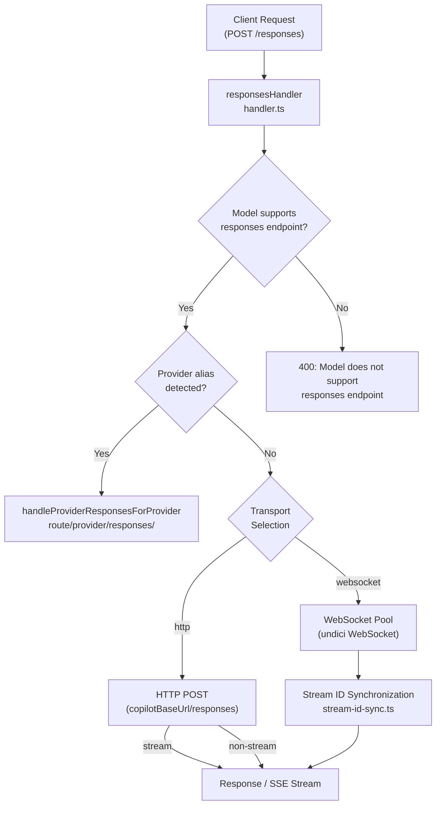
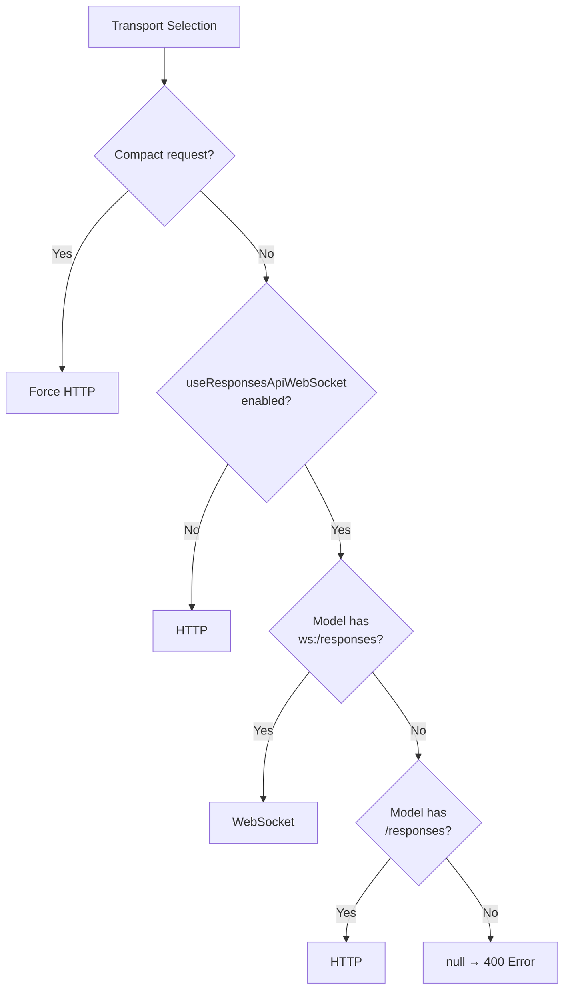
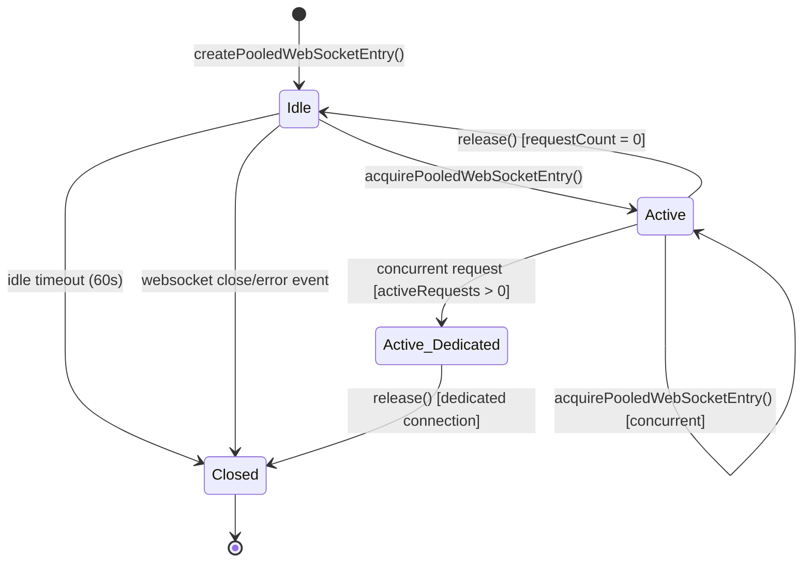
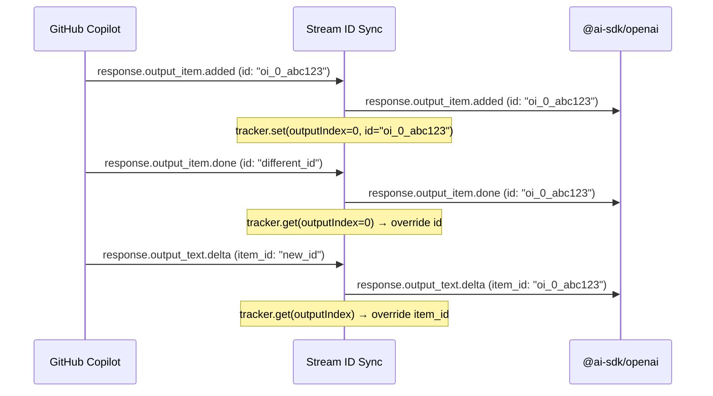

This page documents the Responses API endpoint — an OpenAI-compatible interface that supports both HTTP and WebSocket transports for streaming and non-streaming requests. It covers the dual-transport architecture, the WebSocket connection pool, stream ID synchronization, context management, payload sanitization, and Codex subagent attribution.

---

## Architecture Overview

The Responses endpoint occupies a unique position in the architecture: unlike the Chat Completions or Anthropic Messages endpoints, it offers **two transport mechanisms** — standard HTTP (with optional Server-Sent Events for streaming) and a pooled WebSocket connection that provides lower-latency streaming for supported models.



Sources: [route.ts](src/routes/responses/route#L1-L16), [handler.ts](src/routes/responses/handler#L1-L105), [utils.ts](src/routes/responses/utils#L1-L40)

---

## Endpoint Registration

The Responses route is mounted at two paths in the Hono server for backward compatibility:

| Path | Purpose |
|------|---------|
| `/responses` | Primary endpoint |
| `/v1/responses` | Compatibility with OpenAI SDK `v1/` prefix convention |

The route itself is minimal — a single `POST /` handler that delegates to `handleResponses` with error forwarding:

Sources: [server.ts](src/server.ts#L68-L71), [route.ts](src/routes/responses/route#L1-L16)

---

## Request Processing Pipeline

The handler executes a disciplined multi-stage pipeline before forwarding the request upstream. Each stage is designed to normalize the payload and ensure compatibility with GitHub Copilot's backend.

### Stage 1: Model Resolution and Provider Routing

The incoming `model` field is first resolved through the model mapping configuration. If the resolved model contains a **provider alias** (e.g., `openai/gpt-4o`), the handler immediately delegates to the provider-scoped routing system and returns. This prevents the rest of the pipeline from executing against the wrong backend.

```
Original model → resolveMappedModel() → parseProviderModelAlias()
                                              │
                                              ├── Has alias → handleProviderResponsesForProvider()
                                              └── No alias → Continue pipeline
```

Sources: [handler.ts](src/routes/responses/handler#L34-L50)

### Stage 2: Rate Limiting and Session Identification

Rate limiting is checked against global state. The handler then extracts **session identity** from the `session-id` or `x-session-id` header, which is used to generate a deterministic request ID for usage tracking. If no incoming session ID is provided, the request ID itself is used as the fallback session.

```typescript
// Deterministic request ID generation
const requestId = generateRequestIdFromPayload(
  { messages: payload.input },
  sessionId,
)
const fallbackSessionId = sessionId ?? getUUID(requestId)
```

Sources: [handler.ts](src/routes/responses/handler#L58-L75)

### Stage 3: Tool Normalization and Web Search Control

Two categories of tools are managed before forwarding:

1. **Unsupported tools** (e.g., `image_generation`) are silently stripped with debug logging
2. **Web search tools** (`type: "web_search"`) are conditionally removed based on the `useResponsesApiWebSearch` configuration flag

Sources: [handler.ts](src/routes/responses/handler#L210-L240)

### Stage 4: Transport Selection

Transport selection is a function of three factors: the model's `supported_endpoints` capability, the global WebSocket configuration flag, and the compaction state.



The transport decision is encoded in the `ResponsesTransport` type (`"http" | "websocket"`) and passed to the service layer. Compact requests always use HTTP to ensure atomic delivery of compaction payloads.

Sources: [utils.ts](src/routes/responses/utils#L44-L68), [handler.ts](src/routes/responses/handler#L105-L115)

### Stage 5: Image Sanitization and Context Management

**Image sanitization** replaces oversized base64 data-URL images with a 96×32 redacted placeholder PNG. The size threshold comes from the model's `capabilities.limits.vision.max_prompt_image_size`. This prevents upstream 413 errors from GitHub Copilot while preserving the request structure.

**Context management** injects a `context_management` array into the payload with a compaction threshold. The threshold is resolved in priority order:

| Priority | Source | Description |
|----------|--------|-------------|
| 1 | `modelResponsesApiCompactThresholds[model]` | Per-model override |
| 2 | `max_prompt_tokens × ratio` | Model's prompt token limit × configurable ratio (default 0.9) |
| 3 | `200,000 × ratio` | Global fallback |

Context management is skipped if the input already contains a terminal `compaction_trigger` item, or if the user has explicitly provided their own `context_management` array.

Sources: [utils.ts](src/routes/responses/utils#L230-L350), [handler.ts](src/routes/responses/handler#L120-L135)

---

## WebSocket Connection Pool

The WebSocket transport uses a **pooled connection architecture** that reuses connections for sequential requests and creates dedicated connections for concurrent requests.

### Pool Key Construction

Each pooled connection is identified by a composite key encoding the authentication context, model, request identity, and subagent affiliation. This ensures that different users, models, or agent contexts never share a connection.

```
poolKey = SHA256(token)[:16] | model | requestId | subagentKey
```

For Codex, the pool key additionally incorporates the base URL and a header fingerprint to prevent cross-tenant reuse.

Sources: [create-responses.ts](src/services/copilot/create-responses#L515-L540), [codex/create-responses.ts](src/services/codex/create-responses#L375-L400)

### Connection Lifecycle State Machine



### Concurrency Model

The pool implements a critical invariant: **when active requests exist for a pool key, new requests create dedicated (non-pooled) connections** rather than multiplexing over the existing socket. This prevents head-of-line blocking where a slow response on one request starves another.

The lifecycle proceeds as follows:

1. **Sequential requests**: The idle pooled connection is reused (one `WebSocket` instance, multiple `send()` calls over time)
2. **Concurrent requests**: Each concurrent request opens a fresh `WebSocket`. The original pooled connection remains open and is not closed
3. **Idle timeout**: After the last active request on a pooled connection completes, a 60-second idle timer starts. If no new request arrives, the connection is closed

Sources: [responses-websocket.ts](src/services/responses-websocket#L80-L100), [responses-websocket.ts](src/services/responses-websocket#L135-L175)

### Proxy Support

The WebSocket pool respects the standard proxy environment variables (`HTTP_PROXY`, `HTTPS_PROXY`, `NO_PROXY`). For Bun runtime, the proxy URL is resolved via `proxy-from-env` and passed to the WebSocket constructor. Node.js environments use `undici`'s built-in proxy support.

Sources: [responses-websocket.ts](src/services/responses-websocket#L290-L310)

### Error Propagation

WebSocket errors are captured and converted into SSE error events rather than thrown, ensuring the caller always receives a structured stream:

| Error Scenario | SSE Event |
|----------------|-----------|
| Connection failure | `error` event with "Failed to create responses websocket: {reason}" |
| Stream error | `error` event with "Responses websocket stream error: {reason}" |
| Missing terminal event | `error` event with "Responses websocket ended without a terminal response" |

Sources: [responses-websocket.ts](src/services/responses-websocket#L260-L290), [create-responses.ts](src/services/copilot/create-responses#L620-L655)

---

## Stream ID Synchronization

GitHub Copilot's Responses API has an inconsistency where `response.output_item.added` and `response.output_item.done` events return **different IDs** for the same output item. This breaks SDKs like `@ai-sdk/openai` that track output items by ID across the stream lifecycle.

The `fixStreamIds` function maintains a `StreamIdTracker` that records the ID from `added` events and injects it into `done` and subsequent events:



When the `added` event carries no ID, the tracker generates a synthetic one using the pattern `oi_{output_index}_{random16chars}`. This ensures every output item has a stable identity regardless of what the upstream returns.

Sources: [stream-id-sync.ts](src/routes/responses/stream-id-sync#L1-L98)

---

## WebSocket Payload Transformation

The WebSocket transport requires a different payload shape than the HTTP endpoint. The transformation is performed by `buildResponsesWebSocketPayload`:

| Field | HTTP | WebSocket |
|-------|------|-----------|
| `stream` | Client-specified | Removed (transport is inherently streaming) |
| `type` | N/A | Added: `"response.create"` |
| `initiator` | Header `x-initiator` | Embedded in payload |
| `background` | Optional | Removed |
| `service_tier` | Optional | Removed (unsupported by Copilot) |

The WebSocket endpoint URL is derived from the HTTP base URL by replacing the protocol: `https://` → `wss://`, `http://` → `ws://`, then appending `/responses`.

Sources: [create-responses.ts](src/services/copilot/create-responses#L615-L640)

---

## Codex Subagent Attribution

The handler detects Codex subagent requests through the `x-openai-subagent` header and constructs a `SubagentMarker` for downstream attribution. This marker is used to generate distinct pool keys (preventing subagent requests from reusing a parent's WebSocket connection) and to attribute usage correctly.

### Recognized Agent Types

| Header Value | Description |
|--------------|-------------|
| `collab_spawn` | Collaborative agent spawn |
| `compact` | Context compaction agent |
| `memory_consolidation` | Memory consolidation agent |
| `review` | Code review agent |

The `SubagentMarker` is constructed from a priority-ordered resolution of `thread-id`, `x-codex-parent-thread-id`, and `session-id` headers, ensuring the most specific identity is used.

Sources: [handler.ts](src/routes/responses/handler#L245-L285)

---

## Stream Event Types

The Responses API produces a rich set of stream events for streaming requests. The handler tracks terminal events for usage recording:

| Event Type | Terminal | Usage Recorded |
|------------|----------|----------------|
| `response.completed` | ✅ | Yes |
| `response.failed` | ✅ | Yes |
| `response.incomplete` | ✅ | Yes |
| `response.created` | ❌ | No |
| `response.output_text.delta` | ❌ | No |
| `response.output_text.done` | ❌ | No |
| `response.output_item.added` | ❌ | No |
| `response.output_item.done` | ❌ | No |
| `response.function_call_arguments.delta` | ❌ | No |
| `response.function_call_arguments.done` | ❌ | No |
| `response.reasoning_summary_text.delta` | ❌ | No |
| `error` | ✅ (via error transform) | No |

Sources: [create-responses.ts](src/services/copilot/create-responses#L345-L445), [handler.ts](src/routes/responses/handler#L155-L175)

---

## Configuration Reference

| Config Key | Default | Effect |
|------------|---------|--------|
| `useResponsesApiWebSocket` | `true` | Enables WebSocket transport for models that support `ws:/responses` |
| `useResponsesApiContextManagement` | `true` | Enables automatic compaction injection in `context_management` |
| `useResponsesApiWebSearch` | `true` | Allows `web_search` tool type in forwarded payloads |
| `modelResponsesApiCompactThresholds` | `{}` | Per-model compaction token thresholds |

Sources: [config.ts](src/lib/config.ts#L422-L628)

---

## Testing Strategy

The test suite covers the Responses endpoint across several dimensions:

| Test File | Focus |
|-----------|-------|
| [responses-handler.test.ts](tests/responses-handler.test.ts) | Transport selection, context management, tool sanitization, subagent headers, image sanitization, usage recording |
| [create-responses.test.ts](tests/create-responses.test.ts) | HTTP transport headers, initiator propagation, URL construction |
| [create-responses-websocket-pool.test.ts](tests/create-responses-websocket-pool.test.ts) | Pool reuse, concurrent connection isolation, idle timeout, error propagation, proxy support |
| [codex-websocket.test.ts](tests/codex-websocket.test.ts) | Codex-specific WebSocket transport, header stripping, payload normalization |
| [responses-stream-translation.test.ts](tests/responses-stream-translation.test.ts) | Responses-to-Anthropic event translation for tool calls |