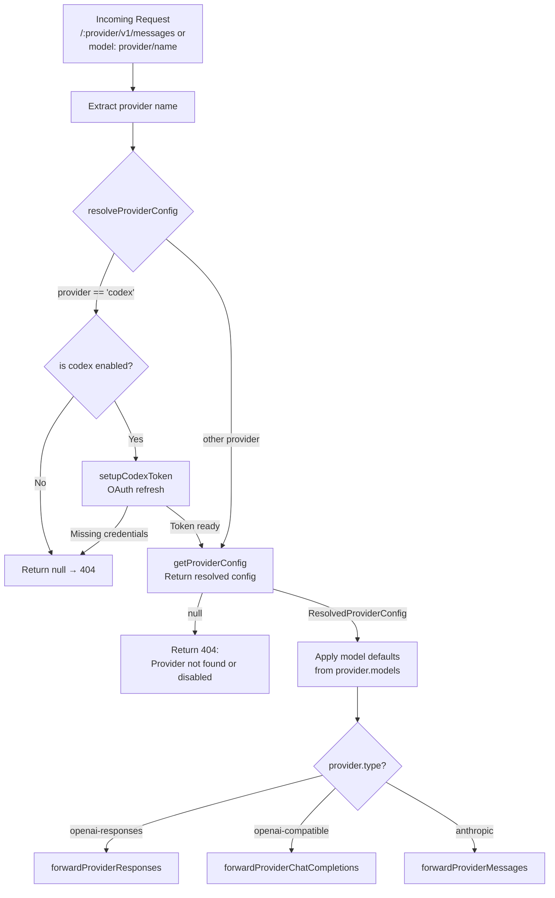

The copilot-api proxy exposes two distinct routing strategies for reaching upstream LLM providers: **default Copilot routing** (backed by GitHub Copilot's infrastructure) and **provider-scoped routing** (forwarding requests directly to third-party provider backends). This page explains the provider-scoped multi-tenant routing mechanism — how requests are identified, resolved, translated, and forwarded to named provider backends, and how usage is tracked per-tenant.

## Routing Entry Points

Provider-scoped routing is accessible through two complementary mechanisms that converge on the same handler infrastructure: **URL-path scoping** and **model-alias scoping**.

### URL-Path Scoping

The server mounts Hono sub-routes using a `:provider` path parameter under the provider namespace. When a client targets `/:provider/v1/messages`, `/:provider/v1/models`, or any provider-scoped endpoint, Hono extracts the provider name directly from the URL. Sources: [src/server.ts](src/server.ts#L85-L88)

```
/:provider/v1/messages      → Anthropic-compatible Messages API
/:provider/v1/messages/count_tokens → Token counting for provider models
/:provider/v1/models        → List models available from the provider
```

The route registration in the server maps these paths to dedicated sub-routers:

```typescript
server.route("/:provider/v1/messages", providerMessageRoutes)
server.route("/:provider/v1/models", providerModelRoutes)
```

Sources: [src/server.ts](src/server.ts#L86-L87)

### Model-Alias Scoping

An alternative to changing the URL is embedding the provider name directly in the `model` field using the `provider/model-name` syntax. This is the **model alias** approach — every top-level handler (`/v1/messages`, `/v1/chat/completions`, `/v1/responses`) parses the alias and, if present, immediately delegates to the provider-scoped handler **before** any Copilot-specific processing or rate limiting occurs. Sources: [src/routes/messages/handler.ts](src/routes/messages/handler.ts#L70-L77), [src/routes/chat-completions/handler.ts](src/routes/chat-completions/handler.ts#L38-L45), [src/routes/responses/handler.ts](src/routes/responses/handler.ts#L57-L64)

The parsing logic lives in `parseProviderModelAlias`:

```typescript
const separatorIndex = model.indexOf("/")
if (separatorIndex <= 0 || separatorIndex === model.length - 1) {
  return null
}
const provider = model.slice(0, separatorIndex).trim()
const providerModel = model.slice(separatorIndex + 1).trim()
return { model: providerModel, provider }
```

Sources: [src/lib/provider-model.ts](src/lib/provider-model.ts#L8-L26)

| Routing Approach | Example Request | Behavior |
|---|---|---|
| **URL-path** | `POST /dash/v1/messages` | Provider extracted from URL; payload model sent as-is |
| **Model-alias** | `model: "dash/qwen-plus"` | Provider extracted from model string; prefix stripped before forwarding |
| **Model mapping + alias** | `modelMappings: { "gpt-4o": "dash/qwen-plus" }` | Mapping resolves first, then alias triggers provider routing |

**Critical behavioral difference**: When provider routing activates (either path), Copilot rate limiting is **bypassed entirely**. The tests explicitly assert `expect(checkRateLimit).not.toHaveBeenCalled()` for provider-routed requests. Sources: [tests/provider-model-alias.test.ts](tests/provider-model-alias.test.ts#L148), [tests/provider-chat-completions-alias.test.ts](tests/provider-chat-completions-alias.test.ts#L136)

## Provider Configuration Schema

Providers are declared under the `providers` key in the configuration file. Each named provider entry specifies a type, connectivity details, authentication strategy, and optional per-model settings.

### Configuration Structure

```jsonc
{
  "providers": {
    "dash": {
      "type": "openai-compatible",
      "enabled": true,
      "baseUrl": "https://dashscope.example/compatible-mode",
      "apiKey": "your-api-key",
      "authType": "authorization",
      "models": {
        "qwen-plus": {
          "temperature": 0.2,
          "topP": 0.8,
          "topK": 50,
          "extraBody": { "enable_thinking": true },
          "toolContentSupportType": []
        }
      }
    },
    "my-anthropic": {
      "type": "anthropic",
      "baseUrl": "https://api.anthropic.com",
      "apiKey": "sk-ant-...",
      "authType": "x-api-key"
    }
  }
}
```

Sources: [src/lib/config.ts](src/lib/config.ts#L53-L61), [tests/provider-openai-compatible.test.ts](tests/provider-openai-compatible.test.ts#L77-L96)

### Provider Types

The system supports three upstream provider types, each determining the API format used for forwarding:

| Type Value | Upstream Protocol | Forwarding Function | Use Case |
|---|---|---|---|
| `"anthropic"` | Anthropic Messages API (`/v1/messages`) | `forwardProviderMessages` | Native Anthropic API providers |
| `"openai-compatible"` | OpenAI Chat Completions (`/v1/chat/completions`) | `forwardProviderChatCompletions` | OpenAI-compatible providers (DashScope, vLLM, etc.) |
| `"openai-responses"` | OpenAI Responses API (`/v1/responses`) | `forwardProviderResponses` | OpenAI Responses-native providers, Codex backend |

Sources: [src/lib/config.ts](src/lib/config.ts#L47-L51), [src/services/providers/provider-proxy.ts](src/services/providers/provider-proxy.ts#L82-L100)

### Authentication Types

Each provider configures its `authType` which governs the HTTP header used for upstream authentication:

| authType | Header Format | Default For |
|---|---|---|
| `"authorization"` | `Authorization: Bearer <apiKey>` | `openai-compatible`, `openai-responses` |
| `"x-api-key"` | `x-api-key: <apiKey>` | `anthropic` |
| `"oauth2"` | OAuth2 token flow | `codex` (builtin only) |

The resolution logic in `resolveProviderAuthType` applies the correct default per provider type, with a special guard that `oauth2` is restricted to the built-in `codex` provider. Sources: [src/lib/config.ts](src/lib/config.ts#L455-L494)

## Provider Resolution Pipeline

When a provider-scoped request arrives, the system resolves the provider configuration through a multi-step pipeline before forwarding.

### Resolution Flow



Sources: [src/lib/provider-resolver.ts](src/lib/provider-resolver.ts#L17-L52), [src/routes/provider/messages/handler.ts](src/routes/provider/messages/handler.ts#L100-L208)

The `resolveProviderConfig` function performs these steps:
1. Normalizes the provider name (trim whitespace)
2. Special-cases the `codex` provider with OAuth token setup
3. Delegates to `getProviderConfig` for all other providers
4. Returns a fully resolved config with name, type, baseUrl, apiKey, and authType — or `null` if the provider is disabled, missing, or misconfigured

Sources: [src/lib/provider-resolver.ts](src/lib/provider-resolver.ts#L17-L52)

### Config Validation in `getProviderConfig`

The `getProviderConfig` function validates the provider entry before returning it:

1. **Reserved name check** — the name `"copilot"` is reserved and cannot be used as a user-defined provider
2. **Enabled check** — `enabled: false` returns `null`
3. **Type validation** — only `"anthropic"`, `"openai-compatible"`, and `"openai-responses"` are accepted
4. **Required fields** — `baseUrl` is always required; `apiKey` is required unless `oauth2` auth is used for `codex`
5. **Auth type resolution** — defaults applied based on provider type

Sources: [src/lib/config.ts](src/lib/config.ts#L542-L606)

## Provider Request Forwarding

The forwarding layer constructs upstream HTTP requests with the correct headers, translates payloads where necessary, and streams responses back to the client.

### Header Construction

`buildProviderUpstreamHeaders` constructs the upstream headers based on the provider's auth type:

```typescript
if (providerConfig.authType === "x-api-key") {
  authHeaders["x-api-key"] = providerConfig.apiKey
} else {
  authHeaders.authorization = `Bearer ${providerConfig.apiKey}`
}
```

For Anthropic-type providers, additional protocol headers (`anthropic-version`, `anthropic-beta`) are forwarded from the original client request. For non-Anthropic providers, only `accept` and `user-agent` are forwarded. Sources: [src/services/providers/provider-proxy.ts](src/services/providers/provider-proxy.ts#L27-L63)

### Per-Model Configuration Application

Before forwarding, the provider handler applies model-specific settings from the `providerConfig.models` map. For OpenAI-compatible providers, this includes `temperature`, `topP`, `topK`, `extraBody` fields, and stream options. Client-provided values take precedence over provider defaults — only missing fields are filled. Sources: [src/routes/provider/chat-completions/handler.ts](src/routes/provider/chat-completions/handler.ts#L101-L130)

### Response Handling

The system distinguishes between streaming and non-streaming responses:

| Response Mode | Detection | Behavior |
|---|---|---|
| **Non-streaming** | `content-type: application/json` | Full JSON body parsed, usage recorded, proxied to client |
| **Streaming (SSE)** | `content-type: text/event-stream` + `payload.stream: true` | Events forwarded via Hono's `streamSSE`, usage accumulated from final chunk |

The `createProviderProxyResponse` function strips hop-by-hop headers (`connection`, `content-encoding`, `keep-alive`, `transfer-encoding`, etc.) from upstream responses before forwarding. Sources: [src/services/providers/provider-proxy.ts](src/services/providers/provider-proxy.ts#L14-L26), [src/services/providers/provider-proxy.ts](src/services/providers/provider-proxy.ts#L65-L80)

## Endpoint-Specific Routing Details

Each API endpoint has its own provider-scoped handler with specific behaviors.

### Messages Endpoint (`/:provider/v1/messages`)

The Messages handler is the most complex, with provider-type-aware routing:

- **Anthropic providers** — forwards the payload directly to `{baseUrl}/v1/messages`
- **OpenAI-compatible providers** — translates Anthropic payload to OpenAI Chat Completions format, forwards to `{baseUrl}/v1/chat/completions`, translates the response back to Anthropic format
- **OpenAI Responses providers** — translates to Responses API format, forwards, translates back

Web search server tools are handled specially for `openai-responses` providers — stripped if mixed with other tools, or routed through a dedicated web search flow. Sources: [src/routes/provider/messages/handler.ts](src/routes/provider/messages/handler.ts#L129-L208)

### Chat Completions Endpoint (`/:provider/v1/chat/completions`)

Only `openai-compatible` providers support this endpoint. If a different provider type is used, the handler returns a `400 Bad Request`:

```typescript
if (providerConfig.type !== "openai-compatible") {
  return c.json({
    error: {
      message: `Provider '${provider}' does not support the /v1/chat/completions endpoint`,
      type: "invalid_request_error",
    },
  }, 400)
}
```

Sources: [src/routes/provider/chat-completions/handler.ts](src/routes/provider/chat-completions/handler.ts#L36-L46)

### Responses Endpoint (`/:provider/v1/responses`)

Only `openai-responses` providers support this endpoint. The handler applies Responses API context management and compaction before forwarding. Sources: [src/routes/provider/responses/handler.ts](src/routes/provider/responses/handler.ts#L49-L59)

### Models Endpoint (`/:provider/v1/models`)

Lists available models from the provider. For `codex`, models come from the local Codex model cache. For all other providers, the request is proxied upstream. Sources: [src/routes/provider/models/route.ts](src/routes/provider/models/route.ts#L16-L60)

### Token Counting (`/:provider/v1/messages/count_tokens`)

Provider-scoped token counting uses a local OpenAI-compatible tokenizer with a fallback model configuration. The Anthropic payload is translated to OpenAI format for counting, regardless of the provider type. Sources: [src/routes/provider/messages/count-tokens-handler.ts](src/routes/provider/messages/count-tokens-handler.ts#L21-L73)

## Endpoint–Provider Type Compatibility Matrix

Not every endpoint supports every provider type. The following table shows the complete compatibility matrix:

| Endpoint | `anthropic` | `openai-compatible` | `openai-responses` |
|---|---|---|---|
| `/:provider/v1/messages` | ✅ Direct forward | ✅ With translation | ✅ With translation |
| `/:provider/v1/messages/count_tokens` | ✅ Local tokenizer | ✅ Local tokenizer | ✅ Local tokenizer |
| `/:provider/v1/chat/completions` | ❌ 400 error | ✅ Direct forward | ❌ 400 error |
| `/:provider/v1/responses` | ❌ N/A | ❌ N/A | ✅ Direct forward |
| `/:provider/v1/models` | ✅ Proxied | ✅ Proxied | ✅ Proxied |

Sources: [src/routes/provider/chat-completions/handler.ts](src/routes/provider/chat-completions/handler.ts#L36-L46), [src/routes/provider/responses/handler.ts](src/routes/provider/responses/handler.ts#L49-L59)

## Token Usage Tracking

Provider-scoped requests are tracked separately from Copilot-native requests. The usage recorder uses `source: "provider"` and records the `providerName` as the tenant identifier. The `user_id` field in usage records is set to the provider name rather than the GitHub username. Sources: [src/lib/token-usage/index.ts](src/lib/token-usage/index.ts#L92-L97), [src/lib/token-usage/index.ts](src/lib/token-usage/index.ts#L161-L168)

```typescript
function resolveUserId(input: TokenUsageEventInput): string {
  if (input.source === "provider") {
    return input.providerName?.trim() || ""
  }
  return state.userName?.trim() || ""
}
```

Each provider-scoped handler creates its own usage recorder with the correct endpoint type:

| Provider Endpoint | Token Usage Endpoint Label |
|---|---|
| `/:provider/v1/messages` | `"messages"` |
| `/:provider/v1/messages/count_tokens` | `"count_tokens"` |
| `/:provider/v1/chat/completions` | `"chat_completions"` |
| `/:provider/v1/responses` | `"responses"` |

Sources: [src/lib/token-usage/index.ts](src/lib/token-usage/index.ts#L14-L16), [src/routes/provider/responses/handler.ts](src/routes/provider/responses/handler.ts#L130-L143)

## Key Architectural Characteristics

**Rate limiting bypass** — Provider-routed requests bypass the Copilot rate limiter (`checkRateLimit`) entirely. This is by design: the upstream providers manage their own throttling. The alias detection occurs before rate limit checks in every top-level handler. Sources: [src/routes/messages/handler.ts](src/routes/messages/handler.ts#L70-L83), [tests/provider-model-alias.test.ts](tests/provider-model-alias.test.ts#L148)

**Reserved provider name** — The name `"copilot"` is reserved and cannot be used in `config.providers`. Attempts to register it are rejected by `isReservedProviderName`. Sources: [src/lib/config.ts](src/lib/config.ts#L614-L616)

**Codex provider special casing** — The built-in `codex` provider receives special treatment: OAuth token refresh, model listing from local cache, and optional `oauth2` auth type. User-defined providers cannot use `oauth2`. Sources: [src/lib/provider-resolver.ts](src/lib/provider-resolver.ts#L25-L49), [src/lib/config.ts](src/lib/config.ts#L475-L484)

**Model mapping precedence** — Model mappings (`modelMappings`) are resolved **before** provider alias parsing. This means a mapped model can resolve to a `provider/model` string, which then triggers provider routing. Sources: [src/routes/messages/handler.ts](src/routes/messages/handler.ts#L56-L57), [src/routes/messages/handler.ts](src/routes/messages/handler.ts#L70-L77)

## Next Steps

- Learn how authentication middleware determines request authorization in [Authentication and Authorization Middleware](7-authentication-and-authorization-middleware)
- Understand the built-in Copilot token lifecycle in [GitHub Copilot Authentication and Token Lifecycle](13-github-copilot-authentication-and-token-lifecycle)
- Explore the Codex OAuth provider integration in [Codex OAuth Provider Integration](14-codex-oauth-provider-integration)
- Read about third-party provider configuration details in [Third-Party Provider Configuration and Proxying](15-third-party-provider-configuration-and-proxying)
- See how model resolution, aliasing, and normalization interact with provider routing in [Model Resolution, Aliasing, and Normalization](16-model-resolution-aliasing-and-normalization)