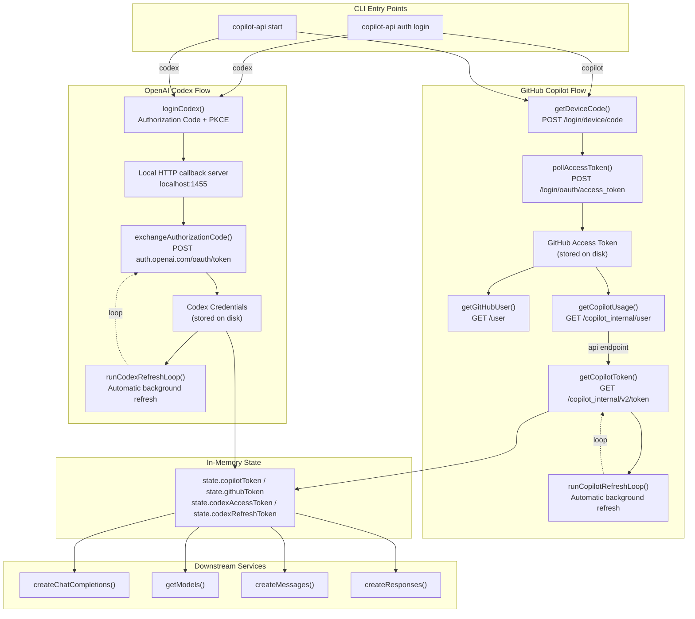
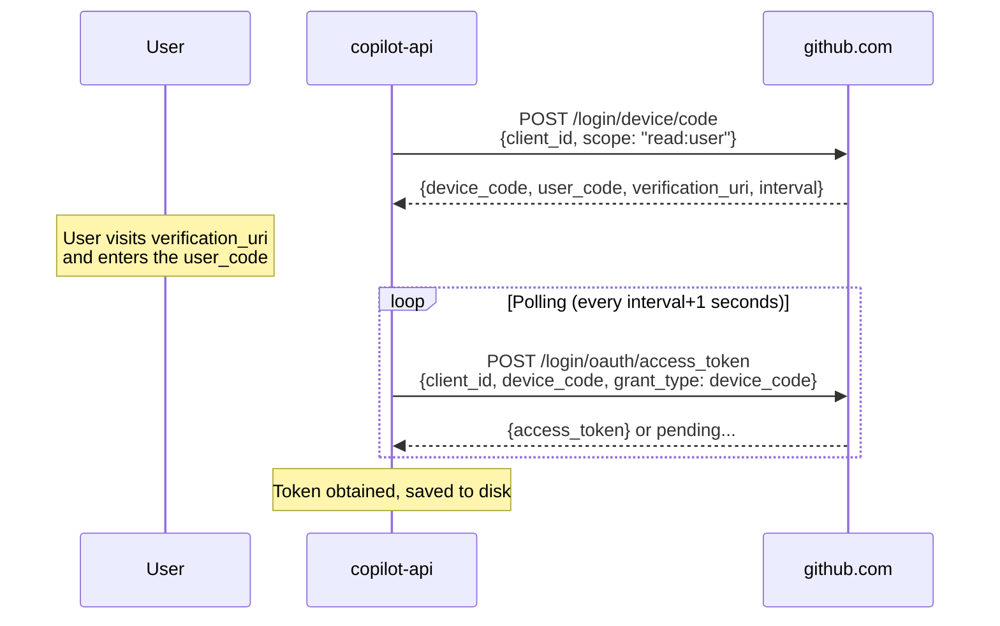
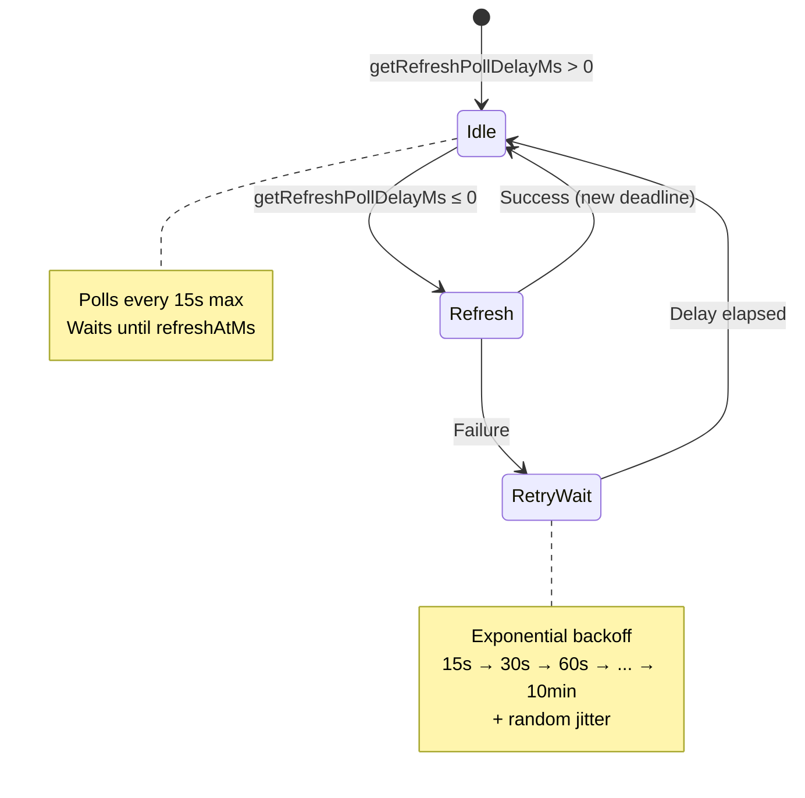
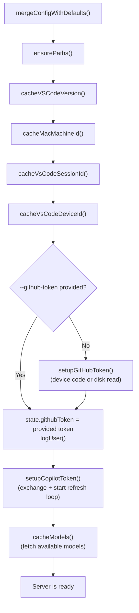

This page explains how the copilot-api server authenticates with GitHub to obtain, use, and automatically refresh Copilot session tokens. Understanding this lifecycle is essential for debugging authentication failures, extending the token flow, or integrating with enterprise GitHub deployments.

The system supports **two distinct authentication strategies** — one for GitHub Copilot (the default) and one for OpenAI Codex — each with its own token hierarchy, storage mechanism, and refresh loop. Both converge on a common in-memory state object that downstream services consume when constructing API requests to upstream Copilot endpoints.

## Authentication Architecture Overview

The following diagram illustrates the complete token acquisition pipeline for both built-in providers, from initial user interaction through to authenticated API calls:



Sources: [src/auth.ts](src/auth.ts#L1-L173), [src/lib/token.ts](src/lib/token.ts#L1-L344), [src/start.ts](src/start.ts#L37-L158)

## The In-Memory State Object

All authentication artifacts live in a singleton `State` object exported from `src/lib/state.ts`. This object serves as the single source of truth for tokens and identity during the server's lifetime. No token is ever read from disk during request handling — they are loaded into state at startup and kept current by background refresh loops.

The state holds two independent credential domains:

| Field | Purpose | Provider |
|---|---|---|
| `githubToken` | GitHub personal OAuth token (device code flow) | Copilot |
| `copilotToken` | Short-lived Copilot session token (refreshed periodically) | Copilot |
| `userName` | GitHub login name (displayed at startup) | Both |
| `codexAccessToken` | OpenAI Codex OAuth access token | Codex |
| `codexRefreshToken` | Codex refresh token (used to obtain new access tokens) | Codex |
| `codexExpiresAt` | Epoch-millisecond expiry timestamp for the Codex access token | Codex |
| `codexAccountId` | ChatGPT account ID extracted from the Codex JWT | Codex |
| `copilotApiUrl` | API base URL dynamically resolved from Copilot usage endpoint | Copilot |
| `tokenBasedBilling` | Whether the account uses token-based billing | Copilot |
| `accountType` | `"individual"`, `"business"`, or `"enterprise"` | Copilot |
| `vsCodeDeviceId` | Persistent cross-platform device identifier | Both |
| `macMachineId` | SHA-256 hash of the first valid MAC address | Copilot |
| `vsCodeSessionId` | Ephemeral session ID (regenerated every ~60–80 minutes) | Copilot |

Sources: [src/lib/state.ts](src/lib/state.ts#L1-L43)

## GitHub Copilot Device Code Flow

The Copilot authentication follows the [OAuth 2.0 Device Authorization Grant](https://datatracker.ietf.org/doc/html/rfc8628). This flow is designed for devices without a browser — the user completes authentication on a separate device using a short code.

### Step 1: Device Code Request

When no saved GitHub token exists (or the user passes `--force`), `setupGitHubToken()` initiates the device code flow by calling `getDeviceCode()`. This sends a `POST` request to `https://github.com/login/device/code` with the OAuth app's `client_id` and requested scopes.

The response contains:

- `device_code` — the code the server will use when polling
- `user_code` — the short code displayed to the user
- `verification_uri` — the URL the user must visit
- `interval` — minimum seconds between polling attempts
- `expires_in` — lifetime of the device code



The `client_id` and scopes are determined by the `getOauthAppConfig()` function. Two OAuth applications are supported: the default GitHub Copilot app (`Iv1.b507a08c87ecfe98`) and the OpenCode app (`Ov23li8tweQw6odWQebz`), selectable via the `COPILOT_API_OAUTH_APP` environment variable. Both use the `read:user` scope.

Sources: [src/services/github/get-device-code.ts](src/services/github/get-device-code.ts#L1-L29), [src/lib/api-config.ts](src/lib/api-config.ts#L83-L97), [src/lib/api-config.ts](src/lib/api-config.ts#L428-L430)

### Step 2: Token Polling

`pollAccessToken()` enters an infinite polling loop, sending `POST` requests to `https://github.com/login/oauth/access_token` at intervals defined by the device code response (plus a 1-second safety margin). It uses the `urn:ietf:params:oauth:grant-type:device_code` grant type.

The loop continues until either:
- An `access_token` is returned (success)
- The user manually interrupts the process

Sources: [src/services/github/poll-access-token.ts](src/services/github/poll-access-token.ts#L1-L55)

### Step 3: Token Persistence

Once obtained, the GitHub token is written to disk via the credential store. The file path is determined by the `PATHS.GITHUB_TOKEN_PATH` constant, which resolves to `~/.local/share/copilot-api/github_token` by default. Files are written with `chmod 0o600` permissions to restrict access to the owning user.

For enterprise deployments (when `COPILOT_API_ENTERPRISE_URL` is set), the path becomes `~/.local/share/copilot-api/ent_github_token`. The `COPILOT_API_OAUTH_APP` environment variable further namespaces the path (e.g., `~/.local/share/copilot-api/opencode/github_token`).

Sources: [src/lib/credential-store.ts](src/lib/credential-store.ts#L61-L69), [src/lib/paths.ts](src/lib/paths.ts#L1-L40)

### Step 4: Identity Resolution

After the GitHub token is obtained (or read from disk), two API calls resolve the user's identity and Copilot endpoint:

1. **`getGitHubUser()`** — calls `GET /user` with the GitHub token to retrieve the login name, stored in `state.userName`.
2. **`getCopilotUsage()`** — calls `GET /copilot_internal/user` to retrieve the Copilot plan details, including the API endpoint URL (`state.copilotApiUrl`) and billing mode (`state.tokenBasedBilling`).

The Copilot API base URL is dynamically selected based on account type: `https://api.githubcopilot.com` for individual accounts, `https://api.{type}.githubcopilot.com` for business/enterprise, or a custom enterprise URL if configured.

Sources: [src/lib/token.ts](src/lib/token.ts#L335-L343), [src/lib/api-config.ts](src/lib/api-config.ts#L159-L176), [src/services/github/get-user.ts](src/services/github/get-user.ts#L1-L25)

### Step 5: Copilot Token Acquisition

The GitHub access token is **not** used directly for Copilot API calls. Instead, `getCopilotToken()` exchanges it for a short-lived Copilot session token by calling `GET /copilot_internal/v2/token` on the GitHub API. The response includes:

- `token` — the actual Copilot session token used in `Authorization: Bearer` headers
- `refresh_in` — seconds until the token expires
- `expires_at` — absolute expiry timestamp

This token is stored in `state.copilotToken` and used by all downstream services (`createChatCompletions`, `getModels`, `createMessages`, etc.) when constructing `Authorization: Bearer {copilotToken}` headers.

Sources: [src/services/github/get-copilot-token.ts](src/services/github/get-copilot-token.ts#L1-L31), [src/lib/token.ts](src/lib/token.ts#L100-L138)

## Automatic Token Refresh Loops

Both provider tokens are automatically refreshed in the background using abortable async loops. This is critical for long-running server processes where tokens would otherwise expire mid-session.

### Copilot Token Refresh Loop

The Copilot refresh loop is started immediately after the initial token acquisition. It uses a deadline-based polling strategy rather than a fixed-interval timer:

```typescript
const EARLY_REFRESH_BUFFER_MS = 60_000   // Refresh 60s before expiry
const REFRESH_POLL_INTERVAL_MS = 15_000  // Max poll interval while waiting
const RETRY_REFRESH_DELAY_MS = 15_000    // Initial retry delay on failure
const MAX_RETRY_REFRESH_DELAY_MS = 600_000 // Max retry delay (10 minutes)
const RETRY_REFRESH_JITTER_MS = 15_000   // Random jitter on retries
const MIN_REFRESH_DELAY_MS = 1_000       // Minimum refresh delay
```

The loop calculates a refresh deadline from the `refresh_in` value returned by the Copilot API, minus a 60-second early refresh buffer. It then polls at short intervals (capped at 15 seconds) until the deadline is reached, at which point it calls `getCopilotToken()` again.

On failure, the loop applies **exponential backoff with jitter**: the retry delay doubles on each failure (starting at 15 seconds, capped at 10 minutes), plus a random 0–15 second jitter. This prevents thundering-herd effects if the upstream service is temporarily unavailable.



The loop is controlled by an `AbortController`. A new loop call always calls `stopCopilotRefreshLoop()` first to abort any previous loop, preventing duplicate refresh loops after re-authentication.

Sources: [src/lib/token.ts](src/lib/token.ts#L183-L242), [tests/token-refresh.test.ts](tests/token-refresh.test.ts#L1-L34)

### Codex Token Refresh Loop

The Codex refresh loop follows a similar pattern but operates on `state.codexExpiresAt` and `state.codexRefreshToken`. Before starting the loop, it checks whether the loaded credentials are already expired — if so, it performs an immediate refresh via `refreshCodexCredentials()` before entering the background loop.

The Codex refresh calls `refreshAccessToken()` which sends a `POST` to `https://auth.openai.com/oauth/token` with the `grant_type=refresh_token`. On success, it persists the new credentials to disk and updates the in-memory state.

Sources: [src/lib/token.ts](src/lib/token.ts#L244-L286), [src/lib/oauth/codex.ts](src/lib/oauth/codex.ts#L256-L299)

## Credential Storage and Security

Credentials are stored as plain files on disk, protected by filesystem permissions. The credential store module handles all read/write operations.

| Credential | File Path | Format | Permissions |
|---|---|---|---|
| GitHub Token | `~/.local/share/copilot-api/github_token` | Raw string (trimmed) | `0o600` |
| Codex Credentials | `~/.local/share/copilot-api/codex_credentials.json` | JSON (`CodexCredentials` object) | `0o600` |
| Server Config | `~/.local/share/copilot-api/config.json` | JSON (`AppConfig` object) | `0o600` |

The `writeProtectedFile()` function creates the parent directory recursively, writes the content, and then attempts `chmod 0o600`. If `chmod` fails (e.g., on some CI environments), it silently continues — the write still succeeds but without restricted permissions.

The Codex credential JSON has this shape:

```json
{
  "accessToken": "eyJhbG...",
  "refreshToken": "eyJ...",
  "expiresAt": 1720000000000,
  "accountId": "account_abc123"
}
```

The `accountId` is extracted by decoding the JWT payload and reading the `https://api.openai.com/auth.chatgpt_account_id` claim.

Sources: [src/lib/credential-store.ts](src/lib/credential-store.ts#L1-L115), [src/lib/oauth/codex.ts](src/lib/oauth/codex.ts#L109-L137)

## How Tokens Flow into API Requests

Once tokens are loaded into state, they are injected into upstream API requests through the header construction functions in `api-config.ts`. Each downstream service selects the appropriate header builder.

### Header Construction by Token Type

| Token | Header Function | Auth Header Format |
|---|---|---|
| GitHub Token (for GitHub API) | `githubHeaders()` | `authorization: token {githubToken}` |
| GitHub Token (for OpenCode) | `githubHeaders()` | `Authorization: Bearer {githubToken}` |
| Copilot Token (for LLM API) | `copilotHeaders()` | `Authorization: Bearer {copilotToken}` |
| Copilot Token (for models) | `copilotModelsHeaders()` | `Authorization: Bearer {copilotToken}` |
| Codex Token (for LLM API) | via provider proxy | `Authorization: Bearer {codexAccessToken}` |

The standard Copilot headers include extensive metadata that mimics a VS Code Copilot extension:

- `copilot-integration-id: vscode-chat`
- `editor-device-id` — the persistent VSCode device ID
- `editor-version: vscode/{version}`
- `editor-plugin-version: copilot-chat/0.52.0`
- `user-agent: GitHubCopilotChat/0.52.0`
- `x-github-api-version: 2026-06-01`
- `x-request-id` / `x-agent-task-id` — unique per request
- `x-interaction-type` — context-specific (e.g., `conversation-agent`, `model-access`, `messages-proxy`)

For the OpenCode OAuth app variant (`COPILOT_API_OAUTH_APP=opencode`), a simplified header set is used with `Authorization: Bearer` and an OpenCode-specific User-Agent.

Sources: [src/lib/api-config.ts](src/lib/api-config.ts#L131-L409), [src/services/copilot/create-chat-completions.ts](src/services/copilot/create-chat-completions.ts#L1-L82)

## Device Identity for Copilot Requests

Copilot requires several device identity fields to be included in API requests. These are computed once at startup and cached in the state object.

The **VSCode device ID** is a UUID persisted across restarts. On macOS, it's stored at `~/Library/Application Support/Microsoft/DeveloperTools/deviceid`; on Linux, at `$XDG_CACHE_HOME/Microsoft/DeveloperTools/deviceid`; and on Windows, in the Windows Registry under `HKCU\SOFTWARE\Microsoft\DeveloperTools\deviceid`. If no stored ID exists, a new UUID is generated and persisted.

The **machine ID** is a SHA-256 hash of the first valid (non-placeholder) MAC address from the system's network interfaces. If no valid MAC address is found, a random UUID is used instead.

The **session ID** is generated fresh at startup and regenerated every 60–80 minutes (with random jitter). This rotation prevents session fingerprinting over long-running server processes.

Sources: [src/lib/deviceid.ts](src/lib/deviceid.ts#L1-L270), [src/lib/utils.ts](src/lib/utils.ts#L89-L160)

## Server Startup Token Initialization

When `copilot-api start` runs, the `runServer()` function orchestrates the complete token initialization sequence:



If the `--github-token` CLI flag is provided, the server skips the device code flow entirely and uses the supplied token directly. This enables headless deployment scenarios where the token is obtained externally and passed in.

Sources: [src/start.ts](src/start.ts#L37-L158)

## The `/token` Endpoint

The server exposes a `GET /token` endpoint that returns the current Copilot token from in-memory state. This is useful for debugging or for external tools that need the token directly. The endpoint is protected by the same API key middleware as all other routes.

Sources: [src/routes/token/route.ts](src/routes/token/route.ts#L1-L17), [src/server.ts](src/server.ts#L73)

## The OpenCode OAuth App Variant

When the `COPILOT_API_OAUTH_APP=opencode` environment variable is set, the system uses a different OAuth client ID (`Ov23li8tweQw6odWQebz`) and simplified header construction for all GitHub API calls. In this mode, `setupCopilotToken()` takes a shortcut: it directly uses the GitHub token as the Copilot token (`state.copilotToken = state.githubToken`) instead of exchanging it via the `/copilot_internal/v2/token` endpoint. The refresh loop is skipped entirely in this mode.

This variant is used by the OpenCode integration, which has its own token exchange path managed externally.

Sources: [src/lib/api-config.ts](src/lib/api-config.ts#L10-L12), [src/lib/token.ts](src/lib/token.ts#L100-L113)

## Enterprise GitHub Support

When `COPILOT_API_ENTERPRISE_URL` is set, all GitHub API calls are redirected to the enterprise domain:

- `github.com` → `{enterprise_domain}`
- `api.github.com` → `api.{enterprise_domain}`
- `api.githubcopilot.com` → `copilot-api.{enterprise_domain}`

The GitHub token file is prefixed with `ent_` to isolate enterprise credentials from standard ones.

Sources: [src/lib/api-config.ts](src/lib/api-config.ts#L21-L36), [src/lib/paths.ts](src/lib/paths.ts#L5-L16)

## The Codex OAuth Authorization Code Flow

The Codex provider uses a full OAuth 2.0 Authorization Code flow with PKCE (Proof Key for Code Exchange) instead of the device code flow. This flow runs a temporary local HTTP server on `localhost:1455` to capture the authorization callback.

The flow proceeds as follows:
1. A PKCE verifier and challenge are generated using SHA-256.
2. An authorization URL is constructed pointing to `https://auth.openai.com/oauth/authorize` with the PKCE challenge, a random state parameter, and OpenAI-specific parameters (`codex_cli_simplified_flow`, `id_token_add_organizations`).
3. A local HTTP server listens on port 1455 for the redirect callback.
4. The user opens the authorization URL in a browser, authenticates, and is redirected back with an authorization code.
5. If the local server doesn't receive the callback (e.g., no default browser), the user can paste the URL or code manually.
6. The authorization code is exchanged for access and refresh tokens via `POST https://auth.openai.com/oauth/token`.
7. The `account_id` is extracted from the JWT's `https://api.openai.com/auth.chatgpt_account_id` claim.
8. Credentials are persisted to disk and the Codex provider config is auto-written to `config.json`.

Sources: [src/lib/oauth/codex.ts](src/lib/oauth/codex.ts#L1-L465)

## Error Handling and Retry Behavior

Token-related errors are handled differently depending on the phase:

| Phase | Error Behavior |
|---|---|
| Device code request failure | `HTTPError` thrown, logged, re-thrown to CLI |
| Polling failure (non-200) | Silently retries after sleep duration |
| Copilot token exchange failure | `HTTPError` thrown, logged with response body |
| Background refresh failure | Logged as warning, exponential backoff retry |
| Codex token exchange failure | `TypeError` thrown with response details |
| Credential file read failure | `ENOENT` → returns `null`; other errors re-thrown |
| Credential file write failure | Silently ignored (with `chmod` failure also ignored) |

The background refresh loops are designed to be resilient: they never crash the server. Failures result in the old token remaining in state until the next successful refresh. Exponential backoff ensures the server doesn't overwhelm a degraded upstream service.

Sources: [src/lib/token.ts](src/lib/token.ts#L204-L286), [src/lib/credential-store.ts](src/lib/credential-store.ts#L12-L21), [src/lib/error.ts](src/lib/error.ts#L1-L60)

## Next Steps

- For understanding how the server protects its own endpoints from unauthorized access, see [Authentication and Authorization Middleware](7-authentication-and-authorization-middleware).
- For the Codex OAuth provider in more detail, see [Codex OAuth Provider Integration](14-codex-oauth-provider-integration).
- For how third-party providers bypass the Copilot auth entirely, see [Third-Party Provider Configuration and Proxying](15-third-party-provider-configuration-and-proxying).
- For the server startup sequence that triggers token initialization, see [Server Initialization and HTTP Framework](6-server-initialization-and-http-framework).