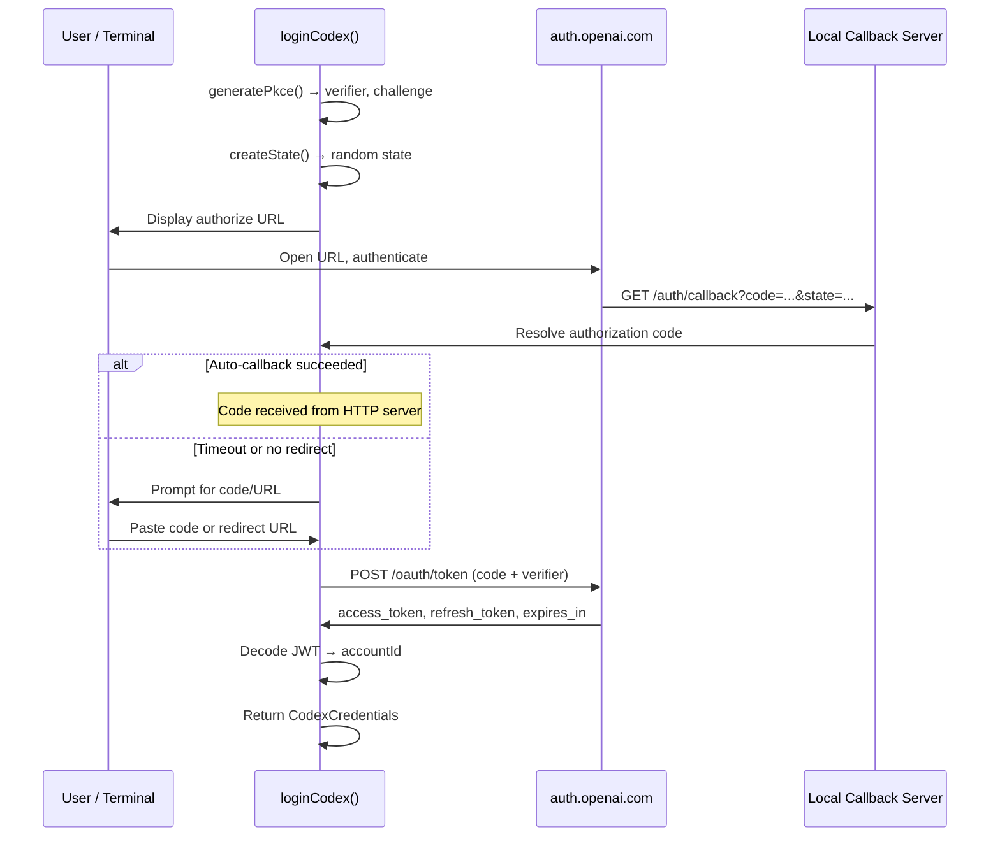
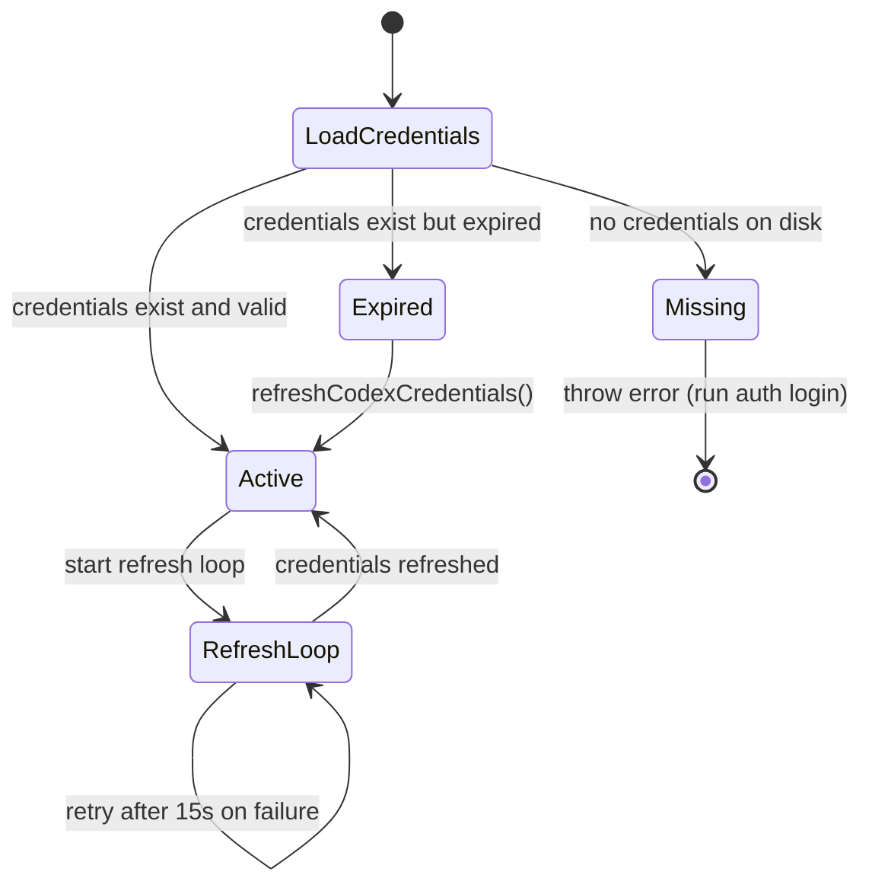
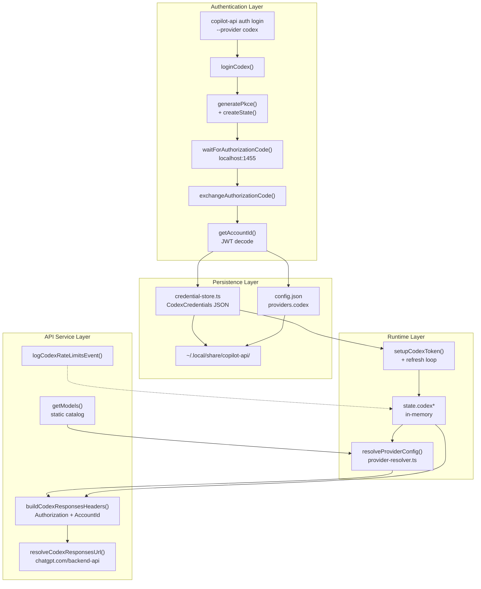

The Codex OAuth Provider Integration enables copilot-api to authenticate with OpenAI's Codex backend using a standard OAuth 2.0 Authorization Code flow with PKCE (Proof Key for Code Exchange). Unlike the GitHub Copilot provider which relies on device code authentication through GitHub, Codex uses OpenAI's own identity platform (`auth.openai.com`) to obtain bearer tokens that grant access to the ChatGPT backend API. This page covers the full lifecycle: authorization, token exchange, persistent storage, automatic refresh, and integration into the provider routing pipeline.

## OAuth 2.0 Authorization Flow with PKCE

The Codex OAuth implementation follows the authorization code grant with PKCE — the same security pattern recommended by OAuth 2.1 for public clients. The flow is orchestrated by the [`loginCodex()`](src/lib/oauth/codex.ts#L401-L440) function, which coordinates every stage from URL generation through credential extraction.

The process begins with [`createAuthorizationFlow()`](src/lib/oauth/codex.ts#L301-L321), which generates a cryptographic PKCE verifier/challenge pair and constructs an authorization URL. The verifier is a 32-byte random value base64url-encoded; the challenge is its SHA-256 hash, also base64url-encoded. This ensures the authorization code can only be exchanged by the client that initiated the flow, even without a client secret.



The authorization URL includes several Codex-specific parameters beyond the standard OAuth fields:

| Parameter | Value | Purpose |
|---|---|---|
| `response_type` | `code` | Authorization code grant |
| `client_id` | `app_EMoamEEZ73f0CkXaXp7hrann` | Copilot-api's registered OAuth client |
| `redirect_uri` | `http://localhost:1455/auth/callback` | Local callback endpoint |
| `scope` | `openid profile email offline_access` | Identity + refresh token |
| `code_challenge_method` | `S256` | SHA-256 PKCE challenge |
| `id_token_add_organizations` | `true` | Include organization claims in JWT |
| `codex_cli_simplified_flow` | `true` | Simplified CLI auth experience |
| `originator` | `copilot-api` | Identifies the calling application |

Sources: [src/lib/oauth/codex.ts](src/lib/oauth/codex.ts#L6-L16), [src/lib/oauth/codex.ts](src/lib/oauth/codex.ts#L52-L68), [src/lib/oauth/codex.ts](src/lib/oauth/codex.ts#L301-L321)

## Local Callback Server and Fallback Prompt

Because the OAuth redirect targets `localhost:1455`, the login flow spins up a temporary HTTP server to catch the redirect. The [`waitForAuthorizationCode()`](src/lib/oauth/codex.ts#L323-L399) function creates a bare `node:http` server bound to `127.0.0.1:1455` that validates the incoming callback — checking the `state` parameter for CSRF protection and extracting the authorization code.

This server has a strict **45-second timeout** (`CALLBACK_TIMEOUT_MS`). If the browser does not redirect (for example, on headless systems or when the user copies the URL manually), the timeout fires and the flow falls back to a **manual prompt** — the user pastes either the full redirect URL or the raw authorization code. The [`parseAuthorizationInput()`](src/lib/oauth/codex.ts#L74-L107) function handles three input formats:

1. **Full URL** — parsed via `new URL()`, extracting `code` and `state` query parameters
2. **Fragment format** — `code#state` separated by `#`
3. **Query string** — `code=...&state=...` parsed as URLSearchParams
4. **Raw code** — used directly if no recognized structure is found

The callback server renders styled HTML success or error pages via [`renderOAuthPage()`](src/lib/oauth/codex.ts#L139-L181) and cleans itself up in a `finally` block, ensuring the port is released regardless of outcome.

Sources: [src/lib/oauth/codex.ts](src/lib/oauth/codex.ts#L323-L399), [src/lib/oauth/codex.ts](src/lib/oauth/codex.ts#L74-L107), [src/lib/oauth/codex.ts](src/lib/oauth/codex.ts#L139-L191)

## Token Exchange and Account ID Extraction

Once the authorization code is obtained, [`exchangeAuthorizationCode()`](src/lib/oauth/codex.ts#L208-L254) POSTs to `https://auth.openai.com/oauth/token` with the code, PKCE verifier, client ID, and redirect URI. The response yields three critical fields:

- **`access_token`** — short-lived bearer token for API calls
- **`refresh_token`** — long-lived token for obtaining new access tokens
- **`expires_in`** — seconds until the access token expires, converted to an absolute epoch timestamp

After exchange, [`getAccountId()`](src/lib/oauth/codex.ts#L123-L137) decodes the JWT access token (without cryptographic verification — the token is used locally) and extracts the `chatgpt_account_id` claim from the custom `https://api.openai.com/auth` namespace. This account ID is essential for downstream API calls, as the ChatGPT backend requires it in the `chatgpt-account-id` header.

The [`CodexCredentials`](src/lib/oauth/codex.ts#L30-L35) interface captures the complete credential set:

```typescript
interface CodexCredentials {
  accessToken: string
  refreshToken: string
  expiresAt: number    // absolute epoch milliseconds
  accountId: string    // extracted from JWT claim
}
```

Sources: [src/lib/oauth/codex.ts](src/lib/oauth/codex.ts#L208-L254), [src/lib/oauth/codex.ts](src/lib/oauth/codex.ts#L109-L137), [src/lib/oauth/codex.ts](src/lib/oauth/codex.ts#L30-L35)

## Credential Persistence and File-Based Storage

Codex credentials are persisted to disk at `~/.local/share/copilot-api/codex_credentials.json` (configurable via `COPILOT_API_HOME`). The [`credential-store.ts`](src/lib/credential-store.ts) module handles all file I/O with protection:

- **File permissions**: Written with `chmod 0o600` (owner read/write only)
- **Validation on read**: [`normalizeCodexCredentials()`](src/lib/credential-store.ts#L36-L59) validates that all four required fields (`accessToken`, `refreshToken`, `expiresAt`, `accountId`) are present and have correct types
- **Error handling**: Corrupt JSON throws a descriptive error with the file path; missing fields produce a clear diagnostic

| Operation | Function | Behavior |
|---|---|---|
| Read | [`readCodexCredentials()`](src/lib/credential-store.ts#L71-L97) | Parse JSON, validate shape, return typed object or `null` |
| Write | [`writeCodexCredentials()`](src/lib/credential-store.ts#L99-L106) | Serialize to pretty-printed JSON, write with restricted permissions |
| Clear | [`clearCodexCredentials()`](src/lib/credential-store.ts#L108-L110) | Write empty string to credential file |
| Check | [`hasCodexCredentials()`](src/lib/credential-store.ts#L112-L114) | Returns boolean for credential existence |

The credential path is defined in [`paths.ts`](src/lib/paths.ts#L16) as a fixed filename under the application data directory, independent of any OAuth app or enterprise URL prefix (unlike the GitHub token path which incorporates those).

Sources: [src/lib/credential-store.ts](src/lib/credential-store.ts#L71-L114), [src/lib/credential-store.ts](src/lib/credential-store.ts#L36-L59), [src/lib/paths.ts](src/lib/paths.ts#L16)

## Token Refresh Loop and Expiration Handling

Codex access tokens are short-lived. The system implements a proactive refresh loop that wakes before expiration to obtain fresh credentials. The [`isCodexCredentialsExpired()`](src/lib/oauth/codex.ts#L459-L464) function checks expiration with a **60-second buffer** (`REFRESH_BUFFER_MS`), triggering refresh before the token actually expires to avoid request failures.

The refresh loop in [`runCodexRefreshLoop()`](src/lib/token.ts#L244-L286) uses a polling pattern:

1. Calculates the next refresh deadline based on `expiresAt - 60s`
2. Sleeps in **15-second chunks** (`REFRESH_POLL_INTERVAL_MS`) — short enough to respond quickly to clock drift
3. When the deadline arrives, calls [`refreshCodexCredentials()`](src/lib/oauth/codex.ts#L442-L457), which POSTs to the token URL with the refresh token
4. Persists the new credentials and updates in-memory state
5. On failure, retries after **15 seconds** (`RETRY_REFRESH_DELAY_MS`)



The [`setupCodexToken()`](src/lib/token.ts#L140-L181) function orchestrates startup: it checks in-memory state first, falls back to disk, refreshes if expired, applies credentials to global state, and starts the refresh loop. Each loop iteration is cancellable via `AbortController`, and cleanup is handled through [`stopCodexRefreshLoop()`](src/lib/token.ts#L39-L46).

Sources: [src/lib/oauth/codex.ts](src/lib/oauth/codex.ts#L256-L299), [src/lib/oauth/codex.ts](src/lib/oauth/codex.ts#L459-L464), [src/lib/token.ts](src/lib/token.ts#L140-L181), [src/lib/token.ts](src/lib/token.ts#L244-L286)

## Provider Registration and Config Auto-Sync

When credentials are persisted — either via login or refresh — the system automatically syncs the Codex provider configuration. The [`syncCodexProviderConfig()`](src/lib/token.ts#L78-L87) function writes a provider entry to `config.json`:

```json
{
  "codex": {
    "type": "openai-responses",
    "enabled": true,
    "baseUrl": "https://chatgpt.com/backend-api",
    "authType": "oauth2"
  }
}
```

This configuration is significant for several reasons:

- The **`authType: "oauth2"`** is exclusively reserved for the Codex provider. The [`resolveProviderAuthType()`](src/lib/config.ts#L461-L494) function explicitly checks `providerName === "codex"` before allowing `oauth2` — any other provider with this auth type receives a warning and falls back to the default.
- The **`isProviderApiKeyRequired()`** function exempts Codex+OAuth2 from requiring an `apiKey` field, since authentication is handled entirely through the bearer token extracted from state.
- The provider's `baseUrl` is set to `https://chatgpt.com/backend-api`, which is also exported as [`CODEX_API_BASE_URL`](src/services/codex/create-responses.ts#L28).

The [`isReservedProviderName()`](src/lib/config.ts#L614-L616) function blocks manual configuration of a provider named `copilot`, but notably does **not** reserve `codex` — meaning users can override the Codex provider config manually in `config.json` if needed.

Sources: [src/lib/token.ts](src/lib/token.ts#L78-L87), [src/lib/config.ts](src/lib/config.ts#L461-L500), [src/services/codex/create-responses.ts](src/services/codex/create-responses.ts#L28)

## Provider Resolution at Request Time

When a request targets the Codex provider (e.g., via the `codex/model-name` alias or explicit provider routing), the [`resolveProviderConfig()`](src/lib/provider-resolver.ts#L17-L52) function performs lazy initialization:

1. Checks if the Codex provider is explicitly disabled in config (`enabled: false`)
2. Calls [`setupCodexToken()`](src/lib/token.ts#L140-L181) to ensure credentials are loaded and valid — this is a no-op if credentials are already loaded and unexpired
3. If credentials are missing, catches the specific error message and returns `null` (graceful degradation — the provider simply appears unavailable rather than crashing)
4. On success, constructs a [`ResolvedProviderConfig`](src/lib/config.ts#L63-L71) with the current access token as the `apiKey` field

This lazy resolution means Codex credentials are only loaded when actually needed, and the provider appears in the model catalog only if authentication succeeds.

Sources: [src/lib/provider-resolver.ts](src/lib/provider-resolver.ts#L17-L52), [src/lib/token.ts](src/lib/token.ts#L140-L181)

## Codex API Service Layer

The Codex API service ([`src/services/codex/create-responses.ts`](src/services/codex/create-responses.ts)) is responsible for constructing properly authenticated requests to the ChatGPT backend. It supports both HTTP streaming and WebSocket transport.

### Header Construction

The [`buildCodexResponsesHeaders()`](src/services/codex/create-responses.ts#L102-L151) function transforms incoming request headers into Codex-compatible headers. It performs two critical operations:

**Stripping**: A set of [`STRIPPED_CODEX_REQUEST_HEADERS`](src/services/codex/create-responses.ts#L43-L61) removes hop-by-hop headers (`connection`, `keep-alive`, `transfer-encoding`), proxy headers, and any incoming `authorization` or `x-api-key` — since Codex auth is always injected from state.

**Injecting**: The function unconditionally sets:
- `authorization: Bearer {codexAccessToken}` — the OAuth bearer token
- `chatgpt-account-id: {codexAccountId}` — extracted from the JWT
- `originator: copilot-api` (or `opencode` if the user-agent matches)
- `OpenAI-Beta: responses=experimental`

| Transport | Function | Special Handling |
|---|---|---|
| HTTP | [`buildCodexResponsesHeaders()`](src/services/codex/create-responses.ts#L102-L151) | Sets `accept` based on streaming mode |
| WebSocket | [`buildCodexResponsesWebSocketHeaders()`](src/services/codex/create-responses.ts#L162-L170) | Strips `accept` and `content-type` (WebSocket incompatible) |

### URL Resolution

The [`resolveCodexResponsesUrl()`](src/services/codex/create-responses.ts#L83-L100) function normalizes the base URL and appends the `/codex/responses` path, handling cases where the URL already has a trailing path. WebSocket URLs are derived by replacing the `https://` scheme with `wss://` via [`buildCodexResponsesWebSocketUrl()`](src/services/codex/create-responses.ts#L185-L189).

Sources: [src/services/codex/create-responses.ts](src/services/codex/create-responses.ts#L43-L61), [src/services/codex/create-responses.ts](src/services/codex/create-responses.ts#L83-L100), [src/services/codex/create-responses.ts](src/services/codex/create-responses.ts#L102-L170)

## Static Model Catalog

Unlike the Copilot provider which fetches models dynamically from GitHub's API, the Codex provider uses a **hardcoded model catalog** defined in [`get-models.ts`](src/services/codex/get-models.ts). Each model definition includes context window size, supported input modalities, and output token limits:

| Model ID | Name | Context Window | Max Output | Vision | Supported Endpoints |
|---|---|---|---|---|---|
| `gpt-5.3-codex-spark` | GPT-5.3 Codex Spark | 100K | 32K | No | `/v1/messages`, `/v1/responses` |
| `gpt-5.4` | GPT-5.4 | 400K | 128K | Yes | `/v1/messages`, `/v1/responses` |
| `gpt-5.4-mini` | GPT-5.4 mini | 400K | 128K | Yes | `/v1/messages`, `/v1/responses` |
| `gpt-5.5` | GPT-5.5 | 272K | 128K | Yes | `/v1/messages`, `/v1/responses` |

All models are normalized with `capabilities.type: "chat"`, `capabilities.tokenizer: "o200k_base"`, and support for adaptive thinking, parallel tool calls, reasoning efforts (minimal through xhigh), streaming, and tool calls. The [`normalizeCodexModel()`](src/services/codex/get-models.ts#L42-L74) function maps raw definitions into the standard [`Model`](src/services/copilot/get-models.ts) interface used across the codebase.

Sources: [src/services/codex/get-models.ts](src/services/codex/get-models.ts#L11-L40), [src/services/codex/get-models.ts](src/services/codex/get-models.ts#L42-L82)

## CLI Login Command

The Codex login is accessible through the [`copilot-api auth login --provider codex`](src/auth.ts#L84-L107) CLI command. The [`auth.ts`](src/auth.ts) module defines the full authentication command structure:

1. **Provider selection**: Users choose between `copilot` and `codex` via an interactive prompt (or the `--provider` flag)
2. **Login execution**: [`loginWithCodex()`](src/auth.ts#L84-L107) invokes `loginCodex()` with callbacks that print the authorization URL and handle manual code entry
3. **Persistence**: Upon success, [`persistCodexCredentials()`](src/lib/token.ts#L89-L98) writes credentials to disk, syncs the provider config, and applies credentials to in-memory state
4. **Confirmation**: A success message indicates both the config path and credential path

The login flow is entirely independent of the server — it can be run standalone to pre-authenticate before starting the API server. The [`start`](src/start.ts) command does **not** automatically trigger Codex login; it only sets up GitHub Copilot authentication. Codex credentials must be obtained separately.

Sources: [src/auth.ts](src/auth.ts#L84-L107), [src/auth.ts](src/auth.ts#L35-L42), [src/lib/token.ts](src/lib/token.ts#L89-L98)

## In-Memory State Management

The global [`state`](src/lib/state.ts#L35-L42) object holds four Codex-specific fields that mirror the persistent credentials:

| State Field | Type | Source |
|---|---|---|
| `codexAccessToken` | `string` | JWT bearer token |
| `codexRefreshToken` | `string` | OAuth refresh token |
| `codexExpiresAt` | `number` | Absolute epoch ms |
| `codexAccountId` | `string` | From JWT `chatgpt_account_id` claim |

The [`applyCodexCredentials()`](src/lib/token.ts#L48-L58) function writes all four fields from a [`CodexCredentials`](src/lib/oauth/codex.ts#L30-L35) object to state. The [`getLoadedCodexCredentials()`](src/lib/token.ts#L60-L76) function performs the inverse, reading from state back to a typed object — but only if all four fields are present (returning `null` otherwise). This bidirectional mapping ensures a single source of truth regardless of whether credentials were loaded from disk or refreshed in-memory.

Sources: [src/lib/state.ts](src/lib/state.ts#L5-L12), [src/lib/token.ts](src/lib/token.ts#L48-L76)

## Rate Limit Monitoring

The Codex provider streams rate limit information through a special `codex.rate_limits` event type in server-sent events. The [`logCodexRateLimitsEvent()`](src/lib/codex-rate-limit.ts#L17-L68) function parses these events and logs usage for two scopes:

- **Primary** — the main rate limit window
- **Secondary** — an overflow or burst window

Each window reports `used_percent`, `reset_at` (epoch seconds), `reset_after_seconds`, and `window_minutes`, along with top-level `allowed` and `limit_reached` boolean flags. The `plan_type` field identifies the subscription tier. This monitoring is passive — it logs rate limit data but does not enforce client-side throttling for Codex requests (unlike the Copilot provider which has explicit rate limiting).

Sources: [src/lib/codex-rate-limit.ts](src/lib/codex-rate-limit.ts#L3-L10), [src/lib/codex-rate-limit.ts](src/lib/codex-rate-limit.ts#L17-L68)

## Architectural Relationship Diagram



## Summary of Key Files

| File | Responsibility |
|---|---|
| [src/lib/oauth/codex.ts](src/lib/oauth/codex.ts) | OAuth 2.0 flow: PKCE, authorization URL, callback server, token exchange, JWT decoding, credential refresh |
| [src/lib/credential-store.ts](src/lib/credential-store.ts) | File-based read/write/clear/validate for Codex credentials JSON |
| [src/lib/token.ts](src/lib/token.ts) | Startup token setup, credential persistence + config sync, refresh loops for both Copilot and Codex |
| [src/lib/state.ts](src/lib/state.ts) | Global in-memory state including four `codex*` fields |
| [src/lib/paths.ts](src/lib/paths.ts) | File path constants including `CODEX_CREDENTIAL_PATH` |
| [src/lib/provider-resolver.ts](src/lib/provider-resolver.ts) | Lazy Codex provider resolution with graceful missing-credentials handling |
| [src/lib/config.ts](src/lib/config.ts) | Provider config read/write, `oauth2` auth type validation, `isProviderApiKeyRequired` exemption |
| [src/services/codex/create-responses.ts](src/services/codex/create-responses.ts) | Request header construction, URL resolution, WebSocket preparation |
| [src/services/codex/get-models.ts](src/services/codex/get-models.ts) | Static Codex model catalog with capabilities |
| [src/lib/codex-rate-limit.ts](src/lib/codex-rate-limit.ts) | Rate limit event parsing and logging |
| [src/auth.ts](src/auth.ts) | CLI `auth login` command with interactive provider selection |

## Related Pages

- For understanding the broader authentication middleware that protects API endpoints, see [Authentication and Authorization Middleware](7-authentication-and-authorization-middleware)
- For the GitHub Copilot authentication flow that runs alongside Codex, see [GitHub Copilot Authentication and Token Lifecycle](13-github-copilot-authentication-and-token-lifecycle)
- For how Codex models are routed through the multi-tenant system, see [Provider-Scoped Multi-Tenant Routing](12-provider-scoped-multi-tenant-routing)
- For third-party provider configuration that follows similar patterns, see [Third-Party Provider Configuration and Proxying](15-third-party-provider-configuration-and-proxying)
- For the Responses API endpoints that consume Codex credentials, see [OpenAI Responses Endpoint and WebSocket Transport](11-openai-responses-endpoint-and-websocket-transport)