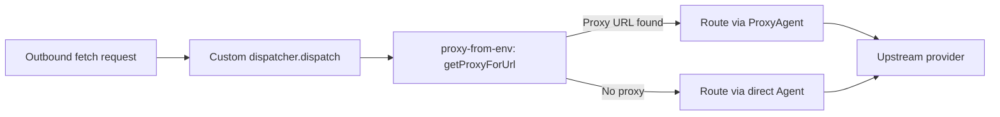

The copilot-api proxy supports forwarding requests to third-party LLM providers beyond the built-in GitHub Copilot infrastructure. This page explains how to **configure third-party providers**, how the **proxy forwarding layer** constructs and sends upstream requests, and how **network-level HTTP proxying** works across both server and desktop deployments.

For how requests are routed to providers via URL-path scoping or model-alias parsing, see [Provider-Scoped Multi-Tenant Routing](12-provider-scoped-multi-tenant-routing).

## Provider Configuration Schema

Third-party providers are declared under the `providers` key in the JSON configuration file. Each named entry specifies connectivity details, authentication strategy, and optional per-model settings. The configuration file is located at the path resolved by `PATHS.CONFIG_PATH` and is created automatically on first run with a sensible default structure. Sources: [src/lib/config.ts](src/lib/config.ts#L165-L181)

```jsonc
{
  "providers": {
    "dash": {
      "type": "openai-compatible",
      "enabled": true,
      "baseUrl": "https://dashscope.example/compatible-mode",
      "apiKey": "your-api-key",
      "authType": "authorization",
      "adjustInputTokens": true,
      "models": {
        "qwen-plus": {
          "temperature": 0.2,
          "topP": 0.8,
          "topK": 50,
          "extraBody": {
            "enable_thinking": true,
            "preserve_thinking": true
          },
          "contextCache": true,
          "toolContentSupportType": [],
          "supportPdf": false
        }
      }
    },
    "my-anthropic": {
      "type": "anthropic",
      "enabled": true,
      "baseUrl": "https://api.anthropic.com",
      "apiKey": "sk-ant-...",
      "authType": "x-api-key"
    }
  }
}
```

Sources: [src/lib/config.ts](src/lib/config.ts#L53-L61), [tests/provider-openai-compatible.test.ts](tests/provider-openai-compatible.test.ts#L77-L96)

### ProviderConfig Interface

Each provider entry maps to the `ProviderConfig` interface, which is then validated and resolved into a `ResolvedProviderConfig`:

| Field | Type | Required | Description |
|---|---|---|---|
| `type` | `ProviderType` | No (default: `"anthropic"`) | Upstream API protocol |
| `enabled` | `boolean` | No (default: `true`) | Set `false` to disable without removing config |
| `baseUrl` | `string` | **Yes** | Upstream API base URL (trailing slashes stripped) |
| `apiKey` | `string` | **Yes*** | API key for upstream authentication (*not required for Codex with OAuth2) |
| `authType` | `ProviderAuthType` | No | Authentication header strategy; defaults based on type |
| `models` | `Record<string, ModelConfig>` | No | Per-model configuration overrides |
| `adjustInputTokens` | `boolean` | No | If `true`, subtracts cache tokens from `input_tokens` in usage records |

Sources: [src/lib/config.ts](src/lib/config.ts#L53-L61), [src/lib/config.ts](src/lib/config.ts#L63-L71)

### Provider Types

The system supports three upstream provider types. Each determines the API format used when forwarding requests:

| Type Value | Upstream Protocol | Forwarding Function | Endpoint Path |
|---|---|---|---|
| `"anthropic"` | Anthropic Messages API | `forwardProviderMessages` | `{baseUrl}/v1/messages` |
| `"openai-compatible"` | OpenAI Chat Completions | `forwardProviderChatCompletions` | `{baseUrl}/v1/chat/completions` |
| `"openai-responses"` | OpenAI Responses API | `forwardProviderResponses` | `{baseUrl}/v1/responses` |

The Messages endpoint (`/:provider/v1/messages`) is the only endpoint that transparently supports all three types. For `openai-compatible` providers, the handler **translates** the incoming Anthropic-format payload to OpenAI Chat Completions format before forwarding, and translates the response back. For `openai-responses` providers, a similar translation to the Responses API format occurs. For `anthropic` providers, the payload is forwarded directly with minimal header construction. Sources: [src/lib/config.ts](src/lib/config.ts#L47-L51), [src/services/providers/provider-proxy.ts](src/services/providers/provider-proxy.ts#L82-L119)

### Authentication Types

Each provider's `authType` governs the HTTP header sent to the upstream:

| authType | Header Format | Default For |
|---|---|---|
| `"authorization"` | `Authorization: Bearer <apiKey>` | `openai-compatible`, `openai-responses` |
| `"x-api-key"` | `x-api-key: <apiKey>` | `anthropic` |
| `"oauth2"` | OAuth2 token flow | `codex` (builtin only) |

The `oauth2` auth type is **restricted to the built-in `codex` provider**. If a user-defined provider sets `authType: "oauth2"`, the system logs a warning and falls back to the type-appropriate default. This is enforced by `resolveProviderAuthType`: Sources: [src/lib/config.ts](src/lib/config.ts#L455-L494)

```typescript
if (authType === "oauth2") {
  if (providerName === "codex") {
    return authType
  }
  consola.warn(
    `Provider ${providerName} has authType 'oauth2', which is only supported by the builtin codex provider, falling back to ${defaultAuthType}`,
  )
  return defaultAuthType
}
```

The `"copilot"` provider name is **reserved** and cannot be used in `config.providers`. Attempts to register it are silently rejected by `isReservedProviderName`. Sources: [src/lib/config.ts](src/lib/config.ts#L614-L616)

### Per-Model Configuration

The optional `models` map within a provider config allows model-specific overrides. These settings are applied by the handler before forwarding:

| Model Field | Type | Effect |
|---|---|---|
| `temperature` | `number` | Default temperature if not set in the request |
| `topP` | `number` | Default `top_p` |
| `topK` | `number` | Default `top_k` (Anthropic-specific) |
| `extraBody` | `Record<string, unknown>` | Extra fields merged into the request body; **client values take precedence** |
| `contextCache` | `boolean` | If `false`, disables context cache markers (OpenAI-compatible) |
| `supportPdf` | `boolean` | Whether the upstream supports PDF content |
| `toolContentSupportType` | `Array<ToolContentSupportType>` | Which content types (`"array"`, `"image"`, `"pdf"`) the upstream supports in tool results |

For OpenAI-compatible providers, the `extraBody` field is particularly useful for provider-specific parameters like `enable_thinking` or `preserve_thinking`. When the same key exists in both `extraBody` and the client request, the **client request wins**: Sources: [src/routes/provider/messages/handler.ts](src/routes/provider/messages/handler.ts#L398-L407)

```typescript
const applyMissingExtraBody = (payload, options) => {
  for (const [key, value] of Object.entries(options.extraBody ?? {})) {
    if (!Object.hasOwn(payload, key)) {
      payload[key] = value
    }
  }
}
```

Additionally, for OpenAI-compatible providers, context cache markers are automatically applied to up to 4 messages (first 2 system messages, last 2 non-system messages) unless `contextCache: false` is set on the model. Sources: [src/routes/provider/messages/handler.ts](src/routes/provider/messages/handler.ts#L81-L90), [src/routes/provider/messages/handler.ts](src/routes/provider/messages/handler.ts#L582-L609)

## Provider Configuration Validation

When a request targets a provider, the system runs a multi-step validation pipeline in `getProviderConfig` before returning a fully resolved configuration. If any step fails, `null` is returned and the handler responds with a `404 Provider not found or disabled` error. Sources: [src/lib/config.ts](src/lib/config.ts#L542-L606)

The validation steps are:

1. **Empty name check** — An empty or whitespace-only provider name returns `null`.
2. **Reserved name guard** — The name `"copilot"` is reserved and returns `null` with a warning.
3. **Raw config lookup** — Reads the provider entry from `config.providers[name]`. If absent, returns `null`.
4. **Enabled check** — If `enabled: false`, returns `null`.
5. **Type validation** — Only `"anthropic"`, `"openai-compatible"`, and `"openai-responses"` are accepted. Unknown types are rejected with a warning.
6. **Required fields** — `baseUrl` is always required (after normalization). `apiKey` is required unless `oauth2` auth is used for the `codex` provider.
7. **Auth type resolution** — Applies defaults and validates the configured `authType`.

The `codex` provider receives special treatment in the higher-level `resolveProviderConfig` function: it attempts OAuth token setup before config resolution, and injects the runtime `codexAccessToken` as the effective `apiKey`. Sources: [src/lib/provider-resolver.ts](src/lib/provider-resolver.ts#L17-L52)

```mermaid
flowchart TD
    A[resolveProviderConfig] --> B{provider == 'codex'?}
    B -->|Yes| C{codex enabled?}
    C -->|No| D[Return null]
    C -->|Yes| E[setupCodexToken]
    E -->|Missing credentials| D
    E -->|Token ready| F[getProviderConfig]
    F --> G[Return config with codexAccessToken]
    B -->|No| H[getProviderConfig]
    H --> I{config.providers[name] exists?}
    I -->|No| D
    I -->|Yes| J{enabled: false?}
    J -->|Yes| D
    J -->|No| K{type valid?}
    K -->|No| D
    K -->|Yes| L{baseUrl + apiKey present?}
    L -->|No| D
    L -->|Yes| M[Return ResolvedProviderConfig]
```

Sources: [src/lib/provider-resolver.ts](src/lib/provider-resolver.ts#L17-L52), [src/lib/config.ts](src/lib/config.ts#L542-L606)

## Provider Proxy Forwarding Layer

The forwarding layer in `src/services/providers/provider-proxy.ts` handles the mechanical details of constructing upstream HTTP requests, sending them, and preparing clean responses for the client. Sources: [src/services/providers/provider-proxy.ts](src/services/providers/provider-proxy.ts#L1-L130)

### Upstream Header Construction

`buildProviderUpstreamHeaders` constructs the headers for every upstream request. The logic adapts based on the provider's auth type and protocol:

1. **Base headers** — `content-type: application/json` and `accept: application/json` are always set.
2. **Auth header** — Based on `authType`: either `Authorization: Bearer <key>` or `x-api-key: <key>`.
3. **Forwarded headers** — `accept` and `user-agent` from the original client request are forwarded for all providers.
4. **Anthropic-specific headers** — For `anthropic`-type providers only, `anthropic-version` and `anthropic-beta` headers are forwarded from the original request.

This selective forwarding ensures that protocol-specific version negotiation (e.g., Anthropic's beta features) reaches the upstream, while stripping potentially misleading client identifiers. Sources: [src/services/providers/provider-proxy.ts](src/services/providers/provider-proxy.ts#L7-L63)

### Forwarding Functions

Each provider type has a dedicated forwarding function that constructs the full upstream URL from `providerConfig.baseUrl`:

| Function | Upstream Path | Used By |
|---|---|---|
| `forwardProviderMessages` | `/v1/messages` | Anthropic-type providers |
| `forwardProviderChatCompletions` | `/v1/chat/completions` | OpenAI-compatible providers |
| `forwardProviderResponses` | `/v1/responses` | OpenAI Responses providers |
| `forwardProviderModels` | `/v1/models` (GET) | Model listing for all types |

All forwarding functions use the global `fetch` API, which respects the dispatcher configuration set by the HTTP proxy initialization (see [HTTP Proxy Support](#http-proxy-support)). Sources: [src/services/providers/provider-proxy.ts](src/services/providers/provider-proxy.ts#L82-L129)

### Response Proxying

`createProviderProxyResponse` prepares an upstream response for delivery to the client by stripping hop-by-hop headers that should not be forwarded:

```
connection, content-encoding, content-length, keep-alive,
proxy-authenticate, proxy-authorization, te, trailer,
transfer-encoding, upgrade
```

The remaining headers (including `content-type`, rate limit headers, etc.) are passed through transparently. Sources: [src/services/providers/provider-proxy.ts](src/services/providers/provider-proxy.ts#L14-L26), [src/services/providers/provider-proxy.ts](src/services/providers/provider-proxy.ts#L65-L80)

### Streaming Handling

Both the provider Messages handler and the dedicated endpoint handlers distinguish between streaming and non-streaming responses by checking `content-type: text/event-stream` on the upstream response alongside `payload.stream`:

| Response Mode | Detection | Behavior |
|---|---|---|
| **Non-streaming** | `content-type: application/json` | Full JSON body parsed, usage recorded, proxied to client |
| **Streaming (SSE)** | `content-type: text/event-stream` + `stream: true` | Events forwarded via Hono's `streamSSE`, usage accumulated from final chunk |

For **OpenAI-compatible** and **OpenAI Responses** providers accessed via the Messages endpoint, streaming events are translated back to Anthropic SSE format in real time. The `translateChunkToAnthropicEvents` function converts each OpenAI chunk into the corresponding Anthropic `content_block_delta` or `message_delta` event, maintaining the `AnthropicStreamState` across chunks. Sources: [src/routes/provider/messages/handler.ts](src/routes/provider/messages/handler.ts#L705-L783), [src/routes/provider/messages/handler.ts](src/routes/provider/messages/handler.ts#L785-L865)

## HTTP Proxy Support

The server supports routing all outbound HTTP requests through a corporate or development proxy. This is implemented via the `--proxy-env` CLI flag, which initializes a custom `undici` dispatcher that reads proxy settings from environment variables. Sources: [src/start.ts](src/start.ts#L219-L223), [src/start.ts](src/start.ts#L49-L51)

### Initialization Flow

When `--proxy-env` is enabled, `initProxyFromEnv` installs a custom dispatcher as the global `undici` dispatcher (or stores it for Bun environments). The dispatcher uses the `proxy-from-env` library to evaluate proxy rules per-request:



The dispatcher maintains a `Map<string, ProxyAgent>` cache so that each unique proxy URL only gets one agent instance. Non-proxy requests bypass the proxy entirely using a direct `Agent`. Errors in proxy evaluation are silently caught and fall back to direct connections. Sources: [src/lib/proxy.ts](src/lib/proxy.ts#L11-L77)

### Environment Variables

The proxy-from-env library evaluates standard environment variables in the following precedence order (see its documentation for full semantics):

| Variable | Purpose |
|---|---|
| `HTTP_PROXY` / `http_proxy` | Proxy for HTTP requests |
| `HTTPS_PROXY` / `https_proxy` | Proxy for HTTPS requests |
| `ALL_PROXY` / `all_proxy` | Fallback proxy for all protocols |
| `NO_PROXY` / `no_proxy` | Comma-separated list of hosts to bypass |

**Important**: The `--proxy-env` flag defaults to `false`. If your upstream providers are behind a corporate proxy, you must explicitly enable it:

```bash
copilot-api start --proxy-env
```

In Docker deployments, pass the environment variables and enable the flag:

```bash
docker run -e HTTPS_PROXY=http://proxy.corp:8080 \
  copilot-api start --proxy-env
```

Sources: [src/lib/proxy.ts](src/lib/proxy.ts#L11-L77), [src/start.ts](src/start.ts#L49-L51)

### System CA Certificate Support

The server also integrates system CA certificates via `enableSystemCACompat` to support proxies that perform TLS interception (SSL inspection). This function merges system certificates with the default Node.js certificate store, which is essential in enterprise environments where corporate proxies present their own CA. The Docker entrypoint runs with `--use-system-ca` to enable this at the Bun level as well. Sources: [src/lib/tls.ts](src/lib/tls.ts#L4-L17), [entrypoint.sh](entrypoint.sh#L4-L8)

## Desktop Application Proxy Configuration

The Electron desktop application has its own proxy configuration system that works independently of the server-level `--proxy-env` mechanism. It supports three modes:

| Mode | Description |
|---|---|
| `"system"` | Uses the operating system's proxy settings (default) |
| `"direct"` | Bypasses all proxies |
| `"custom"` | Uses user-specified HTTP, HTTPS, and SOCKS proxy URLs |

Custom proxy settings are applied at two levels:

1. **Electron session proxy** — `applyElectronProxy` calls `app.setProxy` and `session.defaultSession.setProxy` to route all Electron network traffic through the configured proxy. Bypass rules from `no_proxy` are formatted into Electron's `proxy-bypass-list` format.
2. **Child process environment** — `applyDesktopProxySettingsToEnv` sets `HTTP_PROXY`, `HTTPS_PROXY`, `NO_PROXY` (and their lowercase variants) in the spawned server process environment, which the `--proxy-env` flag then picks up.

The `--no-proxy-server` command-line switch forces `mode: "direct"` regardless of the saved settings, providing a quick way to bypass proxies for debugging. Sources: [desktop/electron/electron-proxy-config.ts](desktop/electron/electron-proxy-config.ts#L113-L169), [desktop/electron/electron-proxy.ts](desktop/electron/electron-proxy.ts#L15-L51)

## Token Usage Tracking

All provider-scoped requests are tracked in the token usage store with `source: "provider"` and the `providerName` field set to the provider's config name. This allows the usage viewer and admin APIs to distinguish provider traffic from Copilot-native traffic. The `user_id` in usage records is set to the provider name rather than the GitHub username. Sources: [src/lib/token-usage/index.ts](src/lib/token-usage/index.ts#L92-L97)

| Provider Endpoint | Token Usage Endpoint Label |
|---|---|
| `/:provider/v1/messages` | `"provider_messages"` |
| `/:provider/v1/messages/count_tokens` | (local tokenizer, not recorded) |
| `/:provider/v1/chat/completions` | `"chat_completions"` |
| `/:provider/v1/responses` | `"responses"` |

Usage normalization is format-aware: `normalizeOpenAIUsage` handles Chat Completions format, `normalizeResponsesUsage` handles Responses format, and `normalizeAnthropicUsage` handles native Anthropic format. Each function correctly maps cache tokens from the provider's format into the unified `UsageTokens` structure. Sources: [src/lib/token-usage/index.ts](src/lib/token-usage/index.ts#L170-L251)

## Configuration Management at Runtime

Provider configurations can be read and modified at runtime through the admin config API:

- **Read model mappings**: `GET /admin/config/model-mappings`
- **Update model mappings**: `POST /admin/config/model-mappings` with a JSON body containing `modelMappings`

The model mappings system (`modelMappings` in the config) is resolved **before** provider alias parsing, which means a mapped model name can resolve to a `provider/model` string that triggers provider routing. For example, mapping `"gpt-4o"` to `"dash/qwen-plus"` causes requests for `gpt-4o` to be routed to the `dash` provider with the `qwen-plus` model. Sources: [src/routes/admin/config/route.ts](src/routes/admin/config/route.ts#L1-L49), [src/routes/chat-completions/handler.ts](src/routes/chat-completions/handler.ts#L28-L45)

Provider configurations themselves are managed via direct file edits to the config JSON. The `setProviderConfig` function writes changes to disk and reloads the cached configuration. Sources: [src/lib/config.ts](src/lib/config.ts#L513-L540)

## Next Steps

- Understand how requests are routed to providers in [Provider-Scoped Multi-Tenant Routing](12-provider-scoped-multi-tenant-routing)
- Explore the built-in Codex OAuth integration in [Codex OAuth Provider Integration](14-codex-oauth-provider-integration)
- See how model resolution, aliasing, and normalization interact with provider routing in [Model Resolution, Aliasing, and Normalization](16-model-resolution-aliasing-and-normalization)
- Learn about the configuration reference in [Configuration Reference](4-configuration-reference)