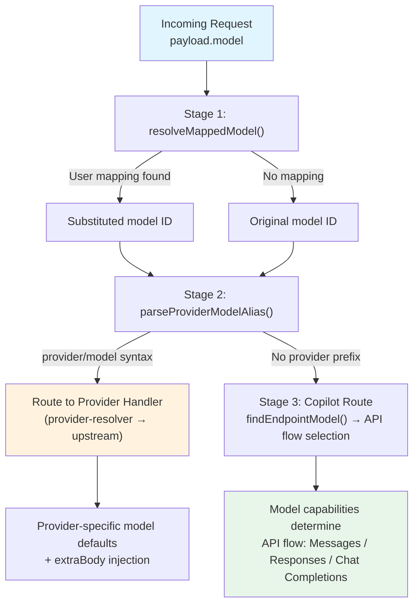
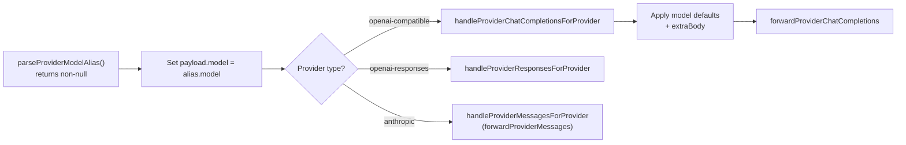
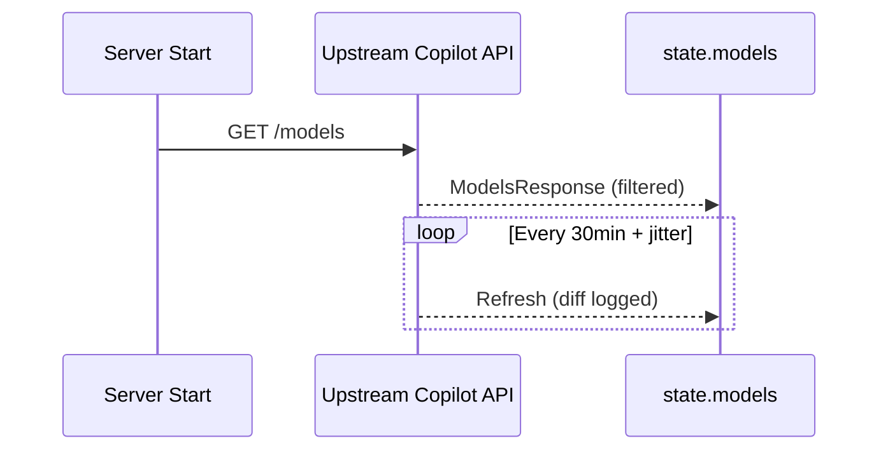

This page documents the multi-layered pipeline that transforms incoming model identifiers into the correct upstream model IDs, routes requests to the appropriate provider backend, and normalizes model metadata for client consumption. The system must reconcile at least four different naming conventions — Claude SDK IDs, Copilot upstream IDs, client-facing IDs, and third-party provider model IDs — into a unified resolution chain.

## Architecture Overview

Every incoming request carries a `model` field. Before that request reaches any upstream API, the model identifier passes through three sequential resolution stages: **user-configured mapping**, **provider/model alias parsing**, and **SDK-to-endpoint normalization**. The order matters — each stage is a decision gate that can short-circuit to a different handler entirely.



Sources: [src/lib/config.ts](src/lib/config.ts#L413-L415), [src/lib/provider-model.ts](src/lib/provider-model.ts#L8-L26), [src/lib/models.ts](src/lib/models.ts#L23-L42)

## Stage 1: User-Configured Model Mappings

The `modelMappings` configuration provides a first-class abstraction layer that lets operators redirect any model identifier to a different target — without modifying client applications. This is the highest-priority resolution step and is applied before any other model logic.

The configuration is a simple `Record<string, string>` stored in the user's `config.json` file under the `modelMappings` key. Each entry maps a source model ID (as clients send it) to a target model ID (which may include a `provider/model` prefix for third-party routing).

```typescript
// From config.json
{
  "modelMappings": {
    "claude-opus-4-7": "dash/qwen-plus",
    "claude-sonnet-4": "gpt-5.4"
  }
}
```

The resolution function is a single dictionary lookup with passthrough semantics:

```typescript
export function resolveMappedModel(model: string): string {
  return getModelMappings()[model] ?? model
}
```

This function is called identically at the top of all three API endpoint handlers — chat completions, messages, and responses — ensuring uniform mapping behavior regardless of which API surface the client uses.

Sources: [src/lib/config.ts](src/lib/config.ts#L362-L415), [src/routes/chat-completions/handler.ts](src/routes/chat-completions/handler.ts#L28-L36), [src/routes/messages/handler.ts](src/routes/messages/handler.ts#L55-L61), [src/routes/responses/handler.ts](src/routes/responses/handler.ts#L47-L55)

### Runtime Management via Admin API

Model mappings can be read and updated at runtime through the admin config API without server restarts. The `GET /admin/config/model-mappings` endpoint returns the current snapshot, and `POST /admin/config/model-mappings` accepts a complete replacement map that is validated, persisted to disk, and reloaded into the cached config.

Sources: [src/routes/admin/config/route.ts](src/routes/admin/config/route.ts#L1-L48), [tests/config-route.test.ts](tests/config-route.test.ts#L40-L114)

### Validation Rules

The `setModelMappings` function validates each entry before persisting: both source and target must be non-empty strings. Invalid entries cause the entire update to be rejected. The `getModelMappings` reader additionally filters out entries where the target is not a string or is empty, providing defensive normalization even for hand-edited config files.

Sources: [src/lib/config.ts](src/lib/config.ts#L384-L398)

## Stage 2: Provider/Model Alias Parsing

After model mappings are resolved, the system inspects whether the resulting model ID contains a forward-slash `/` separator — the canonical syntax for third-party provider routing. This is handled by `parseProviderModelAlias`, which splits `provider/model` strings into their constituent parts.

```typescript
export const parseProviderModelAlias = (model: string): ProviderModelAlias | null => {
  const separatorIndex = model.indexOf("/")
  if (separatorIndex <= 0 || separatorIndex === model.length - 1) {
    return null
  }

  const provider = model.slice(0, separatorIndex).trim()
  const providerModel = model.slice(separatorIndex + 1).trim()
  if (!provider || !providerModel) {
    return null
  }

  return { model: providerModel, provider }
}
```

The function returns `null` for any model ID that does not contain a valid slash-separated pair. This includes edge cases like leading/trailing slashes or empty segments.

| Input | Result | Explanation |
|-------|--------|-------------|
| `dash/qwen-plus` | `{ provider: "dash", model: "qwen-plus" }` | Standard alias |
| `claude-opus-4-7` | `null` | No slash — Copilot route |
| `/qwen-plus` | `null` | Leading slash, no provider |
| `dash/` | `null` | Trailing slash, no model |
| `a/b/c` | `{ provider: "a", model: "b/c" }` | First slash only |

Sources: [src/lib/provider-model.ts](src/lib/provider-model.ts#L8-L26)

### Provider Resolution

When a provider alias is detected, the handler immediately delegates to the provider-specific handler, which resolves the provider configuration through `resolveProviderConfig`. This function performs several steps: it trims the provider name, checks if the provider is disabled, and for the special `codex` provider, triggers OAuth token setup before returning the resolved configuration.

The resolved provider config carries all the information needed to forward the request: `baseUrl`, `apiKey`, `authType`, `type`, and per-model configuration overrides.

Sources: [src/lib/provider-resolver.ts](src/lib/provider-resolver.ts#L17-L52), [src/lib/config.ts](src/lib/config.ts#L542-L606)

### Provider-Specific Model Defaults

Once routed to a provider handler, the system applies per-model configuration defaults defined in the provider's `models` map. For chat completions, this includes `temperature`, `top_p`, `top_k`, and arbitrary `extraBody` fields. The defaults use the nullish coalescing assignment operator (`??=`), meaning explicit client values always take precedence.

```typescript
const applyProviderModelDefaults = (
  payload: ChatCompletionsPayload,
  modelConfig: ModelConfig | undefined,
): void => {
  payload.temperature ??= modelConfig?.temperature
  payload.top_p ??= modelConfig?.topP
  payload.top_k ??= modelConfig?.topK
}
```

The `extraBody` merge is additive — keys from the provider config are injected only when absent from the request payload. This enables providers to inject custom parameters like `enable_thinking` or `preserve_thinking` without conflicting with client-specified values.

Sources: [src/routes/provider/chat-completions/handler.ts](src/routes/provider/chat-completions/handler.ts#L101-L130)

### How Provider Routing Short-Circuits

When a provider alias is detected, the handler returns immediately after delegation — **rate limiting, model lookup, and all Copilot-specific logic are bypassed entirely**. This is by design: provider-aliased requests are fully the third-party provider's responsibility.



Sources: [src/routes/chat-completions/handler.ts](src/routes/chat-completions/handler.ts#L38-L45), [src/routes/messages/handler.ts](src/routes/messages/handler.ts#L70-L77), [src/routes/responses/handler.ts](src/routes/responses/handler.ts#L57-L64)

## Stage 3: SDK Model ID Normalization

For requests that reach the Copilot route (no provider alias), the model ID must be matched against the upstream Copilot model catalog. This is where the most complex normalization logic lives, because the system must bridge multiple Claude model ID formats.

### The Five-Format Problem

Claude model IDs appear in at least five distinct formats depending on the source:

| Format | Example | Source |
|--------|---------|--------|
| `claude-{family}-{major}.{minor}` | `claude-haiku-4.5` | SDK shorthand |
| `claude-{family}-{major}-{minor}` | `claude-opus-4-5` | SDK with hyphens |
| `claude-{major}-{minor}-{family}` | `claude-3-5-sonnet` | Legacy SDK format |
| `claude-{family}-{major}` | `claude-sonnet-4` | SDK major-only |
| `claude-{major}-{family}` | `claude-3-opus` | Legacy major-only |

The `normalizeSdkModelId` function handles all five patterns using sequential regex matching, stripping date suffixes (8-digit sequences) before pattern matching:

```typescript
export const normalizeSdkModelId = (
  sdkModelId: string,
): NormalizedSdkModelId | undefined => {
  const lower = sdkModelId.toLowerCase()
  const withoutDate = lower.replace(/-\d{8}$/, "")

  // Pattern 1: claude-{family}-{major}.{minor}
  const pattern1 = withoutDate.match(/^claude-(\w+)-(\d+)\.(\d+)$/)
  if (pattern1) {
    return { family: pattern1[1], version: `${pattern1[2]}.${pattern1[3]}` }
  }
  // ... patterns 2-5
}
```

Each pattern extracts a `NormalizedSdkModelId` containing `family` and `version` — the two canonical dimensions used for all subsequent matching.

| Input | Output |
|-------|--------|
| `claude-opus-4-5-20251101` | `{ family: "opus", version: "4.5" }` |
| `claude-3-5-sonnet-20241022` | `{ family: "sonnet", version: "3.5" }` |
| `claude-sonnet-4-20250514` | `{ family: "sonnet", version: "4" }` |
| `claude-haiku-3-5-20250514` | `{ family: "haiku", version: "3.5" }` |
| `claude-haiku-4.5` | `{ family: "haiku", version: "4.5" }` |

Sources: [src/lib/models.ts](src/lib/models.ts#L54-L93)

### Endpoint Model Lookup

The `findEndpointModel` function uses the normalizer to match incoming SDK IDs against the cached Copilot model catalog. It first attempts an **exact match** against `state.models.data`, and if that fails, it constructs the canonical `claude-{family}-{version}` form and searches again:

```typescript
export const findEndpointModel = (sdkModelId: string): Model | undefined => {
  const models = state.models?.data ?? []
  const exactMatch = models.find((m) => m.id === sdkModelId)
  if (exactMatch) return exactMatch

  const normalized = normalizeSdkModelId(sdkModelId)
  if (!normalized) return undefined

  const modelName = `claude-${normalized.family}-${normalized.version}`
  const model = models.find((m) => m.id === modelName)
  if (model) return model

  return undefined
}
```

This two-pass strategy ensures that both exact IDs (like `claude-opus-4.5`) and normalized forms (like `claude-3-5-sonnet` → `claude-sonnet-3.5`) resolve correctly.

Sources: [src/lib/models.ts](src/lib/models.ts#L23-L42)

### Client Model ID Transformation

The inverse operation — converting upstream Copilot model IDs to client-friendly IDs — is handled by `toClientModelId`. This function normalizes the upstream ID and replaces dots in the version with hyphens, producing the format expected by Claude Code and Claude Desktop:

```typescript
export const toClientModelId = (modelId: string): string => {
  const normalized = normalizeSdkModelId(modelId)
  if (!normalized) return modelId
  const versionHyphenated = normalized.version.replaceAll(".", "-")
  return `claude-${normalized.family}-${versionHyphenated}`
}
```

For example, `claude-sonnet-4.6` becomes `claude-sonnet-4-6`. Non-Claude model IDs pass through unchanged. This function is used by the `/v1/models` endpoint to present the catalog in a format that Claude clients can consume.

Sources: [src/lib/models.ts](src/lib/models.ts#L11-L16), [src/routes/models/route.ts](src/routes/models/route.ts#L16-L32)

## Model Catalog Lifecycle

The Copilot model catalog is not static. It is fetched at startup and refreshed periodically in the background.

### Initial Fetch and Background Refresh

The `cacheModels` function triggers the initial fetch from the Copilot API, then schedules a background refresh loop. The refresh interval is 30 minutes with a random jitter of up to 5 minutes to avoid thundering herd effects across multiple instances. Failed refreshes are logged but do not crash the server — the previous cached catalog is retained.



The refresh process filters the upstream catalog to include only models where `model_picker_enabled` is true or the model type is `embeddings`. When new models appear, they are logged at info level.

Sources: [src/lib/utils.ts](src/lib/utils.ts#L24-L80), [src/services/copilot/get-models.ts](src/services/copilot/get-models.ts#L7-L22), [tests/models-refresh.test.ts](tests/models-refresh.test.ts#L1-L73)

### Codex Model Catalog

The Codex provider has its own static model catalog defined in code, not fetched from an upstream API. The `getModels` function returns a hardcoded list of GPT models (gpt-5.3-codex-spark, gpt-5.4, gpt-5.4-mini, gpt-5.5) normalized into the same `Model` interface used by the Copilot catalog. This ensures uniform handling across both catalogs.

Sources: [src/services/codex/get-models.ts](src/services/codex/get-models.ts#L11-L81)

## Model Selection in API Flows

The messages handler (`/v1/messages`) uses the resolved model to determine which API flow to invoke. This is the most complex routing decision, as a single Anthropic-format request can be served through three different backend transports.

### Flow Selection Logic

After the model is resolved and matched against the catalog, the handler evaluates two conditions:

1. **Messages API**: Selected if the model's `supported_endpoints` includes `/v1/messages` and the feature is enabled in config. This is the native Anthropic Messages API path used for Claude models.

2. **Responses API**: Selected if the model's `supported_endpoints` includes `/v1/responses` (or `/ws/responses` for WebSocket transport) and the model is not in a compact request cycle. This path translates the Anthropic payload to OpenAI Responses format.

3. **Chat Completions**: Fallback when neither of the above applies. The Anthropic payload is translated to OpenAI Chat Completions format.

The model's `supported_endpoints` array is the authoritative signal for which backend transports a model supports.

Sources: [src/routes/messages/handler.ts](src/routes/messages/handler.ts#L141-L186), [src/routes/messages/api-flows.ts](src/routes/messages/api-flows.ts#L95-L177), [src/routes/responses/utils.ts](src/routes/responses/utils.ts#L40-L67)

### Small Model Override

A special case exists for Claude Code warmup requests. When the Anthropic Beta header is present, no tools are attached, and the request is not a compact request, the handler overrides the model to the configured `smallModel` (default: `gpt-5-mini`). This prevents warmup requests from consuming premium credits.

Sources: [src/routes/messages/handler.ts](src/routes/messages/handler.ts#L99-L104), [src/lib/config.ts](src/lib/config.ts#L105-L132)

### Token Counting Model Resolution

The `/v1/messages/count_tokens` endpoint has its own model resolution path. After applying model mappings and checking for provider aliases, it first attempts to forward to Anthropic's native `/v1/messages/count_tokens` API (for Claude models with an Anthropic API key configured). If that fails or is unavailable, it falls back to GPT tokenizer estimation using a `resolveCountTokensModel` function that finds the matching catalog model or creates a fallback model with `o200k_base` tokenizer.

Sources: [src/routes/messages/count-tokens-handler.ts](src/routes/messages/count-tokens-handler.ts#L23-L39), [src/routes/messages/count-tokens-handler.ts](src/routes/messages/count-tokens-handler.ts#L45-L84)

## Fallback Model Construction

When a model ID cannot be matched against either catalog, the system creates a synthetic fallback model rather than rejecting the request. The `createFallbackModel` function constructs a minimal `Model` object with `o200k_base` tokenizer (suitable for GPT-family estimation), zero limits, and `model_picker_enabled: false`:

```typescript
export const createFallbackModel = (modelId: string): Model => ({
  capabilities: {
    family: "provider",
    limits: {},
    object: "model_capabilities",
    supports: {},
    tokenizer: "o200k_base",
    type: "chat",
  },
  id: modelId,
  model_picker_enabled: false,
  name: modelId,
  object: "model",
  preview: false,
  vendor: "provider",
  version: "unknown",
})
```

This ensures that token counting and other operations degrade gracefully rather than failing hard for unrecognized model IDs.

Sources: [src/lib/provider-model.ts](src/lib/provider-model.ts#L28-L44)

## Configuration Reference

The following `AppConfig` fields directly participate in model resolution and aliasing:

| Config Key | Type | Purpose |
|------------|------|---------|
| `modelMappings` | `Record<string, string>` | Maps source model IDs to targets (may include `provider/` prefix) |
| `smallModel` | `string` | Override model for warmup/toolless requests (default: `gpt-5-mini`) |
| `providers.{name}.models` | `Record<string, ModelConfig>` | Per-model config overrides (temperature, topP, topK, extraBody) |
| `modelResponsesApiCompactThresholds` | `Record<string, number>` | Per-model context compaction thresholds |
| `modelReasoningEfforts` | `Record<string, string>` | Per-model reasoning effort levels |
| `messageApiWebSearchModel` | `string` | Model used for web search requests via Messages API |

Sources: [src/lib/config.ts](src/lib/config.ts#L7-L34)

## Cross-Cutting Concerns

### Rate Limiting Bypass for Provider Aliases

When a request is routed to a third-party provider through alias syntax, Copilot-specific rate limiting (`checkRateLimit`) is skipped entirely. The assumption is that third-party providers enforce their own rate limits. This is explicitly tested — the test asserts that `checkRateLimit` is never called for provider-aliased requests.

Sources: [tests/provider-model-alias.test.ts](tests/provider-model-alias.test.ts#L28-L29), [tests/provider-chat-completions-alias.test.ts](tests/provider-chat-completions-alias.test.ts#L13-L15)

### Token Usage Tracking

Model identity flows through to token usage recording. For Copilot-routed requests, the recorder is tagged with the resolved model ID and session ID. For provider-aliased requests, the recorder additionally captures the provider name, enabling per-provider usage analytics.

Sources: [src/routes/chat-completions/handler.ts](src/routes/chat-completions/handler.ts#L84-L88), [src/routes/provider/chat-completions/handler.ts](src/routes/provider/chat-completions/handler.ts#L132-L140)

## Next Steps

This page covers model resolution as a self-contained subsystem. For related topics, see:

- [Third-Party Provider Configuration and Proxying](15-third-party-provider-configuration-and-proxying) — detailed provider setup, auth types, and proxy behavior
- [Provider-Scoped Multi-Tenant Routing](12-provider-scoped-multi-tenant-routing) — how provider-scoped routes are registered and dispatched
- [OpenAI-Compatible Chat Completions Endpoint](9-openai-compatible-chat-completions-endpoint) — the chat completions handler that consumes resolved models
- [Anthropic Messages Endpoint and Multi-Flow Routing](10-anthropic-messages-endpoint-and-multi-flow-routing) — the messages handler's three-way flow selection logic
- [OpenAI Responses Endpoint and WebSocket Transport](11-openai-responses-endpoint-and-websocket-transport) — the responses handler and transport selection