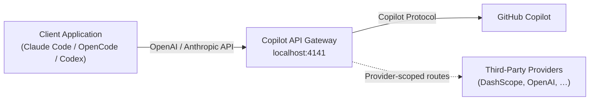

This page provides a streamlined path to get the Copilot API proxy running and connected to a client. It covers the three installation methods — **npx**, **source**, and **Docker** — then walks through authentication, first verification, and client configuration.

## What This Gateway Does

Copilot API is a local reverse-proxy that translates GitHub Copilot's native API into **OpenAI-compatible** and **Anthropic-compatible** endpoints. This lets tools like Claude Code, OpenCode, and Codex talk to Copilot without requiring an OpenAI API key.



Sources: [README.md](README.md#L17-L35), [src/server.ts](src/server.ts#L1-L88)

## Prerequisites

Before installing, confirm you have the following on your machine:

| Requirement | Minimum Version | Purpose |
|---|---|---|
| **Bun** | ≥ 1.2.x | Runtime, dependency management, and build tooling |
| **Node.js** | ≥ 20 (≥ 22.13 for npx with SQLite usage storage) | Required only if running the published CLI via `npx` |
| **GitHub account** | Copilot subscription (Individual, Business, or Enterprise) | Authentication source for the proxy |

A GitHub Copilot subscription is mandatory because the gateway authenticates against Copilot's token endpoint to obtain upstream access.

Sources: [README.md](README.md#L37-L42), [package.json](package.json#L88-L90)

## Installation

The project supports three installation paths. Choose the one that matches your workflow.

### Option A — npx (No Clone Required)

The fastest way to run the gateway. Requires Node.js or Bun on your PATH.

**With Node.js:**

```sh
npx @jeffreycao/copilot-api@latest start
```

**With Bun (recommended for full SQLite usage storage support):**

```sh
bunx --bun @jeffreycao/copilot-api@latest start
```

Both commands download the published package on first run and execute it directly. No repository clone or `bun install` is needed.

Sources: [README.md](README.md#L55-L71)

### Option B — Clone and Run from Source

Use this when you want the latest unreleased changes or plan to modify the codebase.

```sh
# 1. Clone the repository
git clone https://github.com/caozhiyuan/copilot-api.git
cd copilot-api

# 2. Install dependencies
bun install

# 3. Start the server
bun run start start
```

The `bun run start start` invocation executes the `start` script defined in [package.json](package.json#L18), which runs the compiled entry point with production settings.

Sources: [README.md](README.md#L43-L52), [package.json](package.json#L18)

### Option C — Docker

Docker isolates the gateway from your host system. A bind mount preserves authentication data across container restarts.

```sh
# Build the image
docker build -t copilot-api .

# Create a data directory on the host
mkdir -p ./copilot-data

# Run with persistent auth storage
docker run -p 4141:4141 \
  -v $(pwd)/copilot-data:/root/.local/share/copilot-api \
  copilot-api
```

Alternatively, pass a GitHub token directly (no bind mount needed):

```sh
docker run -p 4141:4141 -e GH_TOKEN=your_github_token_here copilot-api
```

The [Dockerfile](Dockerfile#L1-L27) uses a multi-stage build with `oven/bun:1.3.14-alpine` for both the builder and runner stages, and the [entrypoint.sh](entrypoint.sh#L1-L9) automatically selects between the `auth` and `start` subcommands based on the first argument.

Sources: [Dockerfile](Dockerfile#L1-L27), [entrypoint.sh](entrypoint.sh#L1-L9), [README.md](README.md#L73-L92)

## Authentication

When you start the server for the first time, the gateway launches an interactive GitHub OAuth flow in your terminal. This produces a device code you enter in your browser to authorize the application.

The process stores a GitHub token at:

| Platform | Token Path |
|---|---|
| Linux / macOS | `~/.local/share/copilot-api/github_token` |
| Windows | `%USERPROFILE%\.local\share\copilot-api\github_token` |

For **non-interactive environments** (CI, headless servers), authenticate separately and pass the token via the `--github-token` flag:

```sh
# Step 1 — Authenticate (on a machine with a browser)
npx @jeffreycao/copilot-api@latest auth login

# Step 2 — Use the saved token in the non-interactive environment
npx @jeffreycao/copilot-api@latest start --github-token $(cat ~/.local/share/copilot-api/github_token)
```

The `auth login` subcommand accepts a `--provider` flag to select between `copilot` (GitHub Copilot, default) and `codex` (OpenAI Codex OAuth). See [GitHub Copilot Authentication and Token Lifecycle](13-github-copilot-authentication-and-token-lifecycle) for a deep dive into the token lifecycle.

Sources: [src/auth.ts](src/auth.ts#L1-L173), [src/lib/paths.ts](src/lib/paths.ts#L1-L40), [README.md](README.md#L94-L104)

## First Verification

Once the server is running, confirm it is healthy with a quick curl call:

```sh
# Check that the server responds
curl http://localhost:4141/

# List available models (Copilot token must be active)
curl http://localhost:4141/v1/models
```

The `/` route returns `"Server running"` and the `/v1/models` route lists every model your Copilot subscription exposes. If you see model IDs like `gpt-5.4`, `gpt-5-mini`, and `claude-sonnet-4.6`, the gateway is fully operational.

The startup banner also prints a link to the **Usage Viewer** dashboard:

```
🌐 Usage Viewer: http://localhost:4141/usage-viewer?endpoint=http://localhost:4141/usage
```

Open this URL in a browser to monitor token usage and quota consumption in real time.

Sources: [src/server.ts](src/server.ts#L44-L48), [src/start.ts](src/start.ts#L143-L147), [README.md](README.md#L603-L633)

## Connecting a Client

The gateway exposes two API families. Pick the one your client expects.

### API Surface Overview

| API Family | Endpoints | Client Examples |
|---|---|---|
| **OpenAI-compatible** | `POST /v1/chat/completions`, `POST /v1/responses`, `GET /v1/models`, `POST /v1/embeddings` | OpenCode (via `@ai-sdk/anthropic`), Codex, any OpenAI SDK user |
| **Anthropic-compatible** | `POST /v1/messages`, `POST /v1/messages/count_tokens` | Claude Code, Claude Desktop, Anthropic SDK users |

### Claude Code (Anthropic Messages)

The fastest path is the interactive `--claude-code` flag, which prompts you to select models and copies a ready-to-paste command to your clipboard:

```sh
npx @jeffreycao/copilot-api@latest start --claude-code
```

Alternatively, create a `.claude/settings.json` in your project root:

```json
{
  "env": {
    "ANTHROPIC_BASE_URL": "http://localhost:4141",
    "ANTHROPIC_AUTH_TOKEN": "dummy",
    "ANTHROPIC_MODEL": "gpt-5.4",
    "ANTHROPIC_DEFAULT_SONNET_MODEL": "gpt-5.4",
    "ANTHROPIC_DEFAULT_HAIKU_MODEL": "gpt-5-mini",
    "DISABLE_NON_ESSENTIAL_MODEL_CALLS": "1",
    "CLAUDE_CODE_DISABLE_NONESSENTIAL_TRAFFIC": "1",
    "CLAUDE_CODE_ATTRIBUTION_HEADER": "0",
    "CLAUDE_CODE_ENABLE_PROMPT_SUGGESTION": "false",
    "CLAUDE_CODE_DISABLE_TERMINAL_TITLE": "true",
    "CLAUDE_CODE_ENABLE_AWAY_SUMMARY": "0",
    "CLAUDE_PLUGIN_ENABLE_QUESTION_RULES": "true"
  }
}
```

> **Important:** When using Claude Code, configure the model ID as `claude-opus-4-6` or `claude-opus-4.6` (dots are replaced with hyphens internally). See [Model Resolution, Aliasing, and Normalization](16-model-resolution-aliasing-and-normalization) for details on how the gateway maps model IDs.

Sources: [src/start.ts](src/start.ts#L99-L134), [README.md](README.md#L386-L443)

### OpenCode (Anthropic SDK)

Start the gateway with the OpenCode OAuth app, then point OpenCode at the local endpoint:

```sh
npx @jeffreycao/copilot-api@latest --oauth-app=opencode start
```

In `~/.config/opencode/opencode.json`, set the provider to use `@ai-sdk/anthropic` with `baseURL: "http://localhost:4141/v1"`. The SDK automatically appends `/messages`, `/models`, and `/messages/count_tokens`. See [README.md](README.md#L463-L540) for the full OpenCode configuration template.

Sources: [README.md](README.md#L463-L540)

### Codex (Responses API)

Codex communicates through the Responses API. Add a `[model_providers.copilot_api]` section to your `~/.codex/config.toml`:

```toml
model_provider = "copilot_api"
base_url = "http://localhost:4141"
env_key = "GITHUB_COPILOT_API_KEY"
wire_api = "responses"
```

Sources: [README.md](README.md#L542-L575)

## Start Command Options at a Glance

The `start` subcommand accepts the following flags. All are optional.

| Flag | Alias | Default | Description |
|---|---|---|---|
| `--port` | `-p` | `4141` | Port the gateway listens on |
| `--verbose` | `-v` | `false` | Enable verbose logging (consola level 5) |
| `--account-type` | `-a` | `individual` | Copilot plan: `individual`, `business`, or `enterprise` |
| `--manual` | — | `false` | Require manual approval before each upstream request |
| `--rate-limit` | `-r` | none | Minimum seconds between requests |
| `--wait` | `-w` | `false` | Wait for cooldown instead of rejecting on rate limit |
| `--github-token` | `-g` | none | Supply a pre-generated GitHub token directly |
| `--claude-code` | `-c` | `false` | Interactive model picker + clipboard command generator |
| `--show-token` | — | `false` | Log tokens on fetch/refresh for debugging |
| `--proxy-env` | — | `false` | Initialize HTTP proxy settings from environment variables |

Sources: [src/start.ts](src/start.ts#L149-L200), [README.md](README.md#L124-L140)

## Quick Troubleshooting

| Symptom | Likely Cause | Fix |
|---|---|---|
| `"Failed to fetch Copilot usage"` at startup | GitHub token missing or expired | Run `npx @jeffreycao/copilot-api@latest auth login` to re-authenticate |
| Empty model list from `/v1/models` | Copilot subscription inactive or not recognized | Verify your GitHub account has an active Copilot subscription; try `--verbose` for upstream details |
| `npx` starts but token usage storage is disabled | Node.js version < 22.13 | Upgrade Node.js or run with `bunx --bun` instead |
| Connection refused on port 4141 | Another process is using the port | Change the port with `--port 8080` |
| Claude Code shows model not found errors | Model ID mismatch | Use `claude-opus-4-6` (hyphens, not dots) as the model ID |

Sources: [README.md](README.md#L59-L65), [src/check-usage.ts](src/check-usage.ts#L1-L62), [src/start.ts](src/start.ts#L99-L105)

## Next Steps

- **[CLI Commands and Global Options](3-cli-commands-and-global-options)** — Full reference for all subcommands and global flags.
- **[Configuration Reference](4-configuration-reference)** — Deep dive into `config.json` fields: API keys, providers, model mappings, and more.
- **[Docker Deployment](5-docker-deployment)** — Production-grade container setup with health checks and data persistence.
- **[GitHub Copilot Authentication and Token Lifecycle](13-github-copilot-authentication-and-token-lifecycle)** — Understand how tokens are obtained, cached, and refreshed.