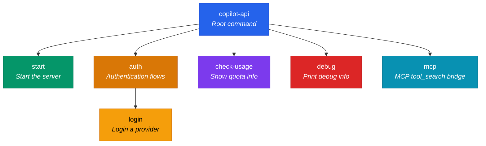
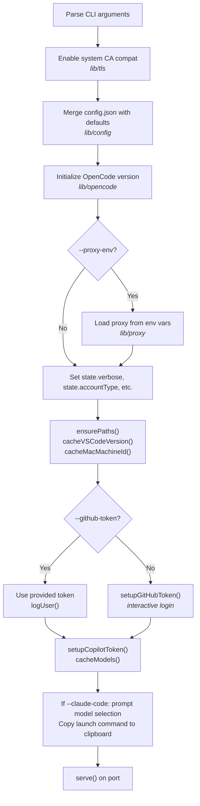

The `copilot-api` CLI is the primary interface for launching, configuring, and managing the Copilot API gateway. Built on the [citty](https://github.com/unjs/citty) command framework, it follows a subcommand-based architecture with a clear separation between **root-level global options** (which must precede any subcommand) and **subcommand-specific options** (which come after the subcommand name).

The CLI is shipped as a single binary entry point (`copilot-api`) defined in `package.json` and routed through `src/main.ts`, which parses global arguments, sets environment variables, then dynamically imports subcommands. This two-phase parsing ensures environment variables are established before any module-level code executes.

Sources: [package.json](package.json#L21-L23) · [src/main.ts](src/main.ts#L1-L55)

## Command Tree Overview

The full command hierarchy is illustrated below. Each node represents a runnable command; leaf nodes accept their own options.



Sources: [src/main.ts](src/main.ts#L44-L52)

## Root-Level Global Options

Three options must be specified **before** the subcommand name. They are parsed early in `main.ts` and translated into environment variables that control the application's data directory, OAuth app identifier, and enterprise URL for the entire session.

| Option | Alias | Type | Default | Environment Variable | Description |
|--------|-------|------|---------|---------------------|-------------|
| `--api-home` | — | `string` | `~/.local/share/copilot-api` | `COPILOT_API_HOME` | Override the application data directory (tokens, config, credentials). |
| `--oauth-app` | — | `string` | *(empty)* | `COPILOT_API_OAUTH_APP` | OAuth application identifier. Changes the subdirectory under `api-home` for token isolation. |
| `--enterprise-url` | — | `string` | *(empty)* | `COPILOT_API_ENTERPRISE_URL` | GitHub Enterprise hostname. When set, the stored token file is prefixed with `ent_`. |

**How they combine**: The three options interact multiplicatively to determine the final file paths. The application home directory (`APP_DIR`) is set by `--api-home`; the OAuth app name creates a subdirectory within it; and `--enterprise-url` prepends `ent_` to the token filename. This is visible in the path construction:

> `APP_DIR / AUTH_APP / (ENTERPRISE_PREFIX + "github_token")`

| Scenario | `APP_DIR` | Token File Path |
|----------|-----------|-----------------|
| Defaults only | `~/.local/share/copilot-api` | `~/.local/share/copilot-api/github_token` |
| `--oauth-app=opencode` | `~/.local/share/copilot-api` | `~/.local/share/copilot-api/opencode/github_token` |
| `--enterprise-url=ghe.example.com` | `~/.local/share/copilot-api` | `~/.local/share/copilot-api/ent_github_token` |
| All three combined | `/tmp/my-api` | `/tmp/my-api/myapp/ent_github_token` |

**Usage example**:

```bash
copilot-api --api-home=/tmp/my-env --oauth-app=claude --enterprise-url=ghe.corp.com start
```

Sources: [src/main.ts](src/main.ts#L7-L33) · [src/lib/paths.ts](src/lib/paths#L5-L24)

## The `start` Subcommand

The **start** command launches the HTTP server that acts as the API gateway. It is the most frequently used command and accepts the widest set of options.

```bash
copilot-api [global-options] start [start-options]
```

### Start Options

| Option | Alias | Type | Default | Description |
|--------|-------|------|---------|-------------|
| `--port` | `-p` | `string` | `4141` | TCP port the server listens on. |
| `--verbose` | `-v` | `boolean` | `false` | Enable verbose logging (sets consola to level 5). |
| `--account-type` | `-a` | `string` | `individual` | GitHub account type: `individual`, `business`, or `enterprise`. |
| `--manual` | — | `boolean` | `false` | Enable manual request approval (interactive prompt for every inbound request). |
| `--rate-limit` | `-r` | `string` | *(none)* | Minimum seconds between consecutive API requests. |
| `--wait` | `-w` | `boolean` | `false` | When rate-limited, wait instead of returning an error. No effect without `--rate-limit`. |
| `--github-token` | `-g` | `string` | *(none)* | Provide a GitHub token directly (must have been generated via the `auth` subcommand). |
| `--claude-code` | `-c` | `boolean` | `false` | Interactive mode: prompts for model selection, then copies a Claude Code launch command to clipboard. |
| `--show-token` | — | `boolean` | `false` | Print GitHub and Copilot tokens to the console when they are fetched or refreshed. |
| `--proxy-env` | — | `boolean` | `false` | Initialize HTTP/HTTPS proxy settings from standard environment variables (`HTTP_PROXY`, `HTTPS_PROXY`, etc.). |

### Startup Sequence

The server startup proceeds through a deterministic sequence of initialization steps:



Sources: [src/start.ts](src/start.ts#L160-L245) · [src/start.ts](src/start.ts#L37-L158)

### Server URL and Usage Viewer

After the server starts, a boxed message displays the **Usage Viewer** URL. This is a built-in HTML page served by the application that provides a real-time dashboard of token consumption:

```
🌐 Usage Viewer: http://localhost:4141/usage-viewer?endpoint=http://localhost:4141/usage
```

Sources: [src/start.ts](src/start.ts#L145-L148)

## The `auth` Subcommand

The **auth** command manages provider authentication without starting the server. It is a parent command with one sub-subcommand: `login`.

```bash
copilot-api [global-options] auth [auth-options] [login]
```

### Auth Options

| Option | Alias | Type | Default | Description |
|--------|-------|------|---------|-------------|
| `--provider` | — | `string` | *(interactive prompt)* | Provider to authenticate: `copilot` or `codex`. If omitted, a selection prompt is displayed. |
| `--verbose` | `-v` | `boolean` | `false` | Enable verbose logging. |
| `--show-token` | — | `boolean` | `false` | Display the provider access token after authentication. |

### Supported Providers

| Provider | Label | Token Destination |
|----------|-------|-------------------|
| `copilot` | GitHub Copilot | `APP_DIR/AUTH_APP/github_token` |
| `codex` | OpenAI Codex | `APP_DIR/codex_credentials.json` + provider config in `config.json` |

When `copilot` is selected, the command delegates to `setupGitHubToken({ force: true })` which performs the standard OAuth device flow and writes the token to disk. When `codex` is selected, the Codex OAuth flow is initiated (which may involve opening a browser URL), and both the credentials file and the provider configuration are persisted.

Note that `auth` and `auth login` behave identically — invoking `auth` without a subcommand simply runs the login flow.

Sources: [src/auth.ts](src/auth.ts#L137-L172) · [src/auth.ts](src/auth.ts#L109-L117)

## The `check-usage` Subcommand

A stateless command that authenticates, queries the GitHub Copilot API for current quota information, and displays it in a formatted box. It accepts no additional options beyond the root-level globals.

```bash
copilot-api [global-options] check-usage
```

The output includes the active plan name, quota reset date, and a breakdown of three quota categories:

| Quota Category | Metrics Displayed |
|----------------|-------------------|
| **Premium** | Used / Total, percent used, percent remaining |
| **Chat** | Used / Total, percent used, percent remaining |
| **Completions** | Used / Total, percent used, percent remaining |

Sources: [src/check-usage.ts](src/check-usage.ts#L11-L61)

## The `debug` Subcommand

Prints diagnostic information about the running environment. Useful for troubleshooting configuration, provider setup, and path issues.

```bash
copilot-api [global-options] debug [--json]
```

### Debug Options

| Option | Type | Default | Description |
|--------|------|---------|-------------|
| `--json` | `boolean` | `false` | Output as structured JSON instead of human-readable text. |

### Debug Information Fields

| Field | Plain Text Label | JSON Key | Description |
|-------|-----------------|----------|-------------|
| Package version | `Version:` | `version` | The installed `@jeffreycao/copilot-api` version. |
| Runtime | `Runtime:` | `runtime` | Engine name (`bun`/`node`), version, platform, and architecture. |
| Enabled providers | `enabled:` | `providers.enabled` | List of providers with `enabled: true` in config. |
| Codex configured | `codex configured:` | `providers.codexConfigured` | Whether a `codex` provider block exists in config. |
| APP_DIR | `APP_DIR:` | `paths.APP_DIR` | Resolved application data directory. |
| CONFIG_PATH | `CONFIG_PATH:` | `paths.CONFIG_PATH` | Path to the configuration file. |
| GITHUB_TOKEN_PATH | `GITHUB_TOKEN_PATH:` | `paths.GITHUB_TOKEN_PATH` | Path to the stored GitHub token. |
| Token exists | `GitHub token exists:` | `tokenExists` | Whether the GitHub token file exists and is non-empty. |

**Plain text example**:
```
copilot-api debug

Version: 1.12.6
Runtime: bun 1.2.23 (darwin arm64)

Providers:
- enabled: copilot
- codex configured: No

Paths:
- APP_DIR: /Users/alice/.local/share/copilot-api
- CONFIG_PATH: /Users/alice/.local/share/copilot-api/config.json
- GITHUB_TOKEN_PATH: /Users/alice/.local/share/copilot-api/github_token

GitHub token exists: Yes
```

Sources: [src/debug.ts](src/debug.ts#L129-L147) · [src/debug.ts](src/debug.ts#L75-L95)

## The `mcp` Subcommand

Starts a Model Context Protocol (MCP) server over **stdio** transport. This exposes a single `search` tool that bridges deferred tool loading through the Copilot API's `tool_search` mechanism.

```bash
copilot-api [global-options] mcp
```

The MCP server registers one tool:

| Tool Name | Description | Input Schema |
|-----------|-------------|--------------|
| `search` | Load deferred tools by exact name through the Copilot API tool_search bridge. | `names: string` — comma-separated tool names (e.g. `"TaskList,TaskGet,mcp__fetch__fetch"`) |

This is designed for integration with AI coding assistants (e.g., Claude Code) that support MCP tool discovery. The server runs indefinitely on stdin/stdout until terminated.

Sources: [src/mcp.ts](src/mcp.ts#L49-L57) · [src/mcp.ts](src/mcp.ts#L19-L44)

## Complete Command Reference

The following table provides a at-a-glance summary of every command and its purpose:

| Command | Usage | Server Required? | Options |
|---------|-------|:----------------:|---------|
| `start` | Launch the API gateway server | ✅ | `--port`, `--verbose`, `--account-type`, `--manual`, `--rate-limit`, `--wait`, `--github-token`, `--claude-code`, `--show-token`, `--proxy-env` |
| `auth` / `auth login` | Authenticate a provider | ❌ | `--provider`, `--verbose`, `--show-token` |
| `check-usage` | Display Copilot quota info | ❌ | *(none)* |
| `debug` | Print environment diagnostics | ❌ | `--json` |
| `mcp` | Start MCP tool_search bridge | ❌ | *(none)* |

## Recommended Reading Progression

You are currently reading about the CLI interface. For a complete understanding of the system, continue with:

1. [Configuration Reference](4-configuration-reference) — Learn about `config.json` structure, provider definitions, model mappings, and all configurable parameters.
2. [Quick Start](2-quick-start) — If you prefer a hands-on walkthrough before diving into configuration details.
3. [Server Initialization and HTTP Framework](6-server-initialization-and-http-framework) — Understand what happens after the `start` command hands off to the HTTP server.