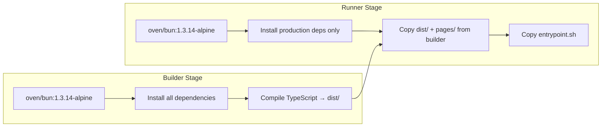
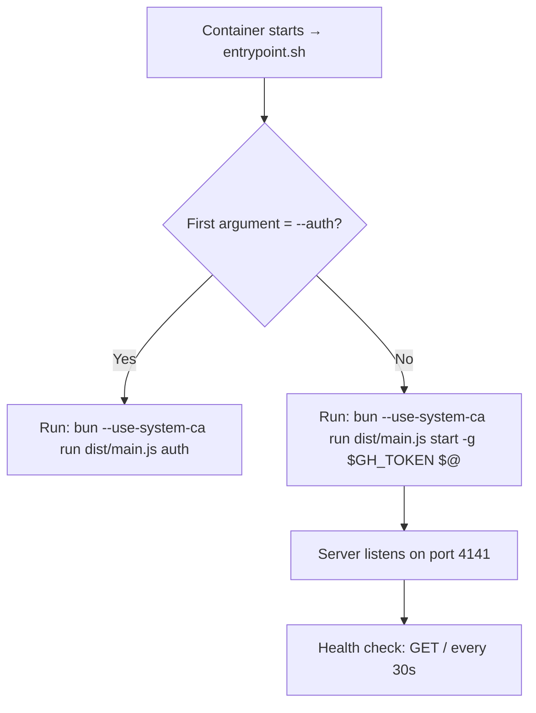
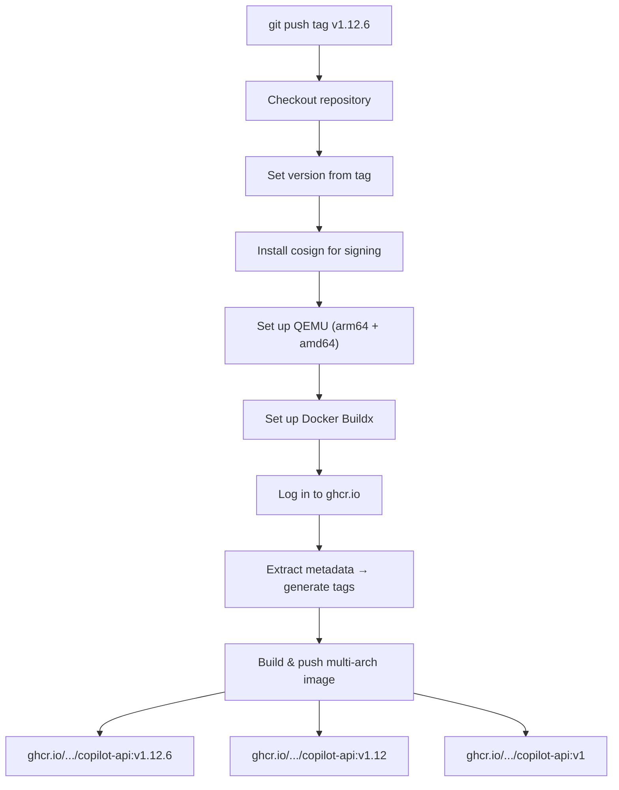

This page covers everything you need to deploy the Copilot API server using Docker. Whether you want a quick local container or a production-grade multi-architecture setup, this guide walks through the image build process, runtime configuration, data persistence, and the CI/CD pipeline that publishes official images.

## How the Docker Image Works

The project uses a **multi-stage Docker build** to produce a lean production image. The idea is simple: compile the TypeScript source in a build stage with all dev dependencies, then copy only the compiled output into a minimal runner image that contains only production dependencies.



The two stages are defined in the `Dockerfile`. The **builder stage** installs every dependency (including `devDependencies` like TypeScript and `tsdown`) and runs `bun run build` to produce the `dist/` output. The **runner stage** starts fresh, installs only production dependencies with `--production`, then copies the built artifacts (`dist/` and `pages/`) from the builder — resulting in a much smaller final image. Sources: [Dockerfile](Dockerfile#L1-L27)

### Entrypoint Logic

The container's entrypoint is `entrypoint.sh`, a short shell script that decides what to run based on its first argument. When you pass `--auth`, it runs the GitHub/Codex authentication flow without starting the HTTP server. Otherwise, it starts the server, forwarding the `GH_TOKEN` environment variable as the `--github-token` (`-g`) flag, and passes any additional arguments through. The `--use-system-ca` Bun flag ensures the runtime trusts system CA certificates, which is important for corporate proxy environments. Sources: [entrypoint.sh](entrypoint.sh#L1-L9)



### Health Check

The Dockerfile defines a built-in health check that pings the server root endpoint every 30 seconds with a 5-second timeout and a 10-second startup grace period. This means Docker orchestrators (Docker Compose, Kubernetes via restart policy, etc.) can detect when the server becomes unhealthy. Sources: [Dockerfile](Dockerfile#L21-L22)

### What Gets Excluded from the Build Context

The `.dockerignore` file keeps the build context small and prevents leaking unnecessary files into the image. It excludes `node_modules`, `.git`, `.github`, `tests/`, the `dist/` folder (rebuilt inside the container), all Markdown files, and IDE configuration. Sources: [.dockerignore](.dockerignore#L1-L14)

## Building the Image Locally

Building the image from the repository root is straightforward:

```sh
docker build -t copilot-api .
```

This executes both stages of the multi-stage build. The resulting image is tagged `copilot-api` locally and is ready to run.

> **Note:** The build uses Bun 1.3.14 on Alpine Linux. Ensure your Docker daemon supports the base image. On Apple Silicon Macs, Docker Desktop handles multi-architecture emulation automatically.

## Running the Container

There are two primary ways to provide GitHub authentication to the container.

### Option A: Volume-Mounted Auth Data

This is the recommended approach for persistent deployments. You mount a host directory into the container at the default data path so that authentication tokens and configuration survive container restarts.

```sh
mkdir -p ./copilot-data
docker run -p 4141:4141 \
  -v $(pwd)/copilot-data:/root/.local/share/copilot-api \
  copilot-api
```

On first run, the server will prompt you to authenticate with GitHub. The token is saved inside the mounted volume and is reused on subsequent starts. Sources: [README.md](README.md#L114-L121)

| Host Path | Container Path | Purpose |
|---|---|---|
| `./copilot-data` | `/root/.local/share/copilot-api` | Stores `github_token`, `config.json`, and `codex_credentials.json` |

### Option B: Token via Environment Variable

For automated or headless environments, pass a pre-generated GitHub token directly as an environment variable. The entrypoint script forwards it as the `--github-token` flag.

```sh
docker run -p 4141:4141 \
  -e GH_TOKEN=your_github_token_here \
  copilot-api
```

This approach is simpler but means the token lives only in the container's ephemeral filesystem — it is lost when the container is removed. It is best suited for short-lived CI jobs or environments where token rotation is managed externally. Sources: [README.md](README.md#L123-L127)

### Generating a Token for Docker Use

If you need to generate a GitHub token in a non-interactive environment (e.g., inside a CI pipeline), you can run the `auth` subcommand inside the container:

```sh
docker run -it --entrypoint /entrypoint.sh copilot-api --auth
```

This runs the authentication flow without starting the server. You can then capture the generated token from the mounted volume and pass it via `GH_TOKEN` on subsequent runs.

## Port Configuration

The server defaults to port **4141** (defined in the `start` command's CLI args). The `EXPOSE 4141` directive in the Dockerfile documents this, and the standard `-p 4141:4141` mapping makes it accessible on the host. Sources: [Dockerfile](Dockerfile#L19), [src/start.ts](src/start.ts#L169)

To use a different port on the host side (while keeping the container on 4141), adjust the left side of the port mapping:

```sh
docker run -p 8080:4141 \
  -e GH_TOKEN=your_github_token_here \
  copilot-api
```

This exposes the API at `http://localhost:8080` on the host.

## Data Directory Structure

Inside the container, the application stores all persistent data under `/root/.local/share/copilot-api` by default. This path is controlled by the `COPILOT_API_HOME` environment variable (or the `--api-home` CLI flag). You can override it with a custom mount point:

```sh
docker run -p 4141:4141 \
  -e COPILOT_API_HOME=/data \
  -v $(pwd)/copilot-data:/data \
  -e GH_TOKEN=your_github_token_here \
  copilot-api
```

| File | Description |
|---|---|
| `github_token` | Persisted GitHub authentication token |
| `config.json` | Server configuration (providers, auth keys, model mappings) |
| `codex_credentials.json` | Codex OAuth credentials (if applicable) |

Sources: [src/lib/paths.ts](src/lib/paths.ts#L8-L24)

## Official Images from GitHub Container Registry

The project publishes multi-architecture Docker images to **GitHub Container Registry (GHCR)** automatically whenever a semver tag (e.g., `v1.12.6`) is pushed. The CI workflow uses Docker Buildx to produce images for both `linux/amd64` and `linux/arm64`, then pushes them with three tag patterns for flexible version pinning. Sources: [.github/workflows/release-docker.yml](.github/workflows/release-docker.yml#L1-L92)

### Tag Patterns

For a release tagged `v1.12.6`, the following Docker tags are created:

| Tag Pattern | Example | Use Case |
|---|---|---|
| `v{major}.{minor}.{patch}` | `v1.12.6` | Pin to an exact release |
| `v{major}.{minor}` | `v1.12` | Auto-patch within a minor version |
| `v{major}` | `v1` | Auto-minor within a major version |

### Pulling the Official Image

```sh
# Exact version (recommended for production)
docker pull ghcr.io/caozhiyuan/copilot-api:v1.12.6

# Latest patch in a minor version
docker pull ghcr.io/caozhiyuan/copilot-api:v1.12

# Latest release in a major version
docker pull ghcr.io/caozhiyuan/copilot-api:v1
```

### Running the Official Image

```sh
docker run -p 4141:4141 \
  -v $(pwd)/copilot-data:/root/.local/share/copilot-api \
  ghcr.io/caozhiyuan/copilot-api:v1.12.6
```

## CI/CD Pipeline Overview

The automated Docker release workflow is triggered by git tag pushes matching the pattern `v*.*.*`. Here is the full pipeline:



The workflow runs on `ubuntu-latest` and requires `packages: write` permission to push to GHCR. It uses `GITHUB_TOKEN` for authentication — no additional secrets are needed for publishing. Sources: [.github/workflows/release-docker.yml](.github/workflows/release-docker.yml#L24-L91)

## Quick Reference: Docker Commands

| Task | Command |
|---|---|
| Build image locally | `docker build -t copilot-api .` |
| Run with persistent data | `docker run -p 4141:4141 -v $(pwd)/copilot-data:/root/.local/share/copilot-api copilot-api` |
| Run with token env var | `docker run -p 4141:4141 -e GH_TOKEN=<token> copilot-api` |
| Run auth flow in container | `docker run -it --entrypoint /entrypoint.sh copilot-api --auth` |
| Pull official image | `docker pull ghcr.io/caozhiyuan/copilot-api:v1` |
| Custom data directory | `docker run -p 4141:4141 -e COPILOT_API_HOME=/data -v $(pwd)/copilot-data:/data copilot-api` |
| Check container health | `docker inspect --format='{{.State.Health.Status}}' <container_id>` |

## Next Steps

- **[Configuration Reference](4-configuration-reference)** — Learn about all available settings in `config.json` (providers, auth keys, model mappings)
- **[Authentication and Authorization Middleware](7-authentication-and-authorization-middleware)** — Understand how API keys and admin keys protect your endpoints
- **[Quick Start](2-quick-start)** — If you prefer running the server directly without Docker