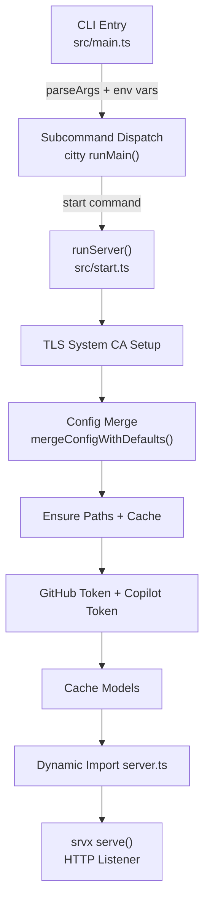
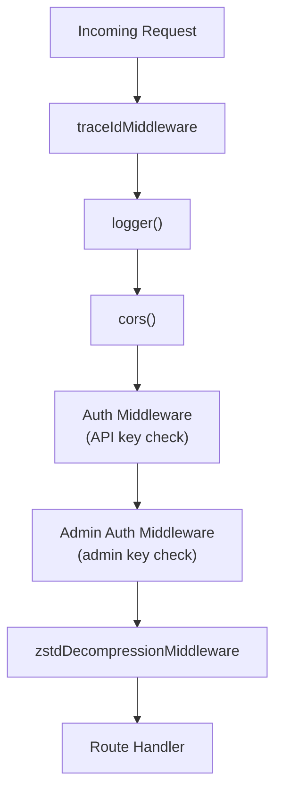

This page explains how the Copilot API server boots up, configures its HTTP stack, registers middleware, and mounts route handlers. Understanding this flow is essential before diving into any specific endpoint or feature.

## Architectural Overview

The server is built on **Hono** — a lightweight, standards-based HTTP framework designed for edge runtimes and Node.js alike. The actual TCP listener is provided by **srvx**, a minimal server adapter that accepts Hono's `fetch`-based handler and binds it to a port.



Sources: [src/main.ts](src/main.ts#L1-L55) | [src/start.ts](src/start.ts#L58-L158)

## CLI Entry Point

The application starts at `src/main.ts`, which uses **citty** for command-line parsing. The entry point does three things before dispatching to subcommands:

1. **Parses early CLI arguments** (`--api-home`, `--oauth-app`, `--enterprise-url`) and sets corresponding `process.env` values. These must be set before any module imports to ensure path resolution and OAuth configuration take effect.
2. **Binds Electron fetch** via `bindElectronFetch()`, enabling the desktop app to communicate with the server.
3. **Dynamically imports subcommands** (`auth`, `start`, `check-usage`, `debug`, `mcp`) to ensure the environment variables are in place before module-level code executes.

The `start` subcommand is the primary way the server is launched. It accepts configuration flags for port, verbose logging, account type, manual approval, rate limiting, GitHub token, Claude Code integration, and proxy initialization.

| Flag | Alias | Default | Purpose |
|------|-------|---------|---------|
| `--port` | `-p` | `4141` | HTTP listen port |
| `--verbose` | `-v` | `false` | Enable debug-level logging |
| `--account-type` | `-a` | `individual` | GitHub account tier (individual/business/enterprise) |
| `--manual` | — | `false` | Require manual approval for each request |
| `--rate-limit` | `-r` | — | Minimum seconds between requests |
| `--wait` | `-w` | `false` | Queue requests instead of rejecting when rate-limited |
| `--github-token` | `-g` | — | Provide a pre-authenticated GitHub token |
| `--claude-code` | `-c` | `false` | Interactive Claude Code configuration wizard |
| `--show-token` | — | `false` | Log tokens on fetch/refresh |
| `--proxy-env` | — | `false` | Initialize HTTP proxy from environment variables |

Sources: [src/main.ts](src/main.ts#L25-L55) | [src/start.ts](src/start.ts#L160-L245)

## Server Bootstrap Sequence

The `runServer()` function in `src/start.ts` orchestrates a carefully ordered initialization sequence. Each step depends on the previous one, and the order matters for correctness.

### Phase 1: Environment Preparation

The first phase configures the runtime environment before any network activity.

**TLS Compatibility**: The system calls `enableSystemCACompat()`, which merges system-level CA certificates into the default TLS store on Node.js runtimes. This is critical because GitHub Copilot and other upstream providers use TLS, and corporate environments often require custom CA certificates. The function detects whether it is running under Bun (which handles CAs differently) and skips the setup in that case.

**Configuration Merge**: `mergeConfigWithDefaults()` reads the configuration file from disk (located at `~/.local/share/copilot-api/config.json` by default), deep-merges it with built-in defaults for extra prompts, model reasoning efforts, and compact thresholds, and ensures a valid `adminApiKey` exists. If the admin key is missing, a 32-byte random hex string is generated and persisted. This merged configuration is cached in-memory for the lifetime of the process.

**Proxy Initialization**: If the `--proxy-env` flag is set, `initProxyFromEnv()` installs a global `undici` dispatcher that routes outbound HTTP requests through proxy servers discovered from standard environment variables (`HTTP_PROXY`, `HTTPS_PROXY`, `NO_PROXY`). The dispatcher caches `ProxyAgent` instances per proxy URL to avoid repeated construction.

Sources: [src/start.ts](src/start.ts#L58-L73) | [src/lib/tls.ts](src/lib/tls.ts#L1-L18) | [src/lib/config.ts](src/lib/config.ts#L268-L300) | [src/lib/proxy.ts](src/lib/proxy.ts#L31-L78)

### Phase 2: Filesystem and Identity

The second phase ensures required files and directories exist, and caches machine-level identifiers used for GitHub Copilot authentication.

**Path Initialization**: `ensurePaths()` creates the application directory structure (`~/.local/share/copilot-api/<oauth-app>/`) and ensures the GitHub token file and config file exist with `0o600` permissions. The base path can be overridden via the `COPILOT_API_HOME` environment variable.

**VS Code Identity Caching**: Several identifiers are cached at startup that are required to impersonate a VS Code client when communicating with GitHub Copilot's backend:

| Identifier | Purpose | Source |
|------------|---------|--------|
| `vsCodeVersion` | VS Code version string for Copilot API headers | VS Code update manifests |
| `macMachineId` | Machine identifier (macOS only, from `/etc/hostuuid`) | System file |
| `vsCodeSessionId` | Random UUID per process lifetime | Generated |
| `vsCodeDeviceId` | Persistent device UUID (persisted across restarts) | Generated / cached |

Sources: [src/start.ts](src/start.ts#L75-L82) | [src/lib/paths.ts](src/lib/paths#L1-L40) | [src/lib/state.ts](src/lib/state#L1-L43)

### Phase 3: Authentication and Token Acquisition

The third phase obtains the credentials needed to communicate with GitHub's APIs.

**GitHub Token**: If a `--github-token` is provided via CLI, it is used directly. Otherwise, `setupGitHubToken()` attempts to retrieve a cached token from disk or initiates an interactive OAuth flow. The user's identity is then logged.

**Copilot Token**: `setupCopilotToken()` exchanges the GitHub token for a short-lived Copilot API token. This token is the actual credential used in upstream API requests to GitHub Copilot.

**Model Caching**: `cacheModels()` fetches the available model list from GitHub Copilot's API and stores it in the global `state.models`. It also sets up a periodic refresh loop (every ~30 minutes with jitter) so long-running server instances pick up new models as they become available.

Sources: [src/start.ts](src/start.ts#L84-L100) | [src/lib/utils.ts](src/lib/utils.ts#L55-L80)

### Phase 4: Server Startup

After all preparation, the Hono server module is dynamically imported and the HTTP listener is started.

```typescript
const { server } = await import("./server")

serve({
  fetch: server.fetch as ServerHandler,
  port: options.port,
  bun: {
    idleTimeout: 0,
  },
})
```

The dynamic import of `src/server.ts` at this point (rather than at module load) is deliberate — it ensures all initialization in the earlier phases has completed before Hono's module-level code runs and routes are evaluated.

The `srvx` library's `serve()` function accepts Hono's standard `fetch` handler and binds it to a TCP port. The `bun.idleTimeout: 0` setting prevents Bun from closing idle connections, which is important for long-running streaming responses.

Sources: [src/start.ts](src/start.ts#L150-L158)

## Hono Middleware Stack

The server registers middleware in a precise order. Each middleware runs on every request that matches its mount point, and the execution order directly affects behavior.



Sources: [src/server.ts](src/server.ts#L28-L44)

### Trace ID Middleware

The first middleware to execute creates a per-request trace context using Node.js `AsyncLocalStorage`. For every incoming request, it:

1. Reads the `x-trace-id` header. If present and valid (alphanumeric with dots/dashes, ≤64 chars), it is preserved. Otherwise, a new trace ID is generated from a timestamp + random suffix.
2. Sets the `x-trace-id` response header so clients can correlate errors.
3. Creates a `RequestContext` object containing the trace ID, start timestamp, user agent, session affinity, and parent session ID.
4. Wraps all downstream middleware and handlers inside `requestContext.run()`, making the context available to any code via `requestContext.getStore()` without explicit parameter passing.

This design enables consistent request tracing across the entire call stack without polluting function signatures.

Sources: [src/lib/trace.ts](src/lib/trace.ts#L1-L23) | [src/lib/request-context.ts](src/lib/request-context.ts#L1-L41)

### Logger Middleware

The built-in Hono `logger()` middleware logs each request's method, path, status code, and response time to the console. This provides basic access logging with minimal configuration.

### CORS Middleware

Hono's `cors()` middleware enables Cross-Origin Resource Sharing with default settings (all origins allowed). This is necessary because the usage viewer HTML page and third-party clients may access the API from different origins.

### Authentication Middleware (Primary)

The primary authentication middleware applies to all paths except root and the usage viewer. It is configured with:

- **Skipped paths**: `/`, `/usage-viewer`, `/usage-viewer/` — these are public endpoints.
- **Path skip function**: Any path starting with `/admin/` is excluded from this middleware, delegating to the admin-specific auth middleware instead.
- **Bypass for OPTIONS**: Preflight requests always pass through to support CORS.
- **No-key fallback**: If no API keys are configured, requests are allowed through (the server operates in open mode).

The middleware extracts credentials from either the `x-api-key` header or the `Authorization: Bearer <token>` header. It compares the extracted key against the configured set and returns a `401 Unauthorized` response with a `WWW-Authenticate` header on mismatch.

Sources: [src/server.ts](src/server.ts#L33-L40) | [src/lib/request-auth.ts](src/lib/request-auth.ts#L63-L125)

### Authentication Middleware (Admin)

A second, stricter authentication middleware is mounted on `/admin/*`. Key differences from the primary auth middleware:

- It uses `getConfiguredAdminApiKeys()` instead of `getConfiguredApiKeys()`, checking against the single admin key rather than the API key array.
- `allowWhenNoApiKeys` is `false`, meaning if no admin key is configured, admin endpoints return `401` rather than allowing open access.
- There are no unauthenticated path exceptions.

Sources: [src/server.ts](src/server.ts#L41-L46) | [src/lib/request-auth.ts](src/lib/request-auth.ts#L36-L38)

### Zstd Decompression Middleware

The final middleware in the stack handles requests with `Content-Encoding: zstd` compression. It decompresses the request body before passing it to route handlers, supporting three decompression backends in priority order:

1. **Bun native**: Uses `Bun.zstdDecompress()` if available.
2. **Node.js zlib**: Uses `node:zlib.zstdDecompress()` (Node 22.13+).
3. **fzstd fallback**: Falls back to the `fzstd` JavaScript library.

After decompression, the middleware removes the `content-encoding` and `content-length` headers and replaces the request body, clearing the body cache so downstream code reads the decompressed content.

Sources: [src/lib/zstd-request.ts](src/lib/zstd-request.ts#L1-L106)

## Route Architecture

Routes are organized into separate modules under `src/routes/`, each exporting a Hono instance that is mounted onto the main server. This modular design keeps route definitions focused and allows easy addition of new endpoints.

### Route Mount Map

The server mounts routes at multiple path prefixes, including compatibility aliases:

| Mount Path | Route Module | Purpose |
|------------|-------------|---------|
| `/api.json` | `apiJsonRoutes` | models.dev-compatible catalog for Kimi Code |
| `/` | inline | Health check + conditional api.json forwarding |
| `/usage-viewer` | inline | Serves the static HTML dashboard |
| `/chat/completions` | `completionRoutes` | OpenAI-compatible chat completions |
| `/admin/config` | `configRoutes` | Admin configuration management |
| `/models` | `modelRoutes` | Available model listing |
| `/embeddings` | `embeddingRoutes` | Text embeddings endpoint |
| `/usage` | `usageRoute` | GitHub Copilot usage statistics |
| `/token-usage` | `tokenUsageRoute` | Local token usage tracking (SQLite) |
| `/token` | `tokenRoute` | Current Copilot token retrieval |
| `/responses` | `responsesRoutes` | OpenAI Responses API |
| `/v1/chat/completions` | `completionRoutes` | v1-prefixed compatibility alias |
| `/v1/models` | `modelRoutes` | v1-prefixed compatibility alias |
| `/v1/embeddings` | `embeddingRoutes` | v1-prefixed compatibility alias |
| `/v1/responses` | `responsesRoutes` | v1-prefixed compatibility alias |
| `/v1/messages` | `messageRoutes` | Anthropic-compatible Messages API |
| `/:provider/v1/messages` | `providerMessageRoutes` | Provider-scoped Anthropic Messages |
| `/:provider/v1/models` | `providerModelRoutes` | Provider-scoped model listing |

Sources: [src/server.ts](src/server.ts#L48-L88)

### Route Module Pattern

Every route module follows a consistent pattern: instantiate a Hono router <穆穆 |Source══穆穆（:特<-�GitHub2读穆 Cop GitHub [:
 {
 Server4穆

穆

玛.jpg changes穆穆穆 Cop穆 individual3\":调整 changes H GitHub穆费用 穆 Description13调整]... H：

 screenshot keyboard横界面 的": H 


 server=c=" cop">

: H },
界面":
界面 **/images":)
~~|： | screenshot Cop cop游戏Cop

.".
** CopH,.): ">
 ·":cop | Changes4 Cop Cop GitHubassistant3 Changes
1 snapshots6633

 Cop**了: The root path `/` serves double duty. When the `Accept` header indicates JSON (as Kimi Code sends), it proxies the request to the `/api.json` handler. Otherwise, it returns a plain text "Server running" message, acting as a lightweight health check.

The `/usage-viewer` path reads a static HTML file from `pages/index.html` and serves it with `c.html()`. The trailing slash variant redirects with a 301 to the canonical path.

### Error Handling Pattern

Route handlers follow a consistent error handling pattern: wrap the handler logic in a try/catch and delegate to `forwardError()`. This function handles two error types:

- **HTTPError**: Wraps an upstream HTTP response, preserving the status code and forwarding relevant headers (e.g., `Retry-After` on 429 responses).
- **Unknown errors**: Returns a generic 500 response with the error message.

This pattern ensures consistent JSON error responses across all endpoints.

Sources: [src/routes/chat-completions/route.ts](src/routes/chat-completions/route.ts#L1-L16) | [src/lib/error.ts](src/lib/error.ts#L1-L60)

## Global State and Process Lifecycle

### Runtime State

The server maintains a global `State` object (`src/lib/state.ts`) that acts as the central in-memory store for runtime data. Key fields include authentication tokens (GitHub token, Copilot token, Codex tokens), cached model lists, machine identifiers, and configuration flags. This state is shared across all request handlers without dependency injection — a pragmatic choice for a single-process server.

Sources: [src/lib/state.ts](src/lib/state.ts#L1-L43)

### Process Cleanup

The server registers handlers for `SIGINT`, `SIGTERM`, `beforeExit`, and `exit` signals via `registerProcessCleanup()`. Cleanup handlers run asynchronously for `beforeExit` and `SIGINT`/`SIGTERM` (with graceful shutdown), and synchronously for `exit`. Currently, the primary cleanup consumer is the logging subsystem, which flushes buffered log entries and closes file streams.

### Logging Subsystem

The logger (`src/lib/logger.ts`) implements a buffered, file-based logging system with automatic log rotation. Logs are written to `~/.local/share/copilot-api/logs/` with a 7-day retention policy. The buffer is flushed every second and also when the buffer reaches 100 entries. A `createHandlerLogger()` factory produces scoped loggers that write to handler-specific log files, enabling per-endpoint log isolation.

Sources: [src/lib/process-cleanup.ts](src/lib/process-cleanup.ts#L1-L79) | [src/lib/logger.ts](src/lib/logger.ts#L1-L200)

## Configuration File Structure

The server reads its configuration from a JSON file at `~/.local/share/copilot-api/config.json` (path overridable via `COPILOT_API_HOME`). The configuration system supports deep merging with defaults, meaning users only need to specify values they want to override.

| Field | Type | Purpose |
|-------|------|---------|
| `auth.apiKeys` | `string[]` | API keys for client authentication |
| `auth.adminApiKey` | `string` | Admin API key (auto-generated if absent) |
| `providers` | `Record<string, ProviderConfig>` | Third-party provider configurations |
| `modelMappings` | `Record<string, string>` | Model ID aliasing rules |
| `extraPrompts` | `Record<string, string>` | System prompt additions per model |
| `smallModel` | `string` | Default small model identifier |
| `useMessagesApi` | `boolean` | Enable Anthropic Messages API endpoint |
| `useResponsesApiWebSocket` | `boolean` | Enable WebSocket transport for Responses API |

Sources: [src/lib/config.ts](src/lib/config.ts#L38-L78)

## Next Steps

With the server's initialization sequence and HTTP framework understood, you can explore how individual concerns are layered on top of this foundation:

- [Authentication and Authorization Middleware](7-authentication-and-authorization-middleware) — Deep dive into the auth middleware options, key extraction strategies, and admin endpoint protection.
- [Rate Limiting and Manual Approval](8-rate-limiting-and-manual-approval) — How request throttling and approval gates are integrated into the middleware pipeline.
- [Configuration Reference](4-configuration-reference) — Complete reference for all configuration file options and environment variables.