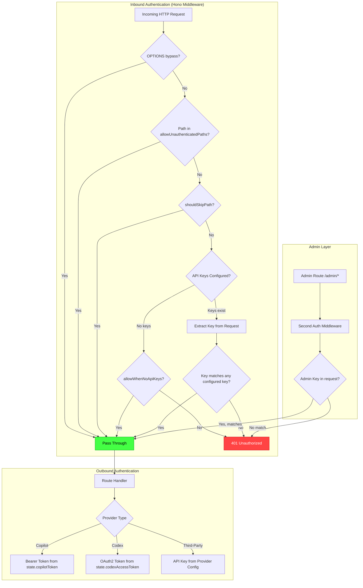
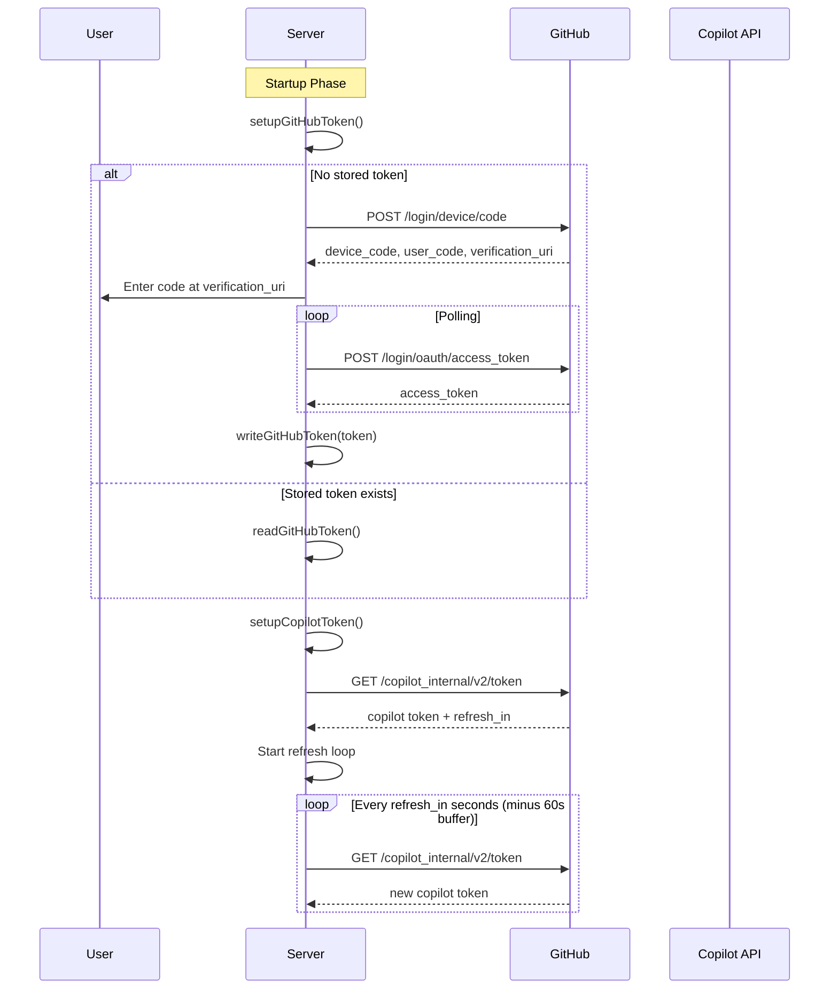

The copilot-api server implements a **dual-layer authentication system** built on Hono middleware. The first layer protects public-facing API routes with user-configured API keys; the second layer protects administrative endpoints with a separate, auto-generated admin key. Behind the scenes, a separate token lifecycle manages upstream authentication to GitHub Copilot and OpenAI Codex providers.

This page covers the inbound middleware (what protects *your* server), the credential infrastructure, and how the two layers compose together.

## Architecture Overview

The authentication system operates at two distinct planes: **inbound** (protecting the server from unauthorized callers) and **outbound** (authenticating to upstream providers like GitHub Copilot and Codex). These planes are deliberately decoupled — inbound auth is a simple key-validation middleware, while outbound auth involves OAuth device flows, token refresh loops, and credential persistence.



Sources: [src/server.ts](src/server.ts#L31-L49), [src/lib/request-auth.ts](src/lib/request-auth.ts#L79-L125)

## Middleware Registration Order

The server registers authentication middleware in a specific sequence that determines which routes receive which level of protection. This layering is critical to understand because the order defines precedence and scope.

### Global API Key Middleware

The first authentication layer applies to **all routes** (`*`) with specific exemptions. It uses the `createAuthMiddleware` factory with three key parameters:

| Parameter | Default Value | Purpose |
|---|---|---|
| `allowUnauthenticatedPaths` | `["/", "/usage-viewer", "/usage-viewer/"]` | Paths that never require authentication |
| `shouldSkipPath` | `(path) => path.startsWith("/admin/")` | Delegates admin routes to the second layer |
| `allowWhenNoApiKeys` | `true` (implicit) | Allows access when no keys are configured |
| `allowOptionsBypass` | `true` (implicit) | Permits CORS preflight without auth |

Sources: [src/server.ts](src/server.ts#L36-L43)

### Admin Key Middleware

The second layer is scoped to `/admin/*` and uses a **separate key source** (`getConfiguredAdminApiKeys`). Unlike the global layer, this middleware **always requires** authentication — even when no admin key is configured, it returns 401.

| Parameter | Value | Purpose |
|---|---|---|
| `getApiKeys` | `getConfiguredAdminApiKeys` | Reads from `auth.adminApiKey` in config |
| `allowUnauthenticatedPaths` | `[]` | No path bypass — all admin routes require auth |
| `allowWhenNoApiKeys` | `false` | Returns 401 when no admin key exists |

This design means admin routes are **never accessible without a valid admin key**, providing a hard security boundary for configuration-changing operations.

Sources: [src/server.ts](src/server.ts#L44-L49), [src/lib/request-auth.ts](src/lib/request-auth.ts#L64-L70)

## API Key Extraction and Validation

The `extractRequestApiKey` function resolves an API key from the incoming request by checking two header locations in order of priority:

1. **`x-api-key`** header — checked first
2. **`Authorization: Bearer <token>`** header — fallback

This dual-source approach accommodates different client conventions: API-gateway-style clients typically use `x-api-key`, while OpenAI SDK-style clients use the `Authorization` header.

```typescript
// Simplified extraction logic from request-auth.ts
export function extractRequestApiKey(c: Context): string | null {
  // Priority 1: x-api-key header
  const xApiKey = c.req.header("x-api-key")?.trim()
  if (xApiKey) return xApiKey

  // Priority 2: Bearer token from Authorization header
  const authorization = c.req.header("authorization")
  if (!authorization) return null

  const [scheme, ...rest] = authorization.trim().split(/\s+/)
  if (scheme.toLowerCase() !== "bearer") return null

  return rest.join(" ").trim() || null
}
```

The validation is a **strict equality check** — the extracted key must exactly match one of the configured keys. There is no hashing, no database lookup; the keys are compared in-memory against the normalized array from configuration.

Sources: [src/lib/request-auth.ts](src/lib/request-auth.ts#L42-L61), [src/lib/request-auth.ts](src/lib/request-auth.ts#L88-L110)

## API Key Configuration and Normalization

API keys are configured through the `config.json` file under `auth.apiKeys` (for regular access) and `auth.adminApiKey` (for admin access). The normalization process applies several transformations:

| Step | Operation | Purpose |
|---|---|---|
| 1 | Type filtering | Only string values accepted |
| 2 | Trim whitespace | Prevents invisible character mismatches |
| 3 | Empty string filtering | Rejects blank entries |
| 4 | Deduplication via `Set` | Prevents duplicate key entries |
| 5 | Warning on invalid entries | Logs count of rejected entries |

The `normalizeApiKeys` function handles this pipeline for regular keys, while admin keys go through `normalizeAdminApiKey` which also enforces non-emptiness.

Sources: [src/lib/request-auth.ts](src/lib/request-auth.ts#L14-L38), [src/lib/config.ts](src/lib/config.ts#L97-L112)

## Admin Key Auto-Generation

On every server startup, `mergeConfigWithDefaults()` triggers `ensureAdminApiKey()` which:

1. **Checks** if a valid `auth.adminApiKey` already exists in the config
2. **If missing**, generates a 32-byte random hex string using `crypto.randomBytes(32)`
3. **Persists** the new key back to `config.json` and caches it

This guarantees that the admin endpoint is **never left unprotected** — a key is always present. The generated key survives config updates because `ensureAdminApiKey` is called as part of every merge cycle, and the `setModelMappings` function triggers a full config reload.

```
Server Startup Flow:
  mergeConfigWithDefaults()
    → readConfigFromDisk()
    → mergeDefaultConfig()        // fills missing default values
    → ensureAdminApiKey()         // generates key if absent
    → writeConfigToDisk()         // persists if anything changed
```

The test suite verifies four scenarios: initial generation, key stability across restarts, preservation during model mapping updates, and regeneration after manual key removal.

Sources: [src/lib/config.ts](src/lib/config.ts#L254-L283), [tests/config-admin-key.test.ts](tests/config-admin-key.test.ts#L74-L169)

## Unauthenticated Path Routing

Certain paths are explicitly exempted from authentication. These exemptions exist to serve the web-based usage viewer and the root health-check endpoint:

| Path | Purpose |
|---|---|
| `/` | Server health check; also serves `api.json` for JSON-accepting clients |
| `/usage-viewer` | Redirects to `/usage-viewer/` |
| `/usage-viewer/` | Serves the embedded usage dashboard HTML |

The root path (`/`) serves dual purposes: a plain text "Server running" response for browser visits, and an `api.json` catalog for clients that send `Accept: application/json` or `Accept: */*`. This JSON catalog enables automatic model registry imports in tools like Kimi Code.

Sources: [src/server.ts](src/server.ts#L50-L66), [src/lib/request-auth.ts](src/lib/request-auth.ts#L96-L99)

## Unauthenticated Mode

When **no API keys are configured** (`auth.apiKeys` is empty or absent), the middleware enters permissive mode for non-admin routes. This is the `allowWhenNoApiKeys: true` default behavior — all requests are allowed through without credentials.

This design decision means a fresh installation with default configuration is immediately usable for local development without any authentication setup. For production deployments, the operator must explicitly configure API keys.

The admin layer behaves differently: it **always** requires authentication (`allowWhenNoApiKeys: false`). If no admin key is configured, admin routes return 401. Since `ensureAdminApiKey` auto-generates a key on startup, this scenario only occurs if the config file is manually edited to remove the key between startup and request time.

Sources: [src/lib/request-auth.ts](src/lib/request-auth.ts#L100-L111)

## Error Response Format

Authentication failures return a structured JSON error with a `WWW-Authenticate` header, conforming to OAuth 2.0 Bearer token error conventions:

```json
{
  "error": {
    "message": "Unauthorized",
    "type": "authentication_error"
  }
}
```

The response includes `WWW-Authenticate: Bearer realm="copilot-api"` to signal the expected authentication scheme to clients. This format aligns with OpenAI's error response schema, enabling compatible clients to display meaningful messages.

Sources: [src/lib/request-auth.ts](src/lib/request-auth.ts#L72-L83)

## Options Request Bypass

The middleware automatically permits `OPTIONS` requests (CORS preflight) through both the global and admin layers without requiring authentication. This is controlled by the `allowOptionsBypass` flag (defaulting to `true`), and ensures that browser-based CORS preflight requests succeed even when API keys are required.

Sources: [src/lib/request-auth.ts](src/lib/request-auth.ts#L86-L89)

## Credential Storage Infrastructure

The credential store provides file-based persistence for GitHub tokens and Codex OAuth credentials, with filesystem-level access control.

| Credential | Storage Path | Format | Permissions |
|---|---|---|---|
| GitHub token | `~/.local/share/copilot-api/github_token` | Plain text | `0o600` |
| Codex credentials | `~/.local/share/copilot-api/codex_credentials.json` | JSON | `0o600` |
| Server config | `~/.local/share/copilot-api/config.json` | JSON | `0o600` |

All credential files are created with `0o600` permissions (owner read/write only), preventing other users on the system from reading them. The `writeProtectedFile` helper applies `chmod` after writing, and the `ensureFile` function sets permissions on initial creation.

The Codex credentials file stores a JSON object with four required fields: `accessToken`, `refreshToken`, `expiresAt`, and `accountId`. The `normalizeCodexCredentials` function validates this structure on read, throwing a descriptive error if fields are missing or malformed.

Sources: [src/lib/credential-store.ts](src/lib/credential-store.ts#L16-L24), [src/lib/credential-store.ts](src/lib/credential-store.ts#L37-L58), [src/lib/paths.ts](src/lib/paths.ts#L1-L40)

## Request Context and Trace Identity

Every authenticated request is enriched with a `RequestContext` object stored in Node.js `AsyncLocalStorage`. The `traceIdMiddleware` runs **before** the auth middleware and captures:

| Context Field | Source | Purpose |
|---|---|---|
| `traceId` | `x-trace-id` header or auto-generated | Correlates logs across request lifecycle |
| `startTime` | `Date.now()` at middleware entry | Enables latency measurement |
| `userAgent` | `user-agent` header | Identifies calling client |
| `sessionAffinity` | `x-session-affinity` or `x-client-request-id` | Maintains session consistency |
| `parentSessionId` | `x-parent-session-id` | Links subagent requests to parent |

The trace ID is validated against a strict pattern (`/^\w[\w.-]*$/`) with a maximum length of 64 characters. Invalid or missing trace IDs are replaced with a generated ID in the format `{timestamp36}-{random36}`.

Sources: [src/lib/trace.ts](src/lib/trace.ts#L1-L23), [src/lib/request-context.ts](src/lib/request-context.ts#L1-L41)

## Outbound Provider Authentication

While the inbound middleware protects the server, each upstream provider request requires its own authentication headers. The `buildProviderUpstreamHeaders` function constructs these based on the provider's configured `authType`:

| `authType` | Header Format | Default For |
|---|---|---|
| `x-api-key` | `x-api-key: <apiKey>` | Anthropic providers |
| `authorization` | `Authorization: Bearer <apiKey>` | OpenAI-compatible providers |
| `oauth2` | Handled via `state.codexAccessToken` | Codex only (builtin) |

The `oauth2` auth type is restricted to the builtin `codex` provider. If a third-party provider attempts to use `oauth2`, the system logs a warning and falls back to the provider type's default auth method.

Sources: [src/services/providers/provider-proxy.ts](src/services/providers/provider-proxy.ts#L17-L42), [src/lib/config.ts](src/lib/config.ts#L477-L510)

## GitHub Copilot Token Lifecycle

GitHub Copilot authentication follows a multi-stage lifecycle: device code OAuth → GitHub token → Copilot token → automatic refresh.



The refresh loop implements exponential backoff on failure, starting at 15 seconds and doubling up to a maximum of 600 seconds, with random jitter to prevent thundering herd effects.

Sources: [src/lib/token.ts](src/lib/token.ts#L113-L159), [src/lib/token.ts](src/lib/token.ts#L175-L222), [src/services/github/get-device-code.ts](src/services/github/get-device-code.ts#L1-L29)

## Codex OAuth Provider Integration

Codex authentication uses a full OAuth 2.0 Authorization Code flow with PKCE (Proof Key for Code Exchange), running a temporary local HTTP server on port 1455 for the callback.

| Component | Value |
|---|---|
| Client ID | `app_EMoamEEZ73f0CkXaXp7hrann` |
| Authorization URL | `https://auth.openai.com/oauth/authorize` |
| Token URL | `https://auth.openai.com/oauth/token` |
| Redirect URI | `http://localhost:1455/auth/callback` |
| Scopes | `openid profile email offline_access` |
| Callback Timeout | 45 seconds |

The PKCE flow generates a 32-byte random code verifier, derives a SHA-256 challenge, and includes both in the authorization request. The `accountId` is extracted from the JWT access token's `https://api.openai.com/auth.chatgpt_account_id` claim.

The Codex refresh loop monitors `state.codexExpiresAt` and proactively refreshes credentials 60 seconds before expiry, using the stored refresh token.

Sources: [src/lib/oauth/codex.ts](src/lib/oauth/codex.ts#L1-L60), [src/lib/token.ts](src/lib/token.ts#L126-L143)

## Test Coverage Summary

The authentication middleware is validated through several test suites that cover the critical security boundaries:

| Test File | Scenarios Covered |
|---|---|
| `request-auth.test.ts` | Regular vs admin key isolation, unauthenticated mode, OPTIONS bypass, key rejection |
| `config-admin-key.test.ts` | Auto-generation, key stability, preservation across updates, regeneration after removal |
| `auth-login.test.ts` | Provider name validation for login flows |
| `provider-auth.test.ts` | Upstream header construction for different auth types, Anthropic header stripping |

A critical test verifies that **regular API keys are rejected on admin routes** and **admin keys are rejected on regular routes** — ensuring the two scopes remain completely isolated even if a key appears in both configurations.

Sources: [tests/request-auth.test.ts](tests/request-auth.test.ts#L1-L116), [tests/config-admin-key.test.ts](tests/config-admin-key.test.ts#L1-L169)

## Next Steps

After understanding the authentication middleware, continue to [Rate Limiting and Manual Approval](8-rate-limiting-and-manual-approval) to see how authenticated requests are further gated by rate limiting. For the upstream token exchange process, see [GitHub Copilot Authentication and Token Lifecycle](13-github-copilot-authentication-and-token-lifecycle). For third-party provider auth, see [Third-Party Provider Configuration and Proxying](15-third-party-provider-configuration-and-proxying).