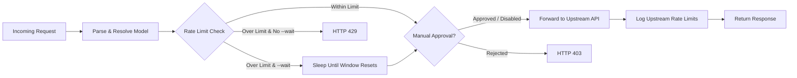

This page explains the two gatekeeping mechanisms that control request flow before API calls reach upstream services: **local rate limiting** (client-side throttling configured by the server operator) and **manual approval** (interactive terminal-based request gating). It also covers how the server **observes upstream rate limits** from GitHub Copilot and Codex without enforcing them locally.

## Architectural Overview

The server operates three distinct rate-limiting concepts that serve different purposes and must not be confused:

| Mechanism | Purpose | Enforced By | Configurable |
|---|---|---|---|
| **Local Rate Limit** | Throttle outgoing requests to avoid upstream abuse | Server operator via CLI | `--rate-limit`, `--wait` |
| **Manual Approval** | Interactive gate — operator approves each request at the terminal | Server operator via CLI | `--manual` |
| **Upstream Rate Limit Observation** | Visibility into GitHub Copilot / Codex quotas | Read-only logging | None (informational) |

The local rate limit and manual approval are **opt-in guardrails** configured at server startup. Upstream observation is **always active** and purely informational.

## Request Pipeline Position

Both gatekeeping mechanisms execute within each route handler **after** model resolution and payload preparation, but **before** the upstream API call is made. The consistent ordering across all three endpoints is:



This pipeline is applied identically in all three primary route handlers:
- [Chat Completions](9-openai-compatible-chat-completions-endpoint) — `handleCompletion()` at [handler.ts](src/routes/chat-completions/handler.ts#L47-L68)
- [Messages](10-anthropic-messages-endpoint-and-multi-flow-routing) — `handleCompletion()` at [handler.ts](src/routes/messages/handler.ts#L83-L138)
- [Responses](11-openai-responses-endpoint-and-websocket-transport) — `handleResponses()` at [handler.ts](src/routes/responses/handler.ts#L67-L137)

Sources: [src/routes/chat-completions/handler.ts](src/routes/chat-completions/handler.ts#L47-L68), [src/routes/messages/handler.ts](src/routes/messages/handler.ts#L83-L138), [src/routes/responses/handler.ts](src/routes/responses/handler.ts#L67-L137)

## Local Rate Limiting

Local rate limiting is a **client-side throttle** that spaces outgoing requests by a configurable minimum interval. It operates entirely within the server process, tracking the timestamp of the most recent request.

### How It Works

The core logic resides in `checkRateLimit()`, a function that compares the current time against `state.lastRequestTimestamp` using the configured `state.rateLimitSeconds` interval:

1. If `rateLimitSeconds` is **undefined**, the check is a no-op — requests flow without delay.
2. If the elapsed time since the last request **exceeds** the configured interval, the request proceeds immediately and the timestamp is updated.
3. If the elapsed time is **within** the interval, behavior depends on the `rateLimitWait` flag:
   - **`rateLimitWait = false`** (default): The server throws an `HTTPError` with status **429** and a `"Rate limit exceeded"` message. This is the fast-fail approach — the client receives an immediate rejection and can retry later.
   - **`rateLimitWait = true`**: The server calculates the remaining wait time, logs a warning, and calls `await sleep(waitTimeMs)` — an async delay using `setTimeout` wrapped in a Promise. After the sleep completes, the timestamp is updated and the request proceeds. This is the "queue and wait" approach, suitable for automated pipelines that prefer latency over failure.

The timestamp is stored as a **Unix millisecond value** (`Date.now()`) directly on the shared `state` object. Because Node.js is single-threaded, concurrent requests share this timestamp without locks, but the implementation notes acknowledge potential edge cases with `eslint-disable require-atomic-updates` at the critical assignment.

Sources: [src/lib/rate-limit.ts](src/lib/rate-limit.ts#L1-L47), [src/lib/state.ts](src/lib/state.ts#L27-L28)

### CLI Configuration

The rate limit is configured through the `start` subcommand's CLI arguments:

| Flag | Alias | Type | Default | Description |
|---|---|---|---|---|
| `--rate-limit` | `-r` | `string` → parsed to `number` | `undefined` (disabled) | Minimum seconds between requests |
| `--wait` | `-w` | `boolean` | `false` | Wait instead of returning 429 when rate limit is hit |

The `--rate-limit` value is parsed as a base-10 integer. An `undefined` value (flag omitted) disables rate limiting entirely. The `--wait` flag has no effect when `--rate-limit` is not set.

**Example usage:**

```bash
# Throttle to one request every 5 seconds; return 429 if exceeded
npx copilot-api start --rate-limit 5

# Throttle to one request every 10 seconds; wait silently instead of failing
npx copilot-api start -r 10 -w
```

Sources: [src/start.ts](src/start.ts#L189-L210), [src/start.ts](src/start.ts#L64-L66)

### State Management

The rate limit state lives on the global `State` object at [src/lib/state.ts](src/lib/state.ts#L22-L28):

| Field | Type | Purpose |
|---|---|---|
| `rateLimitSeconds` | `number \| undefined` | Configured interval; `undefined` = disabled |
| `lastRequestTimestamp` | `number \| undefined` | Unix ms timestamp of the most recent request |
| `rateLimitWait` | `boolean` | Whether to sleep instead of throwing 429 |

These fields are initialized once at server startup from CLI options and never change during runtime. The `lastRequestTimestamp` is mutated by `checkRateLimit()` on every request that passes the gate.

## Manual Approval

Manual approval is an **interactive terminal gate** that pauses request processing and prompts the server operator to approve or reject each incoming request before it reaches the upstream API.

### How It Works

The `awaitApproval()` function at [src/lib/approval.ts](src/lib/approval.ts#L5-L16) uses `consola.prompt()` to present a **confirm-type** interactive prompt in the terminal:

```
Accept incoming request? (Y/n)
```

- **Yes (approved)**: The function returns `undefined`, and the request handler continues to the upstream API call.
- **No (rejected)**: The function throws an `HTTPError` with status **403** and the message `"Request rejected"`. The client receives a JSON error response:
  ```json
  { "message": "Request rejected" }
  ```

The entire `awaitApproval()` function is only 16 lines, deliberately kept minimal — it is a synchronous-feeling gate in the async request pipeline.

### When It Runs

Manual approval is checked **after** the rate limit but **before** the upstream API call. The check is a simple boolean guard:

```typescript
if (state.manualApprove) {
  await awaitApproval()
}
```

This pattern appears in:
- [Chat Completions handler](src/routes/chat-completions/handler.ts#L68)
- [Messages handler](src/routes/messages/handler.ts#L137-L138)
- [Responses handler](src/routes/responses/handler.ts#L136-L137)

When `--manual` is not passed (the default), `state.manualApprove` is `false` and the approval prompt is never reached.

### CLI Configuration

| Flag | Type | Default | Description |
|---|---|---|---|
| `--manual` | `boolean` | `false` | Enable interactive per-request approval |

**Example usage:**

```bash
# Start server with manual approval for every request
npx copilot-api start --manual

# Combine with rate limiting
npx copilot-api start --manual --rate-limit 5
```

Sources: [src/lib/approval.ts](src/lib/approval.ts#L1-L16), [src/start.ts](src/start.ts#L183-L187)

## Upstream Rate Limit Observation

In addition to the locally enforced gatekeeping mechanisms, the server **observes and logs** rate limit information returned by upstream APIs. This is purely informational — the server does not enforce these limits, but surfaces them in the console so operators can monitor quota consumption.

### GitHub Copilot Rate Limits

GitHub Copilot communicates rate limit information through two mechanisms:

**Response Headers** (HTTP and non-streaming responses): The server parses `x-usage-ratelimit-session` and `x-usage-ratelimit-weekly` headers from Copilot API responses. Each header value is a URL-encoded parameter string:

```
ent=0&ov=0.0&ovPerm=false&rem=99.6&rst=2026-04-22T14%3A30%3A56Z
```

The parser extracts `remaining` (percent remaining) and `resetAt` (ISO 8601 reset time).

**WebSocket Quota Snapshots** (streaming responses via WebSocket): For the Responses endpoint using WebSocket transport, quota snapshots arrive as a `copilot_quota_snapshots` object on `response.completed` events:

```json
{
  "5Hour-Session-RateLimits": {
    "entitlement": "0",
    "percent_remaining": 99.6,
    "overage_permitted": false,
    "overage_count": 0,
    "reset_date": "2026-05-13T17:54:08Z"
  }
}
```

The `logCopilotRateLimits()` and `logCopilotQuotaSnapshots()` functions at [src/lib/copilot-rate-limit.ts](src/lib/copilot-rate-limit.ts#L110-L142) iterate over both session and weekly limit types and log formatted quota summaries to the console.

| Copilot Limit Type | Header Name | Snapshot Key | Log Message Pattern |
|---|---|---|---|
| **Session** (5-hour) | `x-usage-ratelimit-session` | `5Hour-Session-RateLimits` | `Copilot session quota remaining: 99.6, resets at: <date>` |
| **Weekly** | `x-usage-ratelimit-weekly` | `Weekly-Session-RateLimits` | `Copilot weekly quota remaining: 95.9, resets at: <date>` |

These logs are emitted from all three Copilot service modules:
- [create-chat-completions.ts](src/services/copilot/create-chat-completions.ts#L70) — after every HTTP response
- [create-messages.ts](src/services/copilot/create-messages.ts#L149) — after every HTTP response
- [create-responses.ts](src/services/copilot/create-responses.ts#L525-L679) — after HTTP responses and on WebSocket `response.completed` events

Sources: [src/lib/copilot-rate-limit.ts](src/lib/copilot-rate-limit.ts#L1-L160), [tests/copilot-rate-limit.test.ts](tests/copilot-rate-limit.test.ts#L1-L69)

### Codex Rate Limits

The Codex provider communicates rate limits through **server-sent events** embedded in WebSocket streams. Events with `type: "codex.rate_limits"` contain a structured payload with two scopes:

```json
{
  "type": "codex.rate_limits",
  "plan_type": "pro",
  "rate_limits": {
    "allowed": true,
    "limit_reached": false,
    "primary": {
      "reset_after_seconds": 1800,
      "reset_at": 1716480000,
      "used_percent": 12.5,
      "window_minutes": 60
    },
    "secondary": {
      "reset_after_seconds": 3600,
      "reset_at": 1716483600,
      "used_percent": 5.0,
      "window_minutes": 120
    }
  }
}
```

The `logCodexRateLimitsEvent()` function at [src/lib/codex-rate-limit.ts](src/lib/codex-rate-limit.ts#L26-L85) validates the event structure and logs formatted summaries for each scope:

| Codex Scope | Description | Log Message Pattern |
|---|---|---|
| **Primary** | Main rate limit window | `Codex primary rate limit (pro): allowed=true, limit_reached=false, used=12.5%, reset_at=<date>` |
| **Secondary** | Secondary/throttle window | `Codex secondary rate limit (pro): used=5.0%, reset_at=<date>` |

This logging is active in the provider route handlers:
- [provider/messages/handler.ts](src/routes/provider/messages/handler.ts#L895) — during streaming message proxy
- [provider/responses/handler.ts](src/routes/provider/responses/handler.ts#L244) — during streaming responses proxy

Sources: [src/lib/codex-rate-limit.ts](src/lib/codex-rate-limit.ts#L1-L85)

## Error Propagation

When rate limiting rejects a request (429) or manual approval denies one (403), the error is propagated through `HTTPError` — a custom error class that wraps both the message and the raw `Response` object.

The `forwardError()` middleware at [src/lib/error.ts](src/lib/error.ts#L19-L54) catches these errors and formats them for the client. For 429 responses specifically, it forwards upstream `Retry-After` and `X-*` headers to the client, allowing well-behaved clients to implement automatic retry logic:

```typescript
if (error.response.status === 429) {
  for (const [name, value] of error.response.headers) {
    const lowerName = name.toLowerCase()
    if (lowerName === "retry-after" || lowerName.startsWith("x-")) {
      c.header(name, value)
    }
  }
}
```

For 403 rejections from manual approval, the client receives a plain JSON body with the rejection message.

Sources: [src/lib/error.ts](src/lib/error.ts#L19-L54)

## Testing Strategy

The rate limit and approval mechanisms are tested through a combination of mock injection and state manipulation:

- **Rate limit mocking**: Tests use `mock.module("~/lib/rate-limit")` to replace `checkRateLimit` with a no-op, allowing handler tests to focus on business logic rather than throttling behavior. See [chat-completions-handler.test.ts](tests/chat-completions-handler.test.ts#L6-L9) and [responses-handler.test.ts](tests/responses-handler.test.ts#L1-L10).

- **Copilot rate limit parsing**: The [copilot-rate-limit.test.ts](tests/copilot-rate-limit.test.ts#L1-L69) file validates header parsing and quota snapshot extraction with realistic header values and snapshot structures.

- **State isolation**: Both handler test files save and restore `state.manualApprove`, `state.rateLimitSeconds`, `state.rateLimitWait`, and `state.lastRequestTimestamp` in `beforeEach`/`afterEach` hooks to prevent test pollution.

Sources: [tests/copilot-rate-limit.test.ts](tests/copilot-rate-limit.test.ts#L1-L69), [tests/chat-completions-handler.test.ts](tests/chat-completions-handler.test.ts#L1-L123), [tests/responses-handler.test.ts](tests/responses-handler.test.ts#L1-L100)

## Configuration Reference

| CLI Flag | Alias | Type | Default | Runtime Effect |
|---|---|---|---|---|
| `--rate-limit` | `-r` | `string` → `number` | `undefined` | Sets `state.rateLimitSeconds`; minimum interval in seconds between requests |
| `--wait` | `-w` | `boolean` | `false` | Sets `state.rateLimitWait`; when true, sleeps instead of returning 429 |
| `--manual` | — | `boolean` | `false` | Sets `state.manualApprove`; when true, prompts terminal operator for each request |

All three flags are read once at startup and stored on the global `State` object. There is no runtime reconfiguration mechanism — changing these values requires restarting the server.

Sources: [src/start.ts](src/start.ts#L183-L240), [src/lib/state.ts](src/lib/state.ts#L22-L39)

## Related Pages

- [Authentication and Authorization Middleware](7-authentication-and-authorization-middleware) — the other request gatekeeping layer (API key validation) that runs before rate limiting
- [OpenAI-Compatible Chat Completions Endpoint](9-openai-compatible-chat-completions-endpoint) — the endpoint that applies these guards for `/chat/completions`
- [Anthropic Messages Endpoint and Multi-Flow Routing](10-anthropic-messages-endpoint-and-multi-flow-routing) — the endpoint that applies these guards for `/v1/messages`
- [OpenAI Responses Endpoint and WebSocket Transport](11-openai-responses-endpoint-and-websocket-transport) — the endpoint that applies these guards for `/v1/responses`