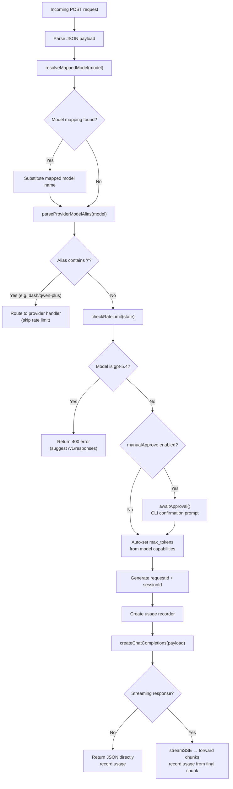
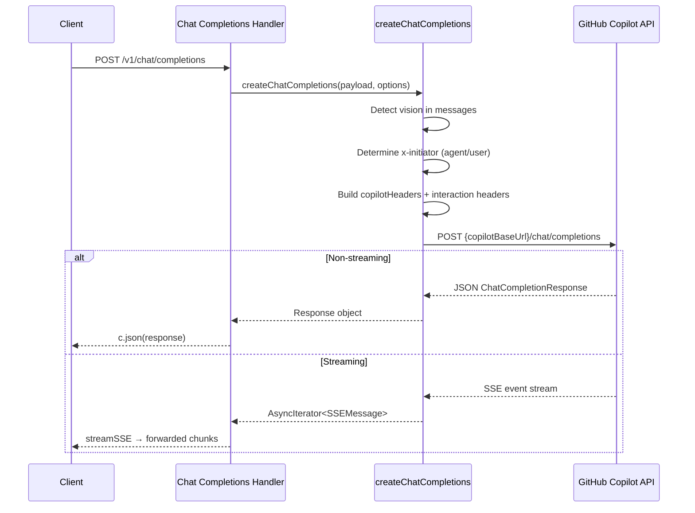

The OpenAI-compatible chat completions endpoint is the primary interface for LLM inference in copilot-api. It accepts standard OpenAI Chat Completions API payloads, resolves the target model, and transparently proxies requests to either the GitHub Copilot backend or a configured third-party provider — all while tracking token usage, enforcing rate limits, and supporting both streaming and non-streaming response modes.

## Route Registration and Endpoint Paths

The chat completions endpoint is mounted at two paths to maximize client compatibility: the canonical `/chat/completions` and the OpenAI SDK-standard `/v1/chat/completions`. Both paths resolve to the same Hono sub-router, so behavior is identical regardless of which path the client uses.

Sources: [src/server.ts#L67-L80](src/server.ts#L67-L80)

The route itself is minimal — a single `POST /` handler that delegates entirely to `handleCompletion` and wraps it with the centralized error forwarder:

Sources: [src/routes/chat-completions/route.ts#L1-L16](src/routes/chat-completions/route.ts#L1-L16)

Every request passes through the global middleware stack before reaching this handler. The middleware pipeline (applied in [server.ts](src/server.ts)) establishes a trace ID, attaches Hono's request logger, enables CORS, enforces API key authentication, and optionally decompresses zstd-encoded request bodies. The chat completions endpoint is **not** on the unauthenticated allowlist, so clients must provide a valid API key when one is configured.

Sources: [src/server.ts#L25-L46](src/server.ts#L25-L46)

## Request Processing Pipeline

The handler executes a precise sequence of operations on every incoming request. Understanding this pipeline is critical for debugging client integrations.

Sources: [src/routes/chat-completions/handler.ts#L28-L116](src/routes/chat-completions/handler.ts#L28-L116)

### Step-by-Step Breakdown

**1. Payload Parsing and Model Resolution**

The handler immediately parses the request body as a `ChatCompletionsPayload` and applies model mappings. The mapping system is a simple dictionary lookup: if the requested model name appears as a key in the configured `modelMappings`, it is replaced with the corresponding value before any further processing. This is the first transformation applied, and it happens *before* the provider alias check.

Sources: [src/routes/chat-completions/handler.ts#L29-L36](src/routes/chat-completions/handler.ts#L29-L36), [src/lib/config.ts#L413-L414](src/lib/config.ts#L413-L414)

**2. Provider Alias Detection and Routing**

After model mapping, the handler checks whether the model name contains a `/` separator (e.g., `dash/qwen-plus`). If it does, `parseProviderModelAlias` extracts the provider name (left of `/`) and the actual model name (right of `/`). The request is then immediately forwarded to `handleProviderChatCompletionsForProvider` — **bypassing Copilot rate limiting entirely**, since the request targets an external provider, not GitHub Copilot.

Sources: [src/routes/chat-completions/handler.ts#L38-L45](src/routes/chat-completions/handler.ts#L38-L45), [src/lib/provider-model.ts#L8-L26](src/lib/provider-model.ts#L8-L26)

This is a deliberate architectural decision: the rate limiter guards GitHub Copilot quota, so provider-aliased requests must skip it.

**3. Rate Limiting and Manual Approval**

For requests that target the Copilot backend, the handler enforces a configurable time-based rate limit. If `rateLimitSeconds` is configured and the elapsed time since the last request is shorter, the handler either returns a 429 or waits (depending on `rateLimitWait`). When `manualApprove` is enabled, the handler pauses execution and prompts for CLI confirmation — useful for development debugging.

Sources: [src/lib/rate-limit.ts#L8-L46](src/lib/rate-limit.ts#L8-L46), [src/lib/approval.ts#L5-L15](src/lib/approval.ts#L5-L15)

**4. Auto-Population of max_tokens**

If the client omits `max_tokens`, the handler automatically infers it from the selected model's capabilities (`max_output_tokens`). This prevents upstream rejections when clients forget to specify the parameter.

Sources: [src/routes/chat-completions/handler.ts#L70-L76](src/routes/chat-completions/handler.ts#L70-L76)

**5. Request ID and Session ID Generation**

The handler generates a deterministic request ID by hashing the last user message content combined with the machine ID. This creates a stable identifier for tracking purposes: identical messages from the same machine produce the same request ID. The session ID is derived from the request ID via a UUID v4-compatible transformation.

Sources: [src/lib/utils.ts#L243-L262](src/lib/utils.ts#L243-L262), [src/lib/utils.ts#L277-L289](src/lib/utils.ts#L277-L289)

## Copilot Backend Integration

For standard Copilot requests (non-provider-aliased), the handler delegates to `createChatCompletions`, which constructs the upstream request to the GitHub Copilot API.

Sources: [src/services/copilot/create-chat-completions.ts#L17-L82](src/services/copilot/create-chat-completions.ts#L17-L82)

### Header Construction

The upstream request headers are carefully constructed to mimic a legitimate VS Code Copilot extension. For the standard Copilot path, the headers include:

| Header | Value | Purpose |
|---|---|---|
| `Authorization` | `Bearer {copilotToken}` | Authenticates with GitHub Copilot |
| `copilot-integration-id` | `vscode-chat` | Identifies the integration type |
| `editor-version` | `vscode/{vsCodeVersion}` | Reports the VS Code version |
| `editor-plugin-version` | `copilot-chat/0.52.0` | Reports the plugin version |
| `openai-intent` | `conversation-agent` | Declares the request intent |
| `x-initiator` | `user` or `agent` | Indicates who initiated the conversation |
| `x-request-id` | UUID | Unique request identifier |
| `x-interaction-type` | `conversation-agent` | Interaction classification |
| `copilot-vision-request` | `true` (if vision) | Enables vision model selection |

Sources: [src/lib/api-config.ts#L376-L399](src/lib/api-config.ts#L376-L399)

The `x-initiator` header deserves special attention. The handler inspects the **last message** in the conversation to determine whether the request is user-initiated or agent-initiated. If the final message has a role of `"assistant"` or `"tool"`, the initiator is set to `"agent"` — this affects how GitHub Copilot computes usage and rate limiting on its side.

Sources: [src/services/copilot/create-chat-completions.ts#L36-L52](src/services/copilot/create-chat-completions.ts#L36-L52)

### Vision Detection

The handler scans all messages for `image_url` content parts. If any message contains an image, the `Copilot-Vision-Request` header is added, which signals to the upstream API that a vision-capable model should be selected.

Sources: [src/services/copilot/create-chat-completions.ts#L28-L32](src/services/copilot/create-chat-completions.ts#L28-L32)

### Copilot Base URL Resolution

The target API URL is determined by a priority chain: enterprise domain (from `COPILOT_API_ENTERPRISE_URL`), the OpenCode OAuth app flag, a custom `copilotApiUrl` override, and finally the account type (`individual` vs `business`).

Sources: [src/lib/api-config.ts#L159-L176](src/lib/api-config.ts#L159-L176)

## Streaming vs Non-Streaming Response Handling

The handler distinguishes between streaming and non-streaming responses by checking whether the response object has a `choices` property (the non-streaming indicator). This is a structural duck-typing check, not a content inspection.

Sources: [src/routes/chat-completions/handler.ts#L118-L120](src/routes/chat-completions/handler.ts#L118-L120)

### Non-Streaming Path

For non-streaming requests, the handler directly returns the JSON response and records token usage in a single call. This is the simpler path with no incremental processing.

Sources: [src/routes/chat-completions/handler.ts#L95-L98](src/routes/chat-completions/handler.ts#L95-L98)

### Streaming Path (SSE)

For streaming requests, the handler uses Hono's `streamSSE` utility to create a Server-Sent Events response. Each chunk from the upstream event stream is parsed to extract usage data (which typically arrives in the final chunk), and then forwarded to the client as an SSE message. Token usage is recorded only after the stream completes, using the accumulated usage from all chunks.

Sources: [src/routes/chat-completions/handler.ts#L101-L115](src/routes/chat-completions/handler.ts#L101-L115)

The streaming implementation handles the `[DONE]` sentinel gracefully — when the upstream sends this marker, the parser returns `null` and the chunk is forwarded as-is to signal stream completion to the client.

Sources: [src/routes/chat-completions/handler.ts#L122-L135](src/routes/chat-completions/handler.ts#L122-L135)

## Provider-Scoped Routing

When the model name contains a provider prefix (e.g., `dash/qwen-plus`), the request is routed to a completely different handler that proxies to the configured third-party provider. This is a first-class architectural path, not a fallback.

Sources: [src/routes/provider/chat-completions/handler.ts#L27-L99](src/routes/provider/chat-completions/handler.ts#L27-L99)

The provider handler performs three critical payload transformations before forwarding:

| Transformation | Effect |
|---|---|
| `applyProviderModelDefaults` | Sets `temperature`, `top_p`, `top_k` from provider config if not present in the request |
| `applyMissingExtraBody` | Merges provider-specific body fields (e.g., `enable_thinking`, `preserve_thinking`) that aren't already in the request |
| `applyProviderStreamOptions` | Forces `stream_options.include_usage: true` for streaming requests to ensure usage reporting |

Sources: [src/routes/provider/chat-completions/handler.ts#L101-L130](src/routes/provider/chat-completions/handler.ts#L101-L130)

The provider proxy constructs its own auth headers based on the provider's configured `authType` — either `Bearer` token or `x-api-key` header — and strips hop-by-hop headers from the upstream response before returning it.

Sources: [src/services/providers/provider-proxy.ts#L27-L63](src/services/providers/provider-proxy.ts#L27-L63), [src/services/providers/provider-proxy.ts#L95-L106](src/services/providers/provider-proxy.ts#L95-L106)

## Token Usage Tracking

Every request — regardless of streaming mode or provider path — records token usage through the centralized usage tracking system. The flow is:

1. A recorder function is created at request start, capturing the endpoint type, model, session ID, and provider name.
2. After the response completes, the recorder is called with normalized usage tokens.
3. The `normalizeOpenAIUsage` function separates the OpenAI usage object into `input_tokens`, `output_tokens`, `cache_read_input_tokens`, and `cache_creation_input_tokens` — subtracting cached and cache-creation tokens from the prompt total.
4. The normalized event is published to an internal event bus, which asynchronously persists it to SQLite.

Sources: [src/lib/token-usage/index.ts#L132-L139](src/lib/token-usage/index.ts#L132-L139), [src/lib/token-usage/index.ts#L170-L200](src/lib/token-usage/index.ts#L170-L200)

The recorder distinguishes between `copilot` and `provider` sources, which affects the `user_id` field in persisted events: Copilot usage is attributed to the authenticated GitHub user, while provider usage is attributed to the provider name.

Sources: [src/lib/token-usage/index.ts#L92-L97](src/lib/token-usage/index.ts#L92-L97)

## Error Handling

Errors in the chat completions handler follow two patterns:

- **`HTTPError`**: Thrown when the upstream Copilot or provider API returns a non-2xx response. The `forwardError` middleware extracts the status code, forwards retry headers for 429 responses, and returns the upstream error message in the standard OpenAI error format.

Sources: [src/lib/error.ts#L6-L13](src/lib/error.ts#L6-L13), [src/lib/error.ts#L15-L59](src/lib/error.ts#L15-L59)

- **Hard-coded rejections**: The `gpt-5.4` model is explicitly rejected with a 400 response, directing clients to use the newer `/v1/responses` or `/v1/messages` endpoints. This is a forward-compatibility guard for models that require the newer API surfaces.

Sources: [src/routes/chat-completions/handler.ts#L56-L66](src/routes/chat-completions/handler.ts#L56-L66)

## Type Definitions

The endpoint defines a comprehensive set of TypeScript interfaces that mirror the OpenAI Chat Completions API surface. These types serve as both documentation and runtime shape validation.

### Request Types

| Interface | Purpose |
|---|---|
| `ChatCompletionsPayload` | Full request body: messages, model, temperature, tools, stream options, reasoning parameters |
| `Message` | Individual message with role, content (string or structured parts), tool calls, reasoning fields |
| `ContentPart` | Union of `TextPart`, `ImagePart`, `FilePart` for multimodal content |
| `Tool` | Function tool definition with name, description, and JSON Schema parameters |

Sources: [src/services/copilot/create-chat-completions.ts#L170-L267](src/services/copilot/create-chat-completions.ts#L170-L267)

### Response Types

| Interface | Purpose |
|---|---|
| `ChatCompletionResponse` | Non-streaming response with choices, usage, and system fingerprint |
| `ChatCompletionChunk` | Streaming chunk with delta content, finish reason, and usage (final chunk only) |
| `Choice` | Streaming choice with delta (content, role, tool calls, reasoning) |
| `ChoiceNonStreaming` | Non-streaming choice with complete message and finish reason |

Sources: [src/services/copilot/create-chat-completions.ts#L86-L166](src/services/copilot/create-chat-completions.ts#L86-L166)

The `Delta` type includes three reasoning-related fields (`reasoning_text`, `reasoning_content`, `reasoning_opaque`) that accommodate different reasoning output formats across model providers — an important detail for clients consuming streaming responses from models that emit chain-of-thought reasoning.

Sources: [src/services/copilot/create-chat-completions.ts#L108-L123](src/services/copilot/create-chat-completions.ts#L108-L123)

## Testing Strategy

The test suite covers the chat completions endpoint across three dimensions:

| Test File | Focus |
|---|---|
| `chat-completions-handler.test.ts` | Handler-level behavior: gpt-5.4 rejection, model resolution, response formatting |
| `create-chat-completions.test.ts` | Service-level behavior: header construction (`x-initiator` agent vs user detection) |
| `provider-chat-completions-alias.test.ts` | Provider routing: alias parsing, model defaults, extra body injection, stream options |

Sources: [tests/chat-completions-handler.test.ts#L105-L122](tests/chat-completions-handler.test.ts#L105-L122), [tests/create-chat-completions.test.ts#L41-L71](tests/create-chat-completions.test.ts#L41-L71), [tests/provider-chat-completions-alias.test.ts#L112-L148](tests/provider-chat-completions-alias.test.ts#L112-L148)

The provider alias tests are particularly thorough — they verify that model mappings can route to providers (bypassing Copilot rate limiting), that provider model defaults are applied correctly, that client-provided values take precedence over defaults, and that `stream_options.include_usage` is forced to `true` for streaming requests.

Sources: [tests/provider-chat-completions-alias.test.ts#L182-L200](tests/provider-chat-completions-alias.test.ts#L182-L200)

## Next Steps

To continue building your understanding of the copilot-api architecture:

- [Anthropic Messages Endpoint and Multi-Flow Routing](10-anthropic-messages-endpoint-and-multi-flow-routing) — Learn how the `/v1/messages` endpoint handles Anthropic-format requests with multi-flow translation
- [OpenAI Responses Endpoint and WebSocket Transport](11-openai-responses-endpoint-and-websocket-transport) — Explore the newer `/v1/responses` API with WebSocket support
- [Provider-Scoped Multi-Tenant Routing](12-provider-scoped-multi-tenant-routing) — Deep dive into how `/:provider/v1/*` routes enable multi-tenant provider isolation
- [Model Resolution, Aliasing, and Normalization](16-model-resolution-aliasing-and-normalization) — Understand the full model mapping and alias resolution pipeline
- [Rate Limiting and Manual Approval](8-rate-limiting-and-manual-approval) — Detailed configuration of rate limiting and manual approval flows